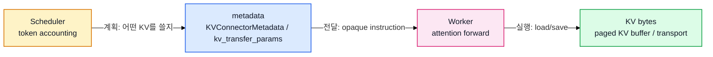
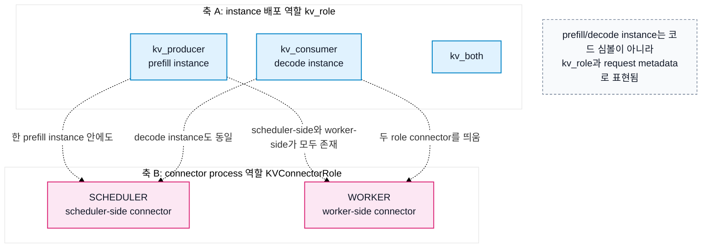
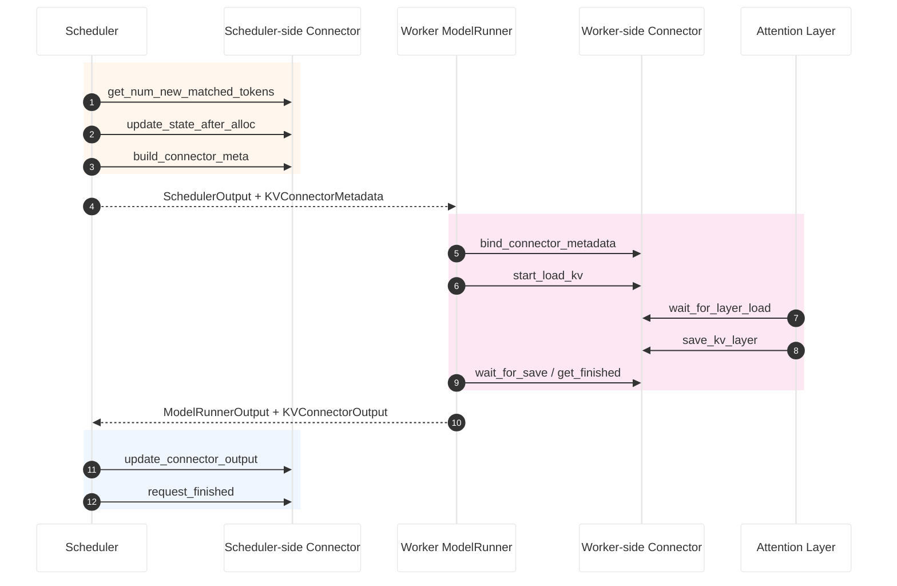
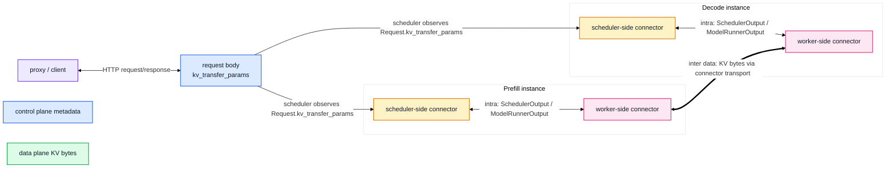
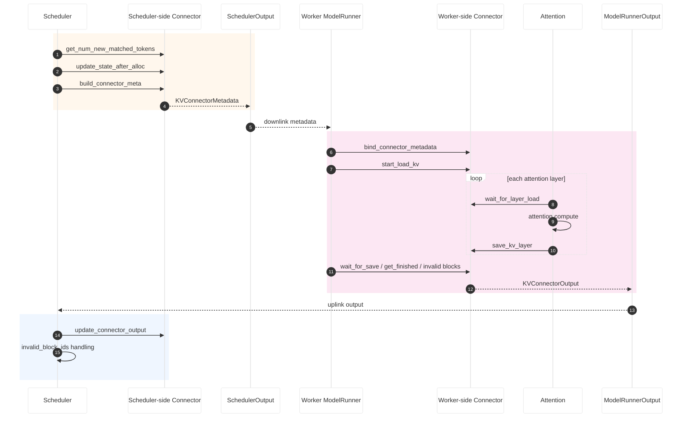
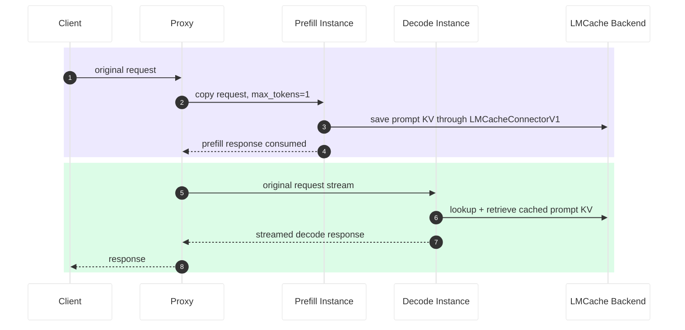
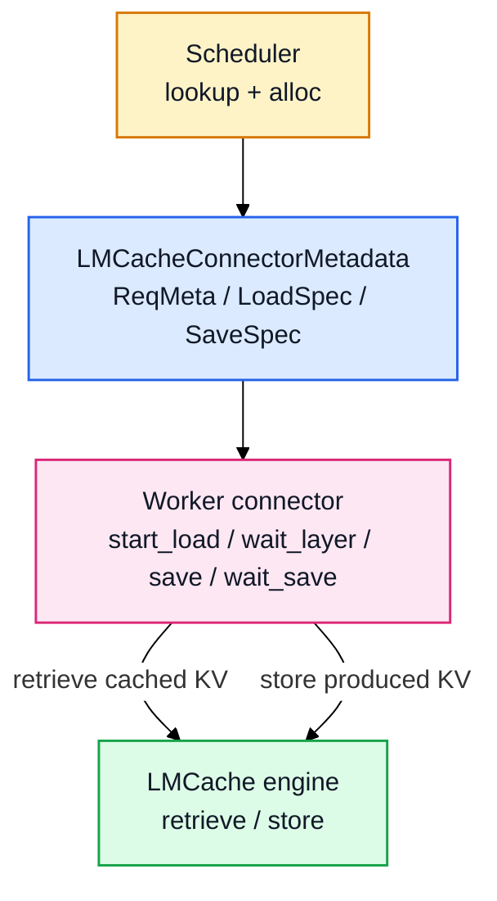
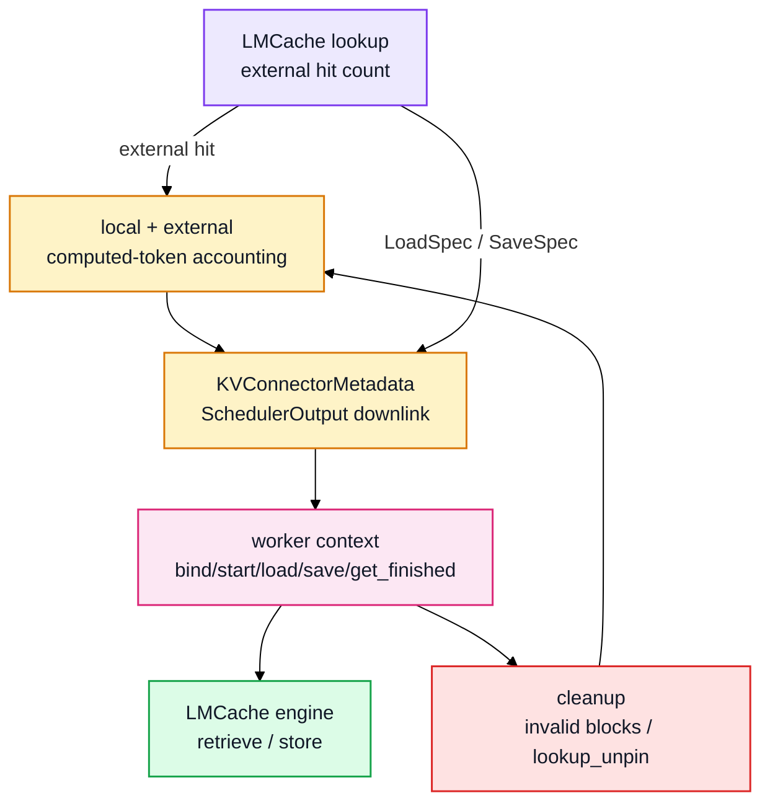

# V1 KVConnector와 P/D Disaggregation 분석

!!! note
    이 문서는 `docs/study`의 기존 KV cache, scheduler, worker, P/D connector
    노트를 하나의 분석 흐름으로 합친 학습 문서입니다. 목표는 `KVConnectorBase_V1`
    기준으로 "external KV가 scheduler 회계에 어떻게 들어오고, worker가 실제 KV를
    어떻게 옮기며, P/D instance 사이에서는 어떤 metadata가 이동하는가"를 한 번에
    따라가는 것입니다.

!!! warning "Baseline"
    upstream `v0.23.0` 계열의 V1 connector 구조를 기준으로 합니다. 구
    `docs/features/disagg_prefill.md`의 Development 절에 나오는
    Connector/LookupBuffer/Pipe 설명은 V0 모델에 가까운 역사적 설명으로만 다룹니다.
    현재 분석의 source of truth는 `KVConnectorBase_V1`입니다.

## 읽는 법

- 긴 줄글보다 다음 패턴으로 읽으세요.
    - **핵심 명제**
    - **그림 또는 표**
    - **짧은 코드 발췌**
    - **읽는 포인트**
    - **출처**
- Mermaid diagram은 흰 배경에서 읽히도록 색상을 명시합니다.
- 코드블럭은 원문 전체 복붙이 아니라 call-site를 이해하기 위한 짧은 발췌입니다.

## 1. KVConnector란 무엇인가

### 핵심 명제

- KVConnector는 "vLLM 밖에 있거나 다른 위치에 있는 KV"를 V1 scheduler/worker
  흐름에 연결하는 boundary입니다.
- 쓰임새는 크게 네 가지입니다.
    - **external KV hit**: local prefix cache 밖에서 찾은 KV를 computed token으로 인정.
    - **remote KV load/save**: worker가 attention 전에 KV를 받아오고, forward 후 저장.
    - **offload**: GPU 밖 저장소/CPU/별도 프로세스에 KV를 저장하거나 다시 로드.
    - **P/D disaggregation**: prefill instance가 만든 KV를 decode instance가 사용.
- 단순한 전송 wrapper가 아닙니다. scheduler의 token accounting, worker의 layer-wise
  execution, request 종료 cleanup까지 관여합니다.

### local prefix cache와 external KV hit

| 구분 | local prefix cache hit | external KV hit |
| --- | --- | --- |
| KV 위치 | vLLM의 local GPU KV cache block | 외부 저장소, offload 영역, 다른 instance |
| scheduler 진입점 | `KVCacheManager.get_computed_blocks()` | `connector.get_num_new_matched_tokens()` |
| 회계상 의미 | 다시 계산하지 않아도 되는 token | 다시 계산하지 않아도 되는 token |
| 데이터 확보 | 이미 local block에 있음 | local block을 할당한 뒤 load 필요 |
| 실패 가능성 | 일반적으로 cache miss로 처리 | load 실패, invalid block, recompute/fail policy |
| cleanup | `KVCacheManager.free()` | `request_finished()`와 delayed free 가능 |

### computed token 회계

새 WAITING request에서 scheduler는 local hit과 external hit을 더해 "이미 계산된
token 수"를 만듭니다.

```python
# vllm/v1/core/sched/scheduler.py:610~641 (요약)
new_computed_blocks, num_new_local_computed_tokens = (
    self.kv_cache_manager.get_computed_blocks(request)
)
ext_tokens, load_kv_async = self.connector.get_num_new_matched_tokens(
    request, num_new_local_computed_tokens
)
num_external_computed_tokens = ext_tokens
num_computed_tokens = (
    num_new_local_computed_tokens + num_external_computed_tokens
)
```

읽는 포인트:

- `num_new_local_computed_tokens`: local prefix cache가 이미 가진 token.
- `num_external_computed_tokens`: connector가 외부에서 가져올 수 있다고 판단한 token.
- 둘은 **"얼마나 계산을 줄일지"** 를 결정할 때만 합쳐집니다.
- 데이터 확보 방식은 끝까지 다릅니다.
    - local hit: 이미 local block에 있음.
    - external hit: block allocation 후 worker connector가 load해야 함.

추가 회계 항목:

- RUNNING request는 새 lookup 대신 기존 `request.num_computed_tokens`에서 출발합니다.
- spec decode는 `num_tokens_with_spec`으로 target token 수를 늘립니다.
- async scheduling은 `num_output_placeholders`로 아직 확정 전인 output 자리를 반영합니다.
- lookahead slot은 block allocation에는 영향을 주지만 external KV hit 자체는 아닙니다.

코드 근거:

- `vllm/v1/core/sched/scheduler.py:610~641`
- `vllm/v1/core/sched/scheduler.py:675~684`
- `vllm/distributed/kv_transfer/kv_connector/v1/base.py:454~486`

관련 노트:

- `docs/study/v1_scheduler_schedule_flow_ko.md`
- `docs/study/v1_kv_cache_lmcache_study_guide_ko.md`

### 제어 평면과 데이터 평면



이 그림에서 봐야 할 것:

- metadata는 "어떤 KV를 어디서/어디로 옮길지"를 설명합니다.
- 실제 KV bytes는 worker-side connector와 transport가 옮깁니다.
- scheduler는 tensor를 직접 옮기지 않고, worker가 수행할 작업을 metadata로 내립니다.

!!! note "LMCache에서는?"
    LMCacheConnectorV1에서 external KV hit은 `lookup_client.lookup()` 결과로
    scheduler 회계에 들어옵니다. 실제 KV bytes는 scheduler가 아니라 worker-side
    adapter가 LMCache engine의 `retrieve()` / `store()` 계열 API를 호출하면서
    vLLM paged KV buffer와 LMCache backend 사이에서 이동합니다.

## 2. 두 가지 role 축

### 축 A: `kv_role`

- instance 단위 배포 역할입니다.
- 정의 위치: `vllm/config/kv_transfer.py:11~13`, `vllm/config/kv_transfer.py:41`.
- 값:
    - `kv_producer`: KV를 만드는 쪽. P/D에서는 보통 prefill instance.
    - `kv_consumer`: KV를 받는 쪽. P/D에서는 보통 decode instance.
    - `kv_both`: 둘 다 수행. offload, sharing, 일부 bidirectional 흐름에서 중요.
      LMCache P/D 예제에서는 prefill instance가 `kv_producer`, decode instance가
      `kv_consumer`로 실행됩니다.

```python
# vllm/config/kv_transfer.py:11~13, 109~119 (요약)
KVProducer = Literal["kv_producer", "kv_both"]
KVConsumer = Literal["kv_consumer", "kv_both"]

def is_kv_producer(self) -> bool:
    return self.kv_connector is not None and self.kv_role in get_args(KVProducer)

def is_kv_consumer(self) -> bool:
    return self.kv_connector is not None and self.kv_role in get_args(KVConsumer)
```

### 축 B: `KVConnectorRole`

- connector process 단위 역할입니다.
- 정의 위치: `vllm/distributed/kv_transfer/kv_connector/v1/base.py:124~129`.
- 값:
    - `SCHEDULER`: engine-core/scheduler 프로세스에서 도는 connector.
    - `WORKER`: GPU worker 프로세스에서 도는 connector.

```python
# vllm/distributed/kv_transfer/kv_connector/v1/base.py:124~129
class KVConnectorRole(enum.Enum):
    SCHEDULER = 0
    WORKER = 1
```

### 두 축을 섞으면 안 되는 이유



읽는 포인트:

- `kv_role`은 "이 instance가 KV를 만들거나 받는가"입니다.
- `KVConnectorRole`은 "같은 connector가 scheduler process에 있나 worker process에 있나"입니다.
- P/D를 설명할 때 두 축을 같이 쓰되, 같은 개념으로 합치면 안 됩니다.

!!! note "LMCache에서는?"
    `examples/disaggregated/lmcache/disagg_prefill_lmcache_v1/disagg_vllm_launcher.sh`
    기준으로 prefiller는 `kv_role="kv_producer"`, decoder는
    `kv_role="kv_consumer"`입니다. 두 instance 각각 안에는 다시
    `KVConnectorRole.SCHEDULER`와 `KVConnectorRole.WORKER` connector가 존재합니다.

## 3. `KVConnectorBase_V1` API 지도

### scheduler-side API

| API | 호출 주체 | 역할 | 코드 근거 |
| --- | --- | --- | --- |
| `get_num_new_matched_tokens` | scheduler `schedule()` | external KV hit token 수 계산 | `base.py:454~486`, `scheduler.py:618` |
| `update_state_after_alloc` | scheduler `schedule()` | 할당된 local block과 remote KV metadata 연결 | `base.py:489~507`, `scheduler.py:788` |
| `build_connector_meta` | scheduler `schedule()` | worker로 보낼 opaque metadata 생성 | `base.py:509~522`, `scheduler.py:955` |
| `update_connector_output` | scheduler `update_from_output()` | worker가 올린 완료/실패/event 반영 | `base.py:532~540`, `scheduler.py:2233` |
| `request_finished(request, block_ids)` | scheduler `_free_request()` | 종료 request의 block free 지연 여부와 `kv_transfer_params` 반환 | `base.py:542~560`, `scheduler.py:2126` |
| `request_finished_all_groups(request, block_ids)` | scheduler `_free_request()` | HMA/여러 KV cache group의 종료 request 처리 | `base.py:74~101`, `scheduler.py:2128` |

### worker-side API

| API | 호출 주체 | 역할 | 코드 근거 |
| --- | --- | --- | --- |
| `bind_connector_metadata` | model runner context | scheduler metadata 설치 | `base.py:211~221`, `kv_connector_model_runner_mixin.py:89` |
| `start_load_kv` | model runner context enter | 비동기 load 시작 | `base.py:292~308`, `kv_connector_model_runner_mixin.py:95` |
| `wait_for_layer_load` | attention layer wrapper | layer KV load barrier | `base.py:310~322`, `kv_transfer_utils.py:51` |
| `save_kv_layer` | attention layer wrapper | layer KV save 시작 | `base.py:324~344`, `kv_transfer_utils.py:57` |
| `wait_for_save` | model runner context exit | async save 완료 대기 | `base.py:346~355`, `kv_connector_model_runner_mixin.py:100` |
| `get_finished` | model runner context exit | finished_sending / finished_recving 수확 | `base.py:357~370`, `kv_connector_model_runner_mixin.py:102~103` |
| `build_connector_worker_meta` | model runner context exit | worker-side metadata/stat/event uplink 생성 | `base.py:372~383`, `kv_connector_model_runner_mixin.py:109` |

### API lifecycle 요약



!!! note "LMCache에서는?"
    LMCacheConnectorV1 wrapper는 공통 V1 API를 그대로 구현하지만 대부분의 실제
    동작을 `LMCacheConnectorV1Impl`에 위임합니다. scheduler-side API는
    `LoadSpec` / `SaveSpec` / `LMCacheConnectorMetadata`를 만들고, worker-side API는
    그 metadata를 바탕으로 LMCache engine의 retrieve/store를 실행합니다.

## 4. `ExampleConnector`로 최소 구현 읽기

### 왜 ExampleConnector를 먼저 보나

- `ExampleConnector`는 production connector가 아닙니다.
- 그래도 `KVConnectorBase_V1` API가 실제로 어떻게 채워지는지 보기 좋습니다.
- 구현은 debug용 shared storage에 KV를 저장/로드합니다.
- production connector가 추가하는 lookup, metadata, failure recovery를 보기 전에
  API shape를 익히기에 적합합니다.

관련 노트:

- `docs/study/v1_pd_disaggregation_lmcache_study_guide_ko.md`
- `docs/study/v1_kv_cache_lmcache_study_guide_ko.md`

### 최소 구현의 흐름

| 단계 | ExampleConnector 구현 | 코드 근거 |
| --- | --- | --- |
| metadata 정의 | `ExampleConnectorMetadata.requests`에 request별 `ReqMeta` 저장 | `example_connector.py:31~81` |
| load | metadata의 load request를 보고 safetensors 파일에서 KV를 읽어 paged buffer에 주입 | `example_connector.py:109~191` |
| layer load barrier | debug 구현이라 no-op | `example_connector.py:192~201` |
| save | layer KV를 slot mapping 기준으로 추출해 safetensors 파일로 저장 | `example_connector.py:203~249` |
| external hit | storage에 prompt hash folder가 있으면 block-aligned token 수 반환 | `example_connector.py:251~286` |
| allocation 이후 상태 | external token이 있으면 `_requests_need_load`에 request 기록 | `example_connector.py:288~298` |
| metadata build | scheduled request를 load/store metadata로 변환하고 내부 상태 clear | `example_connector.py:300~374` |

```python
# vllm/distributed/kv_transfer/kv_connector/v1/example_connector.py:251~286 (요약)
def get_num_new_matched_tokens(self, request, num_computed_tokens):
    if not self._found_match_for_request(request):
        return 0, False
    token_ids = request.prompt_token_ids or []
    num_tokens_to_check = align_to_block_size(len(token_ids) - 1, self._block_size)
    return num_tokens_to_check - num_computed_tokens, False
```

읽는 포인트:

- external hit도 block granularity에 맞춰 반환합니다.
- `False`는 "async load를 위해 별도 WAITING step으로 보내지는 않는다"는 의미입니다.
- production connector는 여기서 remote lookup, async state, failure handling이 커집니다.

```python
# example_connector.py:300~374 (요약)
def build_connector_meta(self, scheduler_output):
    meta = ExampleConnectorMetadata()
    for new_req in scheduler_output.scheduled_new_reqs:
        if new_req.req_id in self._requests_need_load:
            meta.add_request(..., is_store=False)
        else:
            meta.add_request(..., is_store=True)
    self._requests_need_load.clear()
    return meta
```

읽는 포인트:

- scheduler-side connector는 worker가 실행할 load/store 명세를 metadata로 만듭니다.
- `build_connector_meta()` 호출은 internal state를 reset하는 경계이기도 합니다.
- 이 metadata가 worker process로 내려간 뒤에야 실제 KV load/save가 일어납니다.

### production connector에서 커지는 부분

| 관심사 | ExampleConnector | LMCacheConnectorV1 |
| --- | --- | --- |
| 저장 위치 | local/shared filesystem | LMCache engine / configured backend |
| lookup | directory scan | `lookup_client.lookup()` |
| load | debug load metadata | `LoadSpec` + `retrieve()` / `retrieve_layer()` |
| save | debug store metadata | `SaveSpec` + `store()` / `store_layer()` |
| event | 거의 없음 | `LMCacheKVEvents`, `BlockStored` aggregation |

코드 근거:

- `vllm/distributed/kv_transfer/kv_connector/v1/lmcache_connector.py:72`
- `vllm/distributed/kv_transfer/kv_connector/v1/lmcache_integration/vllm_v1_adapter.py:121`
- `vllm/distributed/kv_transfer/kv_connector/v1/lmcache_integration/vllm_v1_adapter.py:569`

!!! note "LMCache에서는?"
    ExampleConnector의 "storage에 파일이 있으면 hit" 구조는 LMCache에서
    `lookup_client.lookup()`으로 바뀝니다. ExampleConnector의 request metadata는
    LMCache에서 `ReqMeta`가 되고, load/store 여부는 `LoadSpec`과 `SaveSpec`으로
    더 세분화됩니다.

## 5. KVConnector 통신의 두 종류

### 한 장 요약



이 그림에서 봐야 할 것:

- **intra instance**: 한 vLLM instance 내부의 scheduler-side ↔ worker-side.
- **inter instance**: prefill instance ↔ decode instance.
- inter control plane은 proxy/HTTP의 `kv_transfer_params`.
- inter data plane은 worker-side connector transport입니다.

!!! note "LMCache에서는?"
    LMCache P/D 예제의 inter-instance 공유 지점은 proxy가 옮기는 remote block
    metadata가 아니라 LMCache backend입니다. proxy는 prefiller를 먼저 호출해 KV가
    backend에 저장되게 만들고, decoder는 같은 prompt key space를 lookup/retrieve합니다.
    따라서 LMCache 중심 설명에서는 `kv_transfer_params` relay보다 backend 공유와
    hash seed/key consistency가 더 중요합니다.

## 6. Intra instance 통신

### 핵심 명제

- scheduler-side connector와 worker-side connector는 직접 호출하지 않습니다.
- 둘 사이의 통신은 기존 engine output/input 객체에 실린 metadata로 이루어집니다.
    - downlink: `SchedulerOutput.kv_connector_metadata`
    - uplink: `ModelRunnerOutput.kv_connector_output`
- worker가 여러 개여도 이 모델은 유지됩니다. worker metadata는 aggregation될 수 있습니다.

### downlink: scheduler가 metadata를 붙인다

```python
# vllm/v1/core/sched/scheduler.py:950~956 (요약)
if self.connector is not None:
    meta = self._build_kv_connector_meta(self.connector, scheduler_output)
    scheduler_output.kv_connector_metadata = meta
```

```python
# vllm/v1/core/sched/output.py:233
kv_connector_metadata: KVConnectorMetadata | None = None
```

읽는 포인트:

- scheduler는 이번 step의 request/block allocation을 이미 결정했습니다.
- connector는 그 결정을 바탕으로 worker가 수행할 load/save 명세를 만듭니다.
- 이 metadata는 opaque object입니다. scheduler output의 다른 field를 수정하지 않습니다.

코드 근거:

- `vllm/v1/core/sched/scheduler.py:950~972`
- `vllm/v1/core/sched/output.py:233`
- `vllm/distributed/kv_transfer/kv_connector/v1/base.py:509~522`

### worker lifecycle: forward를 감싸는 context

```python
# vllm/v1/worker/kv_connector_model_runner_mixin.py:78~112 (요약)
kv_connector.bind_connector_metadata(scheduler_output.kv_connector_metadata)
kv_connector.start_load_kv(get_forward_context())
try:
    yield output
finally:
    kv_connector.wait_for_save()
    output.finished_sending, output.finished_recving = (
        kv_connector.get_finished(scheduler_output.finished_req_ids)
    )
    output.invalid_block_ids = kv_connector.get_block_ids_with_load_errors()
    output.kv_connector_worker_meta = kv_connector.build_connector_worker_meta()
    kv_connector.clear_connector_metadata()
```

읽는 포인트:

- `bind_connector_metadata`: downlink 수신.
- `start_load_kv`: forward 전에 비동기 load 시작.
- `yield`: 실제 model forward가 실행되는 구간.
- `wait_for_save`와 `get_finished`: forward 뒤 완료 상태와 실패 정보를 수확.
- `kv_connector_worker_meta`: worker-side metadata, stats, KV event를 scheduler로 올림.

코드 근거:

- `vllm/v1/worker/kv_connector_model_runner_mixin.py:78~112`
- `vllm/v1/outputs.py:196~219`

### per-layer hook: attention 앞뒤에서 load/save

```python
# vllm/model_executor/layers/attention/kv_transfer_utils.py:37~58 (요약)
def wrapper(*args, **kwargs):
    if not has_kv_transfer_group() or not is_v1_kv_transfer_group():
        return func(*args, **kwargs)
    connector.wait_for_layer_load(layer_name)
    result = func(*args, **kwargs)
    connector.save_kv_layer(layer_name, kv_cache, attn_metadata)
    return result
```

읽는 포인트:

- remote KV는 attention 계산 전에 해당 layer KV가 준비되어야 합니다.
- save는 attention forward 이후 layer KV를 외부로 내보내는 hook입니다.
- connector가 없거나 V1 group이 아니면 wrapper는 no-op입니다.

### 전체 intra-instance sequence



이 그림에서 봐야 할 것:

- scheduler-side와 worker-side가 직접 서로를 호출하지 않습니다.
- metadata와 output만 engine 배관을 타고 이동합니다.
- per-layer hook은 worker forward 내부에서만 작동합니다.

### request 종료와 delayed free

```python
# vllm/v1/core/sched/scheduler.py:1888~1905 (요약)
connector_delay_free_blocks, kv_xfer_params = self._connector_finished(request)
delay_free_blocks |= connector_delay_free_blocks
if not delay_free_blocks:
    self._free_blocks(request)
return kv_xfer_params
```

```python
# vllm/v1/core/sched/scheduler.py:2221~2248 (요약)
for req_id in kv_connector_output.finished_sending or ():
    self._free_blocks(self.requests[req_id])
```

읽는 포인트:

- `request_finished()`는 "지금 free해도 되는가?"를 connector에게 묻는 hook입니다.
- connector가 `True`를 반환하면 scheduler는 block을 pin 상태로 남깁니다.
- worker-side connector가 `finished_sending`을 올려보내면 그때 free합니다.
- prefill block을 전송 중인데 바로 free하면 다른 request가 같은 physical block을 덮어쓸 수 있습니다.

코드 근거:

- `vllm/distributed/kv_transfer/kv_connector/v1/base.py:542~560`
- `vllm/v1/core/sched/scheduler.py:1888~1905`
- `vllm/v1/core/sched/scheduler.py:2099~2128`
- `vllm/v1/core/sched/scheduler.py:2221~2248`

!!! note "LMCache에서는?"
    intra-instance downlink에는 `LMCacheConnectorMetadata.requests`가 실리고,
    각 request는 `ReqMeta`로 표현됩니다. worker는 이 metadata를 보고
    `start_load_kv()`에서 retrieve를 준비하고, attention hook 또는 context exit에서
    retrieve/store와 `lookup_unpin()`을 마무리합니다.

## 7. Inter instance 통신: P/D disaggregation

### 핵심 명제

- LMCacheConnectorV1 중심으로 보면 inter-instance P/D는 "proxy가 metadata를
  relay한다"보다 "두 vLLM instance가 같은 LMCache key space/backend를 본다"가
  더 중요한 mental model입니다.
- proxy는 prefill server에 먼저 `max_tokens=1` 요청을 보내 KV가 LMCache backend에
  저장되도록 만들고, 이후 원래 요청을 decode server로 stream합니다.
- decode instance의 scheduler-side connector는 local prefix cache 뒤에서
  `lookup_client.lookup()`으로 LMCache hit token 수를 확인합니다.
- worker-side connector는 scheduler metadata에 담긴 `LoadSpec` / `SaveSpec`에 따라
  LMCache engine의 `retrieve()` / `store()` 또는 layerwise API를 호출합니다.

### LMCache P/D example의 proxy 흐름



이 그림에서 봐야 할 것:

- LMCache v1 예제 proxy는 P 응답의 `kv_transfer_params`를 D 요청에 붙이지 않습니다.
- P와 D는 각각 `LMCacheConnectorV1`을 사용하지만 `kv_role`이 다릅니다.
    - prefiller: `kv_producer`
    - decoder: `kv_consumer`
- 공유되는 것은 proxy body의 remote block metadata가 아니라 LMCache backend의
  cache key space입니다.

```python
# examples/.../disagg_proxy_server.py:112~123 (요약)
req_data = req_data.copy()
req_data["max_tokens"] = 1
response = await client.post(endpoint, json=req_data, headers=headers)
await response.aread()
```

```python
# examples/.../disagg_proxy_server.py:152~164 (요약)
await send_request_to_service(app.state.prefill_client, "/completions", req_data)
async for chunk in stream_service_response(
    app.state.decode_client, "/completions", req_data
):
    yield chunk
```

코드 근거:

- `examples/disaggregated/lmcache/disagg_prefill_lmcache_v1/disagg_proxy_server.py:106~167`
- `examples/disaggregated/lmcache/disagg_prefill_lmcache_v1/disagg_vllm_launcher.sh:27~58`
- `docs/features/disagg_prefill.md:24~26`

### LMCacheConnectorV1 scheduler-side 흐름

```python
# vllm/.../lmcache_connector.py:259~301 (요약)
def get_num_new_matched_tokens(request, num_computed_tokens):
    return self._lmcache_engine.get_num_new_matched_tokens(
        request, num_computed_tokens
    ), False

def update_state_after_alloc(request, blocks, num_external_tokens):
    self._lmcache_engine.update_state_after_alloc(request, num_external_tokens)

def build_connector_meta(scheduler_output):
    return self._lmcache_engine.build_connector_meta(scheduler_output)
```

```python
# vllm/.../vllm_v1_adapter.py:1184~1227 (요약)
num_external_hit_tokens = self.lookup_client.lookup(token_ids, lookup_id=...)
need_to_allocate = num_external_hit_tokens - num_computed_tokens
if num_external_hit_tokens == request.num_tokens:
    need_to_allocate -= 1
self.load_specs[request.request_id] = LoadSpec(
    vllm_cached_tokens=num_computed_tokens,
    lmcache_cached_tokens=num_external_hit_tokens,
    can_load=False,
)
return max(need_to_allocate, 0)
```

읽는 포인트:

- local prefix cache hit 이후 남은 prefix에 대해 LMCache lookup을 합니다.
- 반환값은 "LMCache에 있는 token 중 vLLM이 추가로 local block을 할당해 load할 수
  있는 token 수"입니다.
- LMCacheConnectorV1 wrapper는 `load_kv_async=False`를 반환합니다. scheduler는
  block을 할당하고 같은 step의 worker metadata로 load/save 명세를 내려보냅니다.
- full prompt hit에서는 마지막 token을 다시 계산하기 위해 `need_to_allocate`를 하나
  줄이는 보정이 있습니다.

코드 근거:

- `vllm/distributed/kv_transfer/kv_connector/v1/lmcache_connector.py:259~301`
- `vllm/distributed/kv_transfer/kv_connector/v1/lmcache_integration/vllm_v1_adapter.py:1140~1227`
- `vllm/distributed/kv_transfer/kv_connector/v1/lmcache_integration/vllm_v1_adapter.py:1230~1292`

### LMCacheConnectorMetadata: worker에게 내려가는 것

```python
# vllm/.../vllm_v1_adapter.py:554~568 (요약)
@dataclass
class LMCacheConnectorMetadata(KVConnectorMetadata):
    requests: list[ReqMeta] = field(default_factory=list)
    lookup_requests_in_step: list[str] = field(default_factory=list)
```

읽는 포인트:

- `build_connector_meta()`는 scheduled request를 `RequestTracker`로 추적합니다.
- `ReqMeta`에는 token ids, slot mapping, `LoadSpec`, `SaveSpec`, optional
  `DisaggSpec`, request-level LMCache config가 들어갑니다.
- `lookup_requests_in_step`은 worker-side `wait_for_save()`에서 lookup pin을
  해제하는 데 쓰입니다.

코드 근거:

- `vllm/distributed/kv_transfer/kv_connector/v1/lmcache_integration/vllm_v1_adapter.py:70~99`
- `vllm/distributed/kv_transfer/kv_connector/v1/lmcache_integration/vllm_v1_adapter.py:120~149`
- `vllm/distributed/kv_transfer/kv_connector/v1/lmcache_integration/vllm_v1_adapter.py:248~398`
- `vllm/distributed/kv_transfer/kv_connector/v1/lmcache_integration/vllm_v1_adapter.py:1295~1406`

### LMCache worker-side load/save



읽는 포인트:

- `start_load_kv()`는 metadata의 `load_spec`이 있는 request를 찾아 LMCache에서
  KV를 가져옵니다.
- layerwise mode에서는 `retrieve_layer()` / `store_layer()`가 attention layer와
  맞물리고, non-layerwise mode에서는 `retrieve()` / `store()`가 사용됩니다.
- `kv_consumer`는 save를 건너뜁니다. prefill producer가 저장하고 decode consumer가
  읽는 LMCache P/D mental model과 맞습니다.

코드 근거:

- `vllm/distributed/kv_transfer/kv_connector/v1/lmcache_integration/vllm_v1_adapter.py:797~905`
- `vllm/distributed/kv_transfer/kv_connector/v1/lmcache_integration/vllm_v1_adapter.py:907~928`
- `vllm/distributed/kv_transfer/kv_connector/v1/lmcache_integration/vllm_v1_adapter.py:931~1128`

### LMCache와 `kv_transfer_params`

```python
# vllm/.../vllm_v1_adapter.py:102~117 (요약)
def extract_request_configs(sampling_params):
    request_configs = None
    if sampling_params.extra_args and "kv_transfer_params" in sampling_params.extra_args:
        kv_transfer_params = sampling_params.extra_args.get("kv_transfer_params")
        for k, v in kv_transfer_params.items():
            if k.startswith("lmcache."):
                request_configs[k] = v
    return request_configs
```

```python
# vllm/.../vllm_v1_adapter.py:1242~1264 (요약)
kv_transfer_params = request.kv_transfer_params
if kv_transfer_params is not None and "disagg_spec" in kv_transfer_params:
    tmp_disagg_tracker[request.request_id] = DisaggSpec(...)
```

읽는 포인트:

- LMCacheConnectorV1의 기본 P/D 예제는 `kv_transfer_params` relay가 핵심이 아닙니다.
- 그래도 LMCache adapter는 `kv_transfer_params`를 완전히 무시하지 않습니다.
    - `lmcache.*` prefix key는 request-level LMCache config로 추출됩니다.
    - `disagg_spec`은 LMCache PD transfer spec으로 `RequestTracker`에 연결됩니다.
    - `ret_first_tok`가 있으면 `request_finished()`가 `first_tok`를 output
      params로 돌려줄 수 있습니다.
- 따라서 이 문서에서 `kv_transfer_params`는 remote block 주소록이 아니라
  "LMCache request override / PD transfer hint" 정도로만 다룹니다.

코드 근거:

- `vllm/distributed/kv_transfer/kv_connector/v1/lmcache_integration/vllm_v1_adapter.py:102~117`
- `vllm/distributed/kv_transfer/kv_connector/v1/lmcache_integration/vllm_v1_adapter.py:1230~1264`
- `vllm/distributed/kv_transfer/kv_connector/v1/lmcache_integration/vllm_v1_adapter.py:1408~1428`

## 8. Failure와 cleanup

### 왜 실패 경로가 핵심인가

- KVConnector는 "KV를 가져오면 빠르다"만 다루지 않습니다.
- remote KV가 없거나, load가 실패하거나, decode request가 engine에 들어가기 전에
  reject되거나, LMCache lookup pin/save state가 남아 있을 수 있습니다.
- 이 경우 scheduler state와 worker transfer state를 맞추지 않으면 다음 문제가 생깁니다.
    - 이미 invalid한 block을 cached로 오염시킴.
    - lookup 결과를 unpin하지 않아 LMCache 내부 상태가 오래 유지됨.
    - producer가 저장하지 않은 token을 consumer가 hit으로 착각해 recompute 기회를 놓침.

### invalid block

```python
# vllm/v1/core/sched/scheduler.py:1357~1365 (요약)
if kv_connector_output and kv_connector_output.invalid_block_ids:
    failed_kv_load_req_ids = self._handle_invalid_blocks(
        kv_connector_output.invalid_block_ids,
        num_scheduled_tokens,
    )
```

읽는 포인트:

- worker connector가 load 실패 block을 `invalid_block_ids`로 보고합니다.
- scheduler는 affected request의 computed token을 줄여 recompute하거나 policy에 따라 fail합니다.
- 실패한 external block이 prefix cache를 오염시키지 않도록 downstream block까지 고려합니다.

코드 근거:

- `vllm/v1/core/sched/scheduler.py:1357~1365`
- `vllm/v1/core/sched/scheduler.py:2250~2385`
- `docs/study/v1_kv_cache_lmcache_study_guide_ko.md`

### LMCache-specific cleanup points

```python
# vllm/.../vllm_v1_adapter.py:1035~1040 (요약)
connector_metadata = self._parent._get_connector_metadata()
self.lmcache_engine.lookup_unpin(
    connector_metadata.lookup_requests_in_step
)
```

```python
# vllm/.../vllm_v1_adapter.py:1408~1428 (요약)
def request_finished(request, block_ids):
    params = request.kv_transfer_params
    if params is not None and "ret_first_tok" in params:
        return False, {"first_tok": request._output_token_ids[0]}
    return False, None
```

읽는 포인트:

- LMCache adapter는 lookup한 request id를 metadata에 담고, worker-side `wait_for_save()`에서
  `lookup_unpin()`을 호출합니다.
- LMCacheConnectorV1의 `request_finished()`는 일반적으로 delayed free를 요청하지 않습니다.
  `ret_first_tok`가 있을 때만 `first_tok` metadata를 output으로 돌려줍니다.
- 따라서 LMCache 중심으로는 lookup pin, load failure,
  save skip/partial chunk 정책을 보는 편이 정확합니다.

코드 근거:

- `vllm/distributed/kv_transfer/kv_connector/v1/lmcache_integration/vllm_v1_adapter.py:1031~1049`
- `vllm/distributed/kv_transfer/kv_connector/v1/lmcache_integration/vllm_v1_adapter.py:1130~1133`
- `vllm/distributed/kv_transfer/kv_connector/v1/lmcache_integration/vllm_v1_adapter.py:1408~1428`

### cleanup checklist

| 상황 | 누가 감지 | 처리 |
| --- | --- | --- |
| remote load 실패 | worker connector | `invalid_block_ids` uplink |
| LMCache lookup 결과 사용 완료 | worker connector | `lookup_unpin()` |
| producer save 생략 가능성 | `ReqMeta.from_request_tracker` | `SaveSpec.can_save=False` |
| consumer save 방지 | worker connector | `kv_consumer` save skip |
| request 종료 | scheduler connector | 보통 delayed free 없이 `(False, None)` |

!!! note "LMCache에서는?"
    cleanup의 핵심은 별도 원격 block 소유권보다 LMCache lookup/save state입니다.
    특히 `lookup_requests_in_step`은 worker-side `wait_for_save()`에서 unpin되고,
    `kv_consumer`는 save를 건너뛰므로 producer/consumer role 설정이 cleanup
    semantics에도 직접 영향을 줍니다.

## 9. 최종 mental model

### 세 문장 요약

- **얼마나 계산할지**는 scheduler token accounting이 결정합니다.
    - 새 request에서는 local prefix hit과 external KV hit이 computed token으로 합쳐집니다.
- **KV를 어떻게 확보할지**는 connector lifecycle이 결정합니다.
    - local reuse, async remote load, layer-wise save, invalid block recovery는 다른 경로입니다.
- **LMCache P/D instance 사이의 공유 지점**은 proxy metadata가 아니라 LMCache backend입니다.
    - proxy는 prefill을 먼저 실행시키고 decode 요청을 이어 보냅니다.
    - KV는 LMCache key space/backend를 통해 저장되고 조회됩니다.

### 한 장짜리 map



읽는 포인트:

- external KV hit은 먼저 scheduler 회계에 들어옵니다.
- 그 다음 worker metadata와 per-layer hook으로 LMCache retrieve/store가 일어납니다.
- 실패/cleanup 결과는 다시 scheduler 회계와 block lifetime에 영향을 줍니다.

## 출처 모음

주요 study notes:

- `docs/study/v1_pd_connector_communication_ko.md`
- `docs/study/v1_pd_disaggregation_lmcache_study_guide_ko.md`
- `docs/study/v1_scheduler_schedule_flow_ko.md`
- `docs/study/v1_worker_execute_model_flow_ko.md`
- `docs/study/v1_kv_cache_lmcache_study_guide_ko.md`

주요 코드:

- `vllm/config/kv_transfer.py`
- `vllm/distributed/kv_transfer/kv_connector/v1/base.py`
- `vllm/distributed/kv_transfer/kv_connector/v1/example_connector.py`
- `vllm/distributed/kv_transfer/kv_connector/v1/lmcache_connector.py`
- `vllm/distributed/kv_transfer/kv_connector/v1/lmcache_integration/vllm_v1_adapter.py`
- `vllm/v1/core/sched/scheduler.py`
- `vllm/v1/core/sched/output.py`
- `vllm/v1/worker/kv_connector_model_runner_mixin.py`
- `vllm/model_executor/layers/attention/kv_transfer_utils.py`
- `vllm/entrypoints/serve/disagg/protocol.py`
- `vllm/outputs.py`
- `examples/disaggregated/lmcache/disagg_prefill_lmcache_v1/disagg_proxy_server.py`
- `examples/disaggregated/lmcache/disagg_prefill_lmcache_v1/disagg_vllm_launcher.sh`
