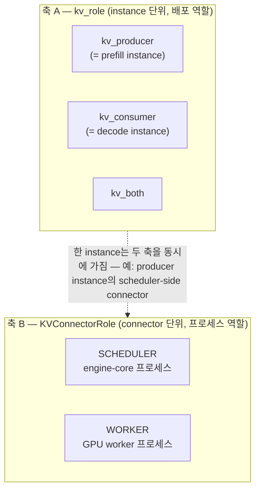
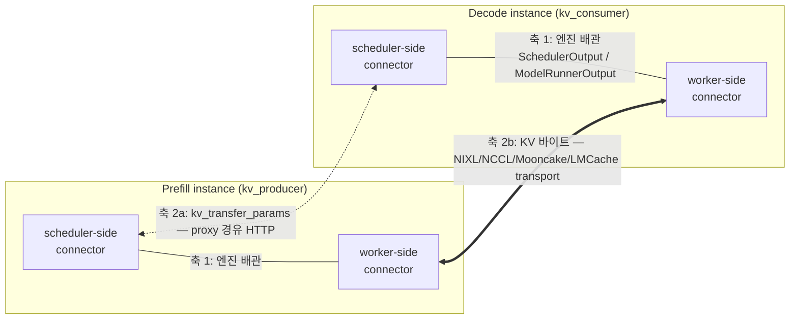
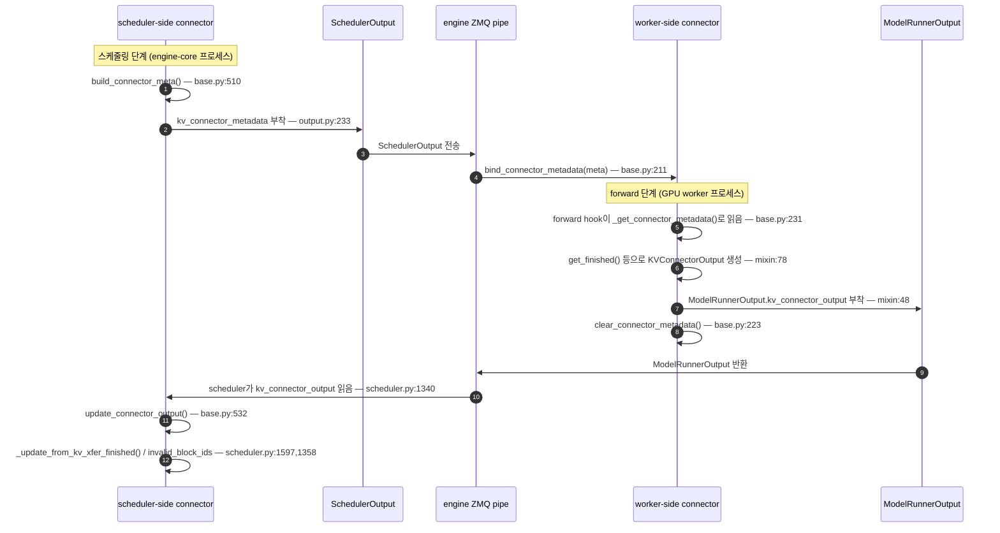
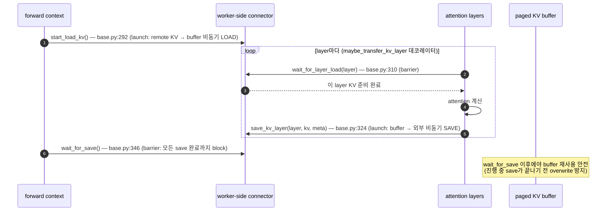
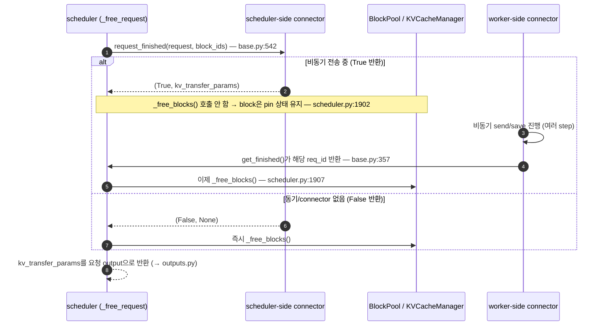
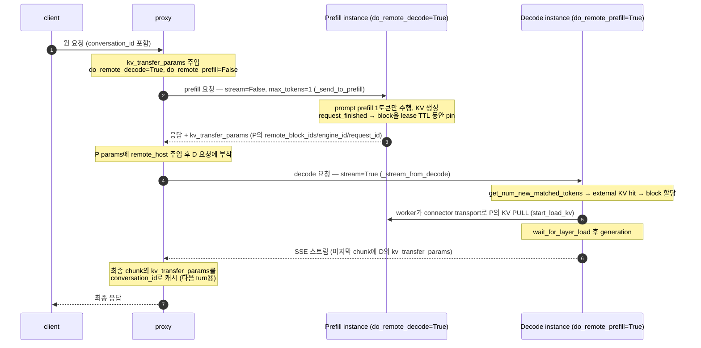
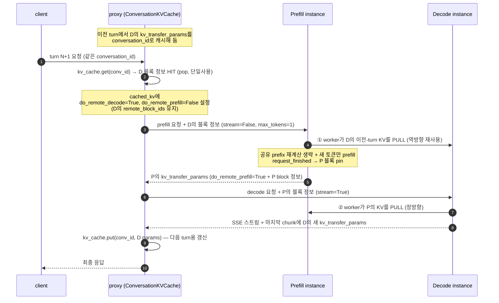

# V1 P/D Disaggregation — Connector 통신 구조

!!! note
    이 문서는 [V1 P/D Disaggregation 학습 가이드](v1_pd_disaggregation_lmcache_study_guide_ko.md)의
    동반 문서로, "scheduler-side connector와 worker-side connector가 실제로 어떻게
    통신하는가"를 코드 경로와 함께 그림으로 정리합니다.

!!! warning "Baseline"
    upstream **`v0.23.0`** 기준. 모든 `file:line`은 이 버전의 작업 트리에서 확인됨.
    Connector 추상화는 V1 (`KVConnectorBase_V1`) 기준이며, 구
    `docs/features/disagg_prefill.md`의 Connector→LookupBuffer→Pipe(V0 모델)는
    현재 코드에 존재하지 않으므로 참조하지 않습니다.

## 1. 두 개의 역할 축 (먼저 구분할 것)

P/D를 이해할 때 가장 헷갈리는 지점은 "역할(role)"이 **서로 다른 두 축**이라는 점입니다.

| 축 | 정의 위치 | 값 | 의미 |
| --- | --- | --- | --- |
| **A. `kv_role`** | `vllm/config/kv_transfer.py` (`kv_producer`/`kv_consumer`/`kv_both`, `is_kv_producer()`/`is_kv_consumer()`) | instance가 KV를 **만드냐(prefill)** vs **받느냐(decode)** | 배포 역할 |
| **B. `KVConnectorRole`** | `vllm/distributed/kv_transfer/kv_connector/v1/base.py:124` (`SCHEDULER`/`WORKER`) | connector가 **scheduler 프로세스**에 있냐 vs **worker 프로세스**에 있냐 | 프로세스 역할 |

> 코드에 `prefill instance` / `decode instance`라는 심볼은 없습니다. instance의
> `kv_role`이 그 역할을 표현합니다. `scheduler connector`/`worker connector`도
> 별개 클래스가 아니라 **같은 connector를 두 `KVConnectorRole`로 띄운 것**입니다.

## 2. 큰 그림 — 통신은 두 종류

- **축 1 (instance 내부)**: scheduler-side ↔ worker-side. **별도 채널 없음** — vLLM
  엔진이 원래 쓰는 배관에 메타데이터 객체를 얹어 통신.
- **축 2 (instance 사이)**: P ↔ D. 엔진 배관을 **우회**.
    - 2a: scheduler 정보(`kv_transfer_params`)는 **proxy의 HTTP** request/response로.
    - 2b: 실제 KV 바이트는 **connector 자체 transport**로 worker끼리 직접.

## 3. 축 1 — instance 내부 scheduler ↔ worker

두 반쪽은 서로를 직접 호출하지 않고 **직렬화 가능한 메타데이터 객체**로만 대화합니다.

- 내려감(scheduler→worker): `KVConnectorMetadata`
- 올라옴(worker→scheduler): `KVConnectorOutput`

> worker가 여러 개(TP/PP)면 각자 `KVConnectorWorkerMetadata`를 내고
> `aggregate()`(base.py:161)로 합쳐 scheduler-side에 전달됩니다.

## 4. Worker-side forward lifecycle (KV load/save)

한 번의 forward를 감싸는 4개 hook. **launch(비동기 시작)** 과 **barrier(완료 대기)** 가 번갈아 나옵니다.

- `start_load_kv` / `save_kv_layer`: 복사를 **시작만** 하고 리턴 → model 실행과 KV 전송 overlap.
- `wait_for_layer_load` / `wait_for_save`: 그 async 작업의 **완료 배리어**.
- `wait_for_save`의 스코프 = **forward 1회 내부**. 같은 forward 종료 후 다음 step이
  paged buffer를 덮어쓰기 전에 진행 중인 save를 마치게 함.

## 5. 요청 종료 시 — 비동기 block free 핸드셰이크

`wait_for_save`가 "forward 1회"라면, 이건 **요청 1건 전체**에 걸친 block 소유권 이전입니다.

- `request_finished`가 `True` → "전송 끝날 때까지 block 잡아둬". `get_finished`가 그
  req_id를 돌려줄 때까지 free 지연.
- 왜? prefill 측에서 finish 즉시 block을 free하면, BlockPool이 그 물리 페이지를
  재할당 → 다음 forward가 덮어씀 → 진행 중 전송이 **망가진 KV**를 보냄.
- 실패 경로: 일부 block load 실패는 `get_block_ids_with_load_errors()`(base.py:375)로
  보고 → scheduler가 `invalid_block_ids`로 처리(scheduler.py:1358).

## 6. 축 2 — instance 사이 P/D 흐름 (실제 proxy 기준)

아래는 `examples/disaggregated/disaggregated_serving/disagg_proxy_multiturn.py`의
single-turn 경로입니다. proxy가 실제로 어떻게 orchestration하는지 코드 그대로
반영합니다.

핵심:

- **proxy는 KV tensor를 직접 다루지 않습니다.** request/response body 안의
  `kv_transfer_params`(metadata)만 운반하고, 실제 KV 바이트는 D worker가 P worker
  로부터 connector transport로 직접 가져옵니다.
- **P 요청은 `stream=False, max_tokens=1`** — prefill만 강제하고 decode는 안 함
  (`_send_to_prefill`, py:184). **D 요청은 `stream=True`** 이고 proxy는
  **마지막 chunk**에서 `kv_transfer_params`를 뽑아 캐시합니다(`_stream_from_decode`,
  py:255~260; SSE 경로는 `_stream_from_decode_sse`, py:298~301).
- **방향 플래그**(NIXL 기준, `nixl/scheduler.py:602`):
  `do_remote_decode=True` ⇒ 그 노드는 **Prefill 노드**(`is_p_node`),
  `do_remote_prefill=True` ⇒ 그 노드는 **Decode 노드**(`is_d_node`, remote KV fetch).

## 7. Multi-turn bidirectional KV transfer

multiturn proxy의 진짜 포인트는 **이전 turn의 KV가 D에 남아 있다는 것**입니다.
다음 turn의 prompt = (이전 대화 + 새 입력)인데, 공유 prefix의 KV는 이미 **D**의
블록에 있습니다. 그래서 KV가 **양방향**으로 흐릅니다: 이전 turn 재사용은 D→P,
현재 prefill은 P→D.

### Proxy의 conversation cache

- `ConversationKVCache` (py:83): `conversation_id` 키로 D의 `kv_transfer_params`를
  저장. **단일 사용**(`get`은 `pop`, py:102) + **TTL 450s**.
- TTL은 의도적으로 **NIXL abort timeout(480s)보다 작게** 잡습니다(py:153~155):
  producer가 abort/lease 만료로 블록을 회수하기 전에 cache 항목이 먼저 죽도록 →
  죽은 remote block을 참조하는 일을 방지. (이게 PD 가이드 Failure 체크리스트의
  "lease/TTL 만료" 항목의 실제 구현입니다.)
- `conversation_id`가 없으면 cross-turn 재사용 비활성화 → 매 turn 재계산(py:372).

### Turn N+1 흐름 (양방향)

①(D→P)과 ②(P→D) 두 전송이 모두 일어나는 게 **bidirectional**입니다. P 노드가
prefill 노드이면서 동시에 remote 블록을 읽을 수 있는 건 connector의
`is_bidirectional_kv_xfer_enabled` 경로(`nixl/scheduler.py:449`) 덕분입니다.

### `kv_transfer_params` 필드 인벤토리

proxy ↔ P/D 사이를 오가는 메타데이터 필드 (proxy + `nixl/scheduler.py:664~669` 기준):

| 필드 | 누가 만드나 | 누가 읽나 | 의미 |
| --- | --- | --- | --- |
| `do_remote_decode` | proxy(P 요청), connector output | 받는 instance | True면 그 노드 = Prefill(`is_p_node`) |
| `do_remote_prefill` | proxy(D 요청), connector output | 받는 instance | True면 그 노드 = Decode(remote KV fetch) |
| `remote_block_ids` | producer `request_finished` | 읽는 worker | 읽어갈 remote 블록 ID (그룹별 list) |
| `remote_engine_id` | producer `request_finished` | 읽는 worker | 어느 엔진의 블록인지 |
| `remote_request_id` | producer `request_finished` | proxy/읽는 worker | 원격 요청 식별자 |
| `remote_host` | **proxy가 주입** (py:257,300,424) | 읽는 worker | 응답한 instance의 host |
| `remote_port` | producer/config | 읽는 worker | side channel 포트 |

> `remote_host`는 connector가 아니라 **proxy가** 응답 instance 주소로 채워 넣는다는
> 점이 포인트 — connector는 자기 host를 모르고, 노드 간 라우팅은 proxy 책임.

## 8. Code Map (v0.23.0)

| 심볼 / 필드 | 위치 | 역할 |
| --- | --- | --- |
| `KVConnectorRole` (SCHEDULER/WORKER) | `kv_connector/v1/base.py:124` | connector 프로세스 역할 |
| `kv_role`, `is_kv_producer/consumer` | `config/kv_transfer.py` | instance 배포 역할 (producer/consumer) |
| `build_connector_meta` | `base.py:510` | (sched) worker로 보낼 `KVConnectorMetadata` 생성 |
| `kv_connector_metadata` | `v1/core/sched/output.py:233` | SchedulerOutput에 실리는 다운링크 필드 |
| `bind/clear/_get_connector_metadata` | `base.py:211/223/231` | (worker) 메타데이터 설치·소비·정리 |
| `start_load_kv` | `base.py:292` | (worker) remote KV 비동기 load 시작 |
| `wait_for_layer_load` | `base.py:310` | (worker) layer KV load 완료 배리어 |
| `save_kv_layer` | `base.py:324` | (worker) layer KV 비동기 save 시작 |
| `wait_for_save` | `base.py:346` | (worker) forward 종료 시 save 완료 배리어 |
| `get_finished` | `base.py:357` | (worker→sched) 전송 완료 req_id 통지 |
| `KVConnectorOutput` | `v1/worker/kv_connector_model_runner_mixin.py:78` | 업링크 객체 (finished/invalid/stats) |
| `update_connector_output` | `base.py:532` | (sched) worker 결과 반영 |
| `get_num_new_matched_tokens` | `base.py:454` | (sched) external KV hit 토큰 수 계산 |
| `update_state_after_alloc` | `base.py:489` | (sched) 할당된 block ↔ remote KV 연결 |
| `request_finished` | `base.py:542` | (sched) 종료 시 block free 지연 + `kv_transfer_params` |
| `get_block_ids_with_load_errors` | `base.py:375` | (worker) load 실패 block 보고 |
| `maybe_transfer_kv_layer` (데코레이터) | `model_executor/layers/attention/kv_transfer_utils.py:15` | attention forward를 감싸 layer hook 호출 |
| `do_remote_decode` / `do_remote_prefill` 해석 | `nixl/scheduler.py:602` | `is_p_node`/`is_d_node` 방향 결정 |
| `request_finished` 반환 params | `nixl/scheduler.py:664` | `remote_block_ids/engine_id/request_id` 생성 |
| block lease/TTL pin | `nixl/scheduler.py:642~655` | `_reqs_need_send` + lease로 블록 회수 지연 |
| `ConversationKVCache` | `examples/.../disagg_proxy_multiturn.py:83` | proxy의 conv별 D-params 캐시 (단일사용+TTL) |
| `_send_to_prefill` / `_stream_from_decode` | `disagg_proxy_multiturn.py:178/204` | P=non-stream max_tokens=1, D=stream+params 캡처 |

## 9. 한 줄 요약

> **instance 내부** scheduler↔worker = 엔진의 `SchedulerOutput`/`ModelRunnerOutput`
> 배관에 `KVConnectorMetadata`(↓)·`KVConnectorOutput`(↑)을 실어 통신.
> **instance 사이**는 별개 — scheduler끼리는 proxy의 `kv_transfer_params`(HTTP),
> worker끼리는 connector transport로 KV 바이트를 직접 옮긴다.
> **multi-turn**에서는 이전 turn의 D 블록을 다음 turn의 P가 다시 읽어(D→P) KV가
> **양방향**으로 흐르고, proxy의 `ConversationKVCache`(단일사용+TTL<abort)가 그
> 연결고리다.
