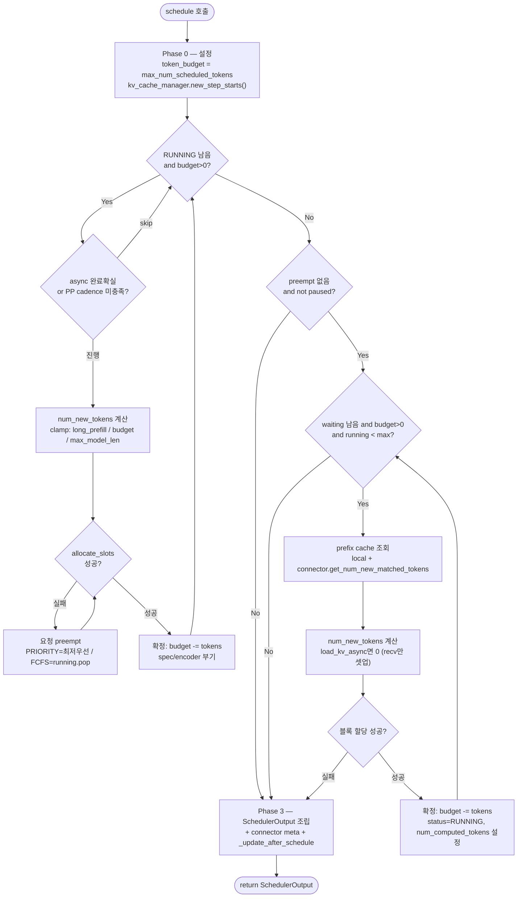
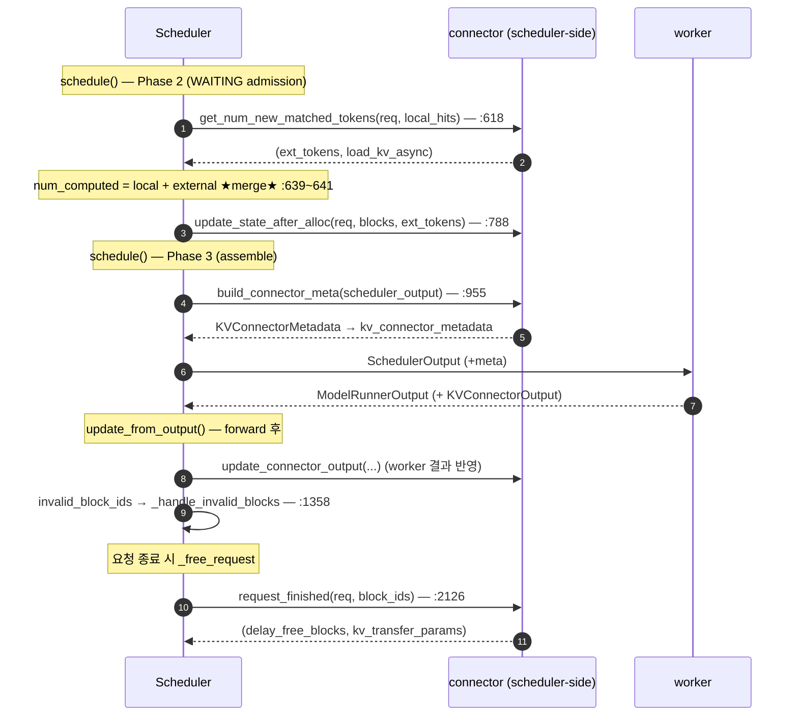

# V1 Scheduler — `schedule()` 흐름

!!! note
    `vllm/v1/core/sched/scheduler.py`의 `Scheduler.schedule()`(340~967)을 코드와 함께
    따라가는 노트입니다. V1 core의 심장 — 매 엔진 step마다 **무엇을 GPU에서 돌릴지**
    결정하는 곳입니다. §6은 **connector scheduler-side가 이 흐름 안에서 어떻게
    동작하는지**(hook 발화 지점 + local/external KV hit의 합류·분리)를 다룹니다.

!!! warning "Baseline"
    upstream **`v0.23.0`** 기준. 모든 `file:line`은 이 버전 작업 트리에서 확인됨.

## 0. 대전제 — prefill/decode 구분이 없다

```python
# scheduler.py:342~351 (주석)
# There's no "decoding phase" nor "prefill phase" in the scheduler.
# Each request just has the num_computed_tokens and num_tokens_with_spec.
# At each step, the scheduler tries to assign tokens so that each request's
# num_computed_tokens can catch up its num_tokens_with_spec.
```

모든 요청은 숫자 두 개만 갖습니다:

- `num_computed_tokens` — 지금까지 계산(KV 캐시)된 토큰 수
- `num_tokens_with_spec` = `len(prompt) + len(output) + len(spec_token_ids)`

스케줄러는 매 step **computed가 total을 따라잡도록 토큰을 배정**할 뿐입니다. 이
단일 모델이 chunked prefill, prefix caching, speculative decoding을 전부 커버합니다.
한 번의 `schedule()` 호출 = **하나의 step(= forward 배치 1개)** 구성.

## 1. 전체 흐름 (한눈에)



핵심: **RUNNING 먼저, WAITING 나중.** 진행 중 요청에 우선 budget을 주고, 남으면 새
요청을 admit합니다.

## 2. Phase 0 — 설정 (341~374)

```python
def schedule(self) -> SchedulerOutput:
    self.current_step += 1
    scheduled_new_reqs, scheduled_resumed_reqs = [], []
    scheduled_running_reqs, preempted_reqs = [], []
    req_to_new_blocks: dict[str, KVCacheBlocks] = {}
    num_scheduled_tokens: dict[str, int] = {}
    token_budget = self.max_num_scheduled_tokens          # :360 이번 forward의 정원
    if self._pause_state == PauseState.PAUSED_ALL:
        token_budget = 0                                  # paused면 아무것도 스케줄 안 함
    encoder_compute_budget = self.max_num_encoder_input_tokens
    scheduled_spec_decode_tokens: dict[str, list[int]] = {}
    self.kv_cache_manager.new_step_starts()               # :374
```

- **`token_budget`** = 이번 step의 forward가 처리할 토큰 총량(배치 정원). step마다 리셋.
- 결과를 담을 누산기들(리스트/딕셔너리)을 비워서 시작.

## 3. Phase 1 — RUNNING 요청 (376~560)

```python
req_index = 0
while req_index < len(self.running) and token_budget > 0:
    request = self.running[req_index]
```

### (a) 두 가지 skip 조건

```python
    # (1) async 스케줄링: 직전 in-flight 스텝이 max_tokens를 끝낼 게 확실하면 skip
    if (request.num_output_placeholders > 0
        and request.num_computed_tokens + 2 - request.num_output_placeholders
            >= request.num_prompt_tokens + request.max_tokens):     # :381~395
        req_index += 1
        continue
    # (2) V2+PP+async: 같은 요청의 decode 사이에 pp_size step 간격 강제
    if self.current_step < request.next_decode_eligible_step:        # :397~401
        req_index += 1
        continue
```

(1)은 "draft가 전부 거부돼도 어차피 끝남"이면 불필요한 step을 안 잡는 최적화입니다
(placeholder 회계는 `async_scheduler.py:33,59`와 `num_computed_tokens`/
`num_output_placeholders` 관계 참고). (2)는 pipeline-parallel 마이크로배칭 cadence를
맞추기 위함.

### (b) 배정할 토큰 수 계산

```python
    num_new_tokens = (request.num_tokens_with_spec
                      + request.num_output_placeholders
                      - request.num_computed_tokens)               # :403~407
    if 0 < long_prefill_token_threshold < num_new_tokens:
        num_new_tokens = long_prefill_token_threshold              # 긴 prefill 청크 상한
    num_new_tokens = min(num_new_tokens, token_budget)             # 정원 클램프
    num_new_tokens = min(num_new_tokens,
                         self.max_model_len - 1 - request.num_computed_tokens)
```

`computed`가 `total`을 따라잡는 데 필요한 양을, **정원·긴prefill임계·모델길이**로 깎습니다.
이후 encoder 입력(`_try_schedule_encoder_inputs`)·mamba 정렬로 더 줄어들 수 있고,
`num_new_tokens == 0`이면 `continue`(441~457).

### (c) KV 블록 할당 — 실패 시 preempt

```python
    while True:
        new_blocks = self.kv_cache_manager.allocate_slots(
            request, num_new_tokens, num_lookahead_tokens=self.num_lookahead_tokens)
        if new_blocks is not None:
            break                                                 # 할당 성공
        # 할당 실패 → 누군가를 쫓아낸다(preempt)
        if self.policy == SchedulingPolicy.PRIORITY:
            preempted_req = max(self.running, key=lambda r: (r.priority, r.arrival_time))
            self.running.remove(preempted_req)
            ...                                                   # 이미 스케줄됐으면 budget 환원
        else:
            preempted_req = self.running.pop()                    # FCFS: 막내(가장 최근)
        self._preempt_request(preempted_req, scheduled_timestamp) # :501
        preempted_reqs.append(preempted_req)
        if preempted_req == request:
            break                                                 # 자기 자신까지 쫓겨남 → 스케줄 불가
```

`_preempt_request`(974~995)는 KV/encoder 캐시를 free하고 `num_computed_tokens=0`으로
리셋한 뒤 **waiting 큐 맨 앞에 재투입**합니다. 즉 preempt = "이 요청 처음부터 다시".

### (d) 확정(commit)

```python
    scheduled_running_reqs.append(request)
    req_to_new_blocks[request_id] = new_blocks
    num_scheduled_tokens[request_id] = num_new_tokens
    token_budget -= num_new_tokens                                # :516 정원 차감
    req_index += 1
    # spec decode 토큰 부기 (519~535), encoder cache 할당 + ec_connector 갱신 (537~550)
```

토큰을 정원에서 떼어내고 결과 누산기에 기록. spec/encoder 관련 부기가 뒤따릅니다.

## 4. Phase 2 — WAITING 요청 (562~868)

```python
# preemption이 발생했으면 이번 step엔 새 요청을 admit하지 않는다.
if not preempted_reqs and self._pause_state == PauseState.UNPAUSED:   # :563
    step_skipped_waiting = create_request_queue(self.policy)
    while (self.waiting or self.skipped_waiting) and token_budget > 0:
        if len(self.running) == self.max_num_running_reqs:           # 동시 실행 상한
            break
        request = request_queue.peek_request()
```

진행 중 요청을 쫓아낸 step에서는 새 요청을 받지 않습니다(메모리 압박 상황).

### (a) admission 가드 → 못 받으면 skipped_waiting으로

```python
        # blocked 상태(예: WAITING_FOR_REMOTE_KVS) 승격 시도, 아직 막혔으면 skip
        if self._is_blocked_waiting_status(request.status) \
           and not self._try_promote_blocked_waiting_request(request):  # :577
            request_queue.pop_request()
            step_skipped_waiting.prepend_request(request)
            continue
        # max_loras 초과면 skip (591~602)
```

### (b) prefix cache 조회 (local + external)

```python
        if request.num_computed_tokens == 0:                          # 새 요청
            new_computed_blocks, num_new_local_computed_tokens = \
                self.kv_cache_manager.get_computed_blocks(request)    # 로컬 prefix hit
            if self.connector is not None:
                ext_tokens, load_kv_async = \
                    self.connector.get_num_new_matched_tokens(        # :618 외부(P/D) KV hit
                        request, num_new_local_computed_tokens)
                if ext_tokens is None:                                # connector 미정 → skip
                    request_queue.pop_request()
                    step_skipped_waiting.prepend_request(request)
                    continue
                num_external_computed_tokens = ext_tokens
            num_computed_tokens = num_new_local_computed_tokens + num_external_computed_tokens
        else:
            # KVTransfer: async KV recv 완료 후 WAITING 요청은 computed>0
            num_computed_tokens = request.num_computed_tokens          # :669
```

여기 `get_num_new_matched_tokens`가 **P/D disaggregation의 external KV hit** 진입점
([Connector 통신 구조](v1_pd_connector_communication_ko.md) §3/§6 참고).

### (c) 토큰 수 결정 — remote KV 로딩 중이면 0

```python
        if load_kv_async:
            num_new_tokens = 0                                         # :678 recv만 셋업, compute 안 함
        else:
            num_new_tokens = request.num_tokens - num_computed_tokens  # 남은 prefill
            if not enable_chunked_prefill and num_new_tokens > token_budget:
                break                                                  # 청크 불가 → 정원 부족이면 중단
            num_new_tokens = min(num_new_tokens, token_budget)
```

### (d) 할당 + RUNNING 승격

```python
        req_to_new_blocks[request_id] = self.kv_cache_manager.get_blocks(request_id)
        num_scheduled_tokens[request_id] = num_new_tokens
        token_budget -= num_new_tokens                                # :844
        request.status = RequestStatus.RUNNING                        # WAITING → RUNNING
        request.num_computed_tokens = num_computed_tokens
        if num_computed_tokens + num_new_tokens < request.num_tokens:
            self._inflight_prefills.add(request)                      # 아직 prefill 중
```

스킵된 요청들은 다음 우선순위로 `skipped_waiting`에 재큐잉(866~868).

## 5. Phase 3 — SchedulerOutput 조립 (870~967)

```python
    total_num_scheduled_tokens = sum(num_scheduled_tokens.values())
    assert total_num_scheduled_tokens <= self.max_num_scheduled_tokens
    # cascade attention용 공통 prefix 블록 수 (883~891)
    num_common_prefix_blocks = self.kv_cache_manager.get_num_common_prefix_blocks(...)
    # payload: new/resumed = NewRequestData, running = _make_cached_request_data
    scheduler_output = SchedulerOutput(
        scheduled_new_reqs=new_reqs_data,
        scheduled_cached_reqs=cached_reqs_data,
        num_scheduled_tokens=num_scheduled_tokens,
        scheduled_spec_decode_tokens=scheduled_spec_decode_tokens,
        scheduled_encoder_inputs=scheduled_encoder_inputs,
        num_common_prefix_blocks=num_common_prefix_blocks,
        preempted_req_ids={r.request_id for r in preempted_reqs},
        finished_req_ids=self.finished_req_ids,
        new_block_ids_to_zero=new_block_ids_to_zero,
    )                                                                 # :932~948

    # connector 다운링크 메타데이터 부착 (worker가 받음)
    if self.connector is not None:
        scheduler_output.kv_connector_metadata = \
            self._build_kv_connector_meta(self.connector, scheduler_output)  # :954~956
    if self.ec_connector is not None:
        scheduler_output.ec_connector_metadata = \
            self.ec_connector.build_connector_meta(scheduler_output)         # :959~963

    self._update_after_schedule(scheduler_output)                     # :966
    return scheduler_output
```

- `SchedulerOutput`은 worker에게 보낼 **이번 step의 작업 명세**입니다 (new/cached 요청,
  요청별 토큰 수, spec/encoder 입력, preempted/finished id 등).
- **`build_connector_meta`**(954~963)가 [Connector 통신 구조](v1_pd_connector_communication_ko.md)
  §3에서 본 **다운링크 메타데이터**를 만들어 `kv_connector_metadata`에 싣습니다.
- **`_update_after_schedule`**(997~)가 스케줄 *후* `num_computed_tokens`를 전진시키고,
  async 모드면 `num_output_placeholders += 1 + spec`로 placeholder를 추가합니다 —
  Phase 1 (a)(1)의 skip 판정이 다음 step에서 동작하는 근거.

## 6. Connector scheduler-side가 scheduler 안에서 동작하는 법

connector의 scheduler-side는 **독립적으로 도는 루프가 아닙니다.** scheduler가 매 엔진
step마다 부르는 두 메서드 — **`schedule()`(forward 전)** 와 **`update_from_output()`
(forward 후)** — 의 **특정 지점에 hook으로 박혀** 동작합니다. 즉 connector는
scheduler의 결정 흐름에 "끼어드는" 형태입니다.

### 엔진 step 1주기에서 hook이 발화하는 위치



### hook 매핑 — 어느 메서드의 어디서

| hook | 발화 메서드 / 위치 | 하는 일 |
| --- | --- | --- |
| `get_num_new_matched_tokens` | `schedule()` Phase 2, :618 | external(원격) KV hit 토큰 수 산출 |
| `update_state_after_alloc` | `schedule()` Phase 2, :788 | 할당된 블록 ↔ remote KV 연결 (worker가 load하도록) |
| `build_connector_meta` | `schedule()` Phase 3, :955 | 이번 step의 load/save 명세를 `SchedulerOutput`에 부착 (다운링크) |
| `update_connector_output` | `update_from_output()` (forward 후) | worker의 `KVConnectorOutput`(완료/실패) 반영 |
| `invalid_block_ids` 처리 | `update_from_output()`, :1358 | external load 실패 블록 → 해당 요청 computed 롤백→recompute |
| `request_finished` | `update_from_output()`→`_free_request`, :2126 | 종료 시 block free 지연 + `kv_transfer_params` 반환 |

> 즉 scheduler-side connector는 **입구(admission/allocation)·출구(assemble)·사후
> 처리(output/cleanup)** 세 군데에 흩어져 scheduler의 정상 흐름에 흡수돼 있습니다.
> 전용 connector 루프는 없습니다.

### local prefix hit vs external KV hit — 합류와 분리

connector가 가장 깊이 개입하는 지점이 **external KV hit**입니다. 이게 local prefix
hit과 **어디서 합쳐지고 어디서 갈라지는지**가 step 8의 핵심입니다.

**합쳐지는 단 한 곳** — "얼마나 더 계산해야 하나" 결정:

```python
# scheduler.py:608~641 (schedule() Phase 2)
new_computed_blocks, num_new_local_computed_tokens = \
    self.kv_cache_manager.get_computed_blocks(request)          # ① local
ext_tokens, load_kv_async = \
    self.connector.get_num_new_matched_tokens(                  # ② external (local 다음부터)
        request, num_new_local_computed_tokens)
num_external_computed_tokens = ext_tokens
num_computed_tokens = num_new_local_computed_tokens + num_external_computed_tokens  # ★합류★
...
num_new_tokens = request.num_tokens - num_computed_tokens       # :684 (local/external 무관)
```

**끝까지 분리되는 곳** — "그 KV를 어떻게 확보하나":

| 단계 | local prefix hit | external KV hit | 위치 |
| --- | --- | --- | --- |
| 산출 | `get_computed_blocks` (GPU에 이미 있음) | `get_num_new_matched_tokens` (원격) | 611 / 618 |
| 할당 인자 | `new_computed_blocks` (재사용) | `num_external_computed_tokens` (할당+load) | 764~767 |
| async 로딩 | 없음 (즉시) | `load_kv_async`→`WAITING_FOR_REMOTE_KVS`, `num_new_tokens=0` | 754, 804~824 |
| 할당 후 연결 | 불필요 | `update_state_after_alloc` | 788 |
| 실패 가능성 | 없음 | `invalid_block_ids`→recompute 롤백 | 1358 |
| 종료 cleanup | `kv_cache_manager.free` | `request_finished` (remote free + params) | 2126 |

**핵심 통찰**: 토큰 회계(=일을 얼마나 더는가)에서는 local·external 둘 다 "computed"라
한 숫자로 **합칩니다**. 하지만 **데이터 확보 메커니즘**은 정반대(즉시 재사용 vs
비동기·실패가능 전송)라 산출·할당·로딩·실패·종료 전 단계에서 **갈라집니다**. §0의
"prefill/decode 구분 없는 통합 모델"과 같은 철학 — **결정(얼마나)은 통합, 메커니즘
(어떻게)은 분리.**

## 7. 가로지르는 개념 정리

| 개념 | 무엇 | 위치 |
| --- | --- | --- |
| `token_budget` | 이번 forward 정원. 요청마다 차감, 0이면 중단 | 360, 516, 844 |
| RUNNING→WAITING 순서 | 진행 요청 우선, 남으면 admit | 376 / 562 |
| preemption | KV 블록 할당 실패 시 요청 축출(`num_computed_tokens=0`, waiting 재투입) | 460~509, 974~995 |
| skip(async/spec) | 끝날 게 확실하면 step 안 잡음 | 381~395 |
| skip(PP cadence) | 같은 요청 decode 간 `pp_size` 간격 | 397~401 |
| external KV hit | connector로 P/D remote prefix 매칭 | 618 |
| `load_kv_async` | remote KV 받는 중엔 compute 0 | 675~678 |
| connector 출구 | `build_connector_meta` → SchedulerOutput | 954~963 |
| placeholder 갱신 | async 출력 예약 | `_update_after_schedule` 997~ |

## 8. 한 줄 요약

> `schedule()`은 **`token_budget`(forward 정원)을 RUNNING → WAITING 순으로 떼어 주며
> 이번 step에 태울 요청을 고르고**, KV 블록이 모자라면 preempt, async/spec로 끝이 확실한
> 요청은 skip, 외부 KV hit은 connector로 조회한 뒤, 모든 결정을 `SchedulerOutput`(+
> connector 메타데이터)으로 묶어 worker에 넘긴다.

관련 노트: [Worker `execute_model` 흐름](v1_worker_execute_model_flow_ko.md),
[Connector 통신 구조](v1_pd_connector_communication_ko.md),
[P/D Disaggregation 가이드](v1_pd_disaggregation_lmcache_study_guide_ko.md).
