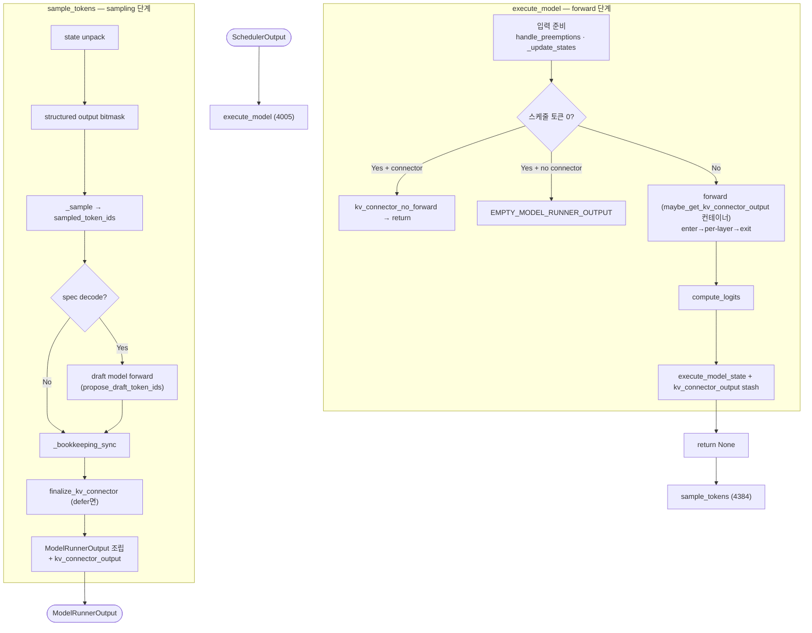
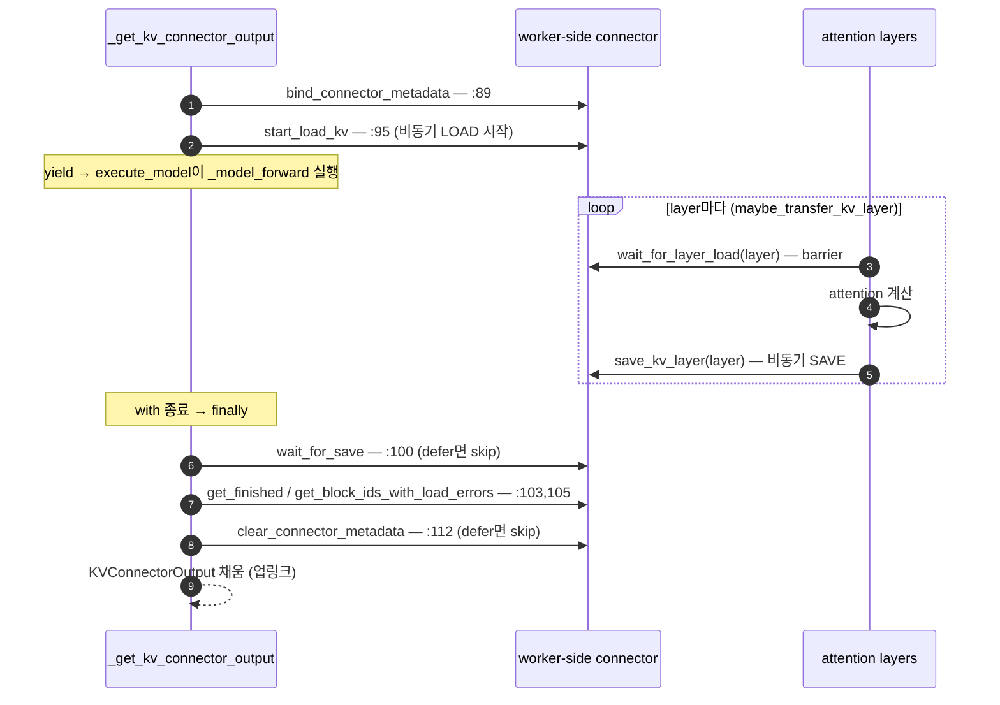

# V1 Worker — `execute_model` / `sample_tokens` 흐름

!!! note
    `vllm/v1/worker/gpu_model_runner.py`의 `GPUModelRunner`가 한 엔진 step에서 GPU를
    어떻게 돌리는지 정리하는 컴포넌트 노트입니다. scheduler가 만든 `SchedulerOutput`을
    받아 forward→sampling을 실행하고 `ModelRunnerOutput`을 돌려줍니다. KV connector
    worker-side lifecycle도 이 흐름 안에 박혀 있습니다(§4). scheduler 쪽은
    [Scheduler `schedule()` 흐름](v1_scheduler_schedule_flow_ko.md), 두 컴포넌트의
    상호작용은 [Connector 통신 구조](v1_pd_connector_communication_ko.md) 참고.

!!! warning "Baseline"
    upstream **`v0.23.0`** 기준. 모든 `file:line`은 이 버전 작업 트리에서 확인됨.

## 0. 대전제 — worker는 2단계로 쪼개져 있다

V1 worker는 한 step을 **두 메서드**로 나눕니다:

- **`execute_model`**(4005~4366): 입력 준비 → **model forward** → logits 계산 →
  상태를 `self.execute_model_state`에 stash하고 **`return None`**.
- **`sample_tokens`**(4384~): stash한 상태를 풀어 **sampling → draft → bookkeeping →
  connector finalize → `ModelRunnerOutput` 조립**.

둘은 `self.execute_model_state`(4347)와 `self.kv_connector_output`(4359)로 이어집니다.

> 왜 쪼갰나? **async scheduling** 때문입니다. forward를 launch한 뒤(`execute_model`
> 리턴) 엔진이 다음 step을 스케줄하는 동안 sampling을 분리 실행(`sample_tokens`)해
> CPU/GPU overlap을 키웁니다.

## 1. 전체 흐름 (한눈에)



## 2. `execute_model` — forward 단계 (4005~4366)

### (a) 입력 준비 (4016~4047)

```python
# ngram_gpu면 scheduler_output을 얕은 복사(engine core 측 오염 방지) — 4022~4034
if has_kv_transfer_group():
    get_kv_transfer_group().handle_preemptions(
        scheduler_output.kv_connector_metadata)            # :4039 async save connector의 선처리
deferred_state_corrections_fn = self._update_states(scheduler_output)  # :4047 persistent batch 갱신
```

- `_update_states`: `InputBatch`(요청 행, block table, slot mapping)를 이번 step에 맞게
  추가/제거/compact. async scheduling 보정은 `deferred_state_corrections_fn`로 미룸(4363).
- `handle_preemptions`: async save를 쓰는 connector가 **preempt/evict로 블록이 덮이기
  전에** 선처리.

### (b) no-work / EC encoder 분기 (4049~4073)

```python
if has_ec_transfer() and not get_ec_transfer().is_consumer:   # 멀티모달 인코더 분리
    with self.maybe_get_ec_connector_output(...):
        self._execute_mm_encoder(scheduler_output)
        return make_empty_encoder_model_runner_output(...)     # :4055

if not num_scheduled_tokens:                                   # forward할 토큰 없음
    if not has_kv_transfer_group():
        return EMPTY_MODEL_RUNNER_OUTPUT                       # :4072
    return self.kv_connector_no_forward(scheduler_output, ...) # :4073 KV 전송만 (forward X)
```

`kv_connector_no_forward`는 scheduler의 `load_kv_async`/`WAITING_FOR_REMOTE_KVS` step의
worker 측 실체(§4 참고).

### (c) model forward — connector 컨테이너로 감쌈 (4258~4287)

```python
defer_kv_connector_finalize = self.speculative_config is not None  # :4262 spec decode면 defer
with (
    set_forward_context(attn_metadata, self.vllm_config, ...),
    self.maybe_get_kv_connector_output(                           # :4276 connector 컨테이너
        scheduler_output, defer_finalize=defer_kv_connector_finalize) as kv_connector_output,
):
    model_output = self._model_forward(input_ids, positions, ...) # :4281 실제 forward
```

`with` 진입 시 connector `bind`+`start_load_kv`, forward 중 per-layer load/save, `with`
종료 시 `wait_for_save`(defer 아니면)+수확 — 상세는 §4.

### (d) postprocess → logits (4289~4345)

```python
hidden_states = model_output
if not get_pp_group().is_last_rank:           # PP 중간 rank
    self.kv_connector_output = kv_connector_output
    return hidden_states                       # :4304 IntermediateTensors 반환
if self.is_pooling_model:
    return self._pool(...)                     # :4308 임베딩/풀링 모델
sample_hidden_states = hidden_states[logits_indices]
logits = self.model.compute_logits(sample_hidden_states)   # :4316
```

### (e) 상태 stash → `return None` (4347~4366)

```python
self.execute_model_state = ExecuteModelState(scheduler_output, logits, spec_decode_metadata,
    ..., hidden_states, sample_hidden_states, aux_hidden_states, ec_connector_output, ...)  # :4347
self.kv_connector_output = kv_connector_output            # :4359 sample_tokens로 넘길 connector output
if deferred_state_corrections_fn:
    deferred_state_corrections_fn()                       # :4363 async 보정 적용
return None                                               # :4366 sampling은 sample_tokens에서
```

`execute_model`은 **forward만 launch하고 끝.** logits·hidden_states·connector output을
인스턴스에 stash하고 None을 반환 → 엔진이 이어서 `sample_tokens`를 부릅니다.

## 3. `sample_tokens` — sampling 단계 (4384~)

### (a) state unpack & 조기 분기 (4387~4411)

```python
if self.execute_model_state is None:                      # forward가 logits를 안 낸 경우(PP 중간 등)
    kv_connector_output = self.kv_connector_output; self.kv_connector_output = None
    return ModelRunnerOutput.with_kv_conn_output_only(kv_connector_output)  # :4395 connector output만
(scheduler_output, logits, spec_decode_metadata, ..., slot_mappings) = self.execute_model_state  # :4398
self.execute_model_state = None
```

### (b) structured output → sampling (4413~4423)

```python
if grammar_output is not None:
    apply_grammar_bitmask(scheduler_output, grammar_output, self.input_batch, logits)  # :4415
sampler_output = self._sample(logits, spec_decode_metadata)        # :4420 실제 토큰 샘플링
self._update_states_after_model_execute(sampler_output.sampled_token_ids, scheduler_output)  # :4422
```

### (c) speculative decode — draft model forward (4442~4555)

```python
def propose_draft_token_ids(sampled_token_ids):
    self._draft_token_ids = self.propose_draft_token_ids(scheduler_output, sampled_token_ids, ...)  # :4445 draft forward

spec_config = self.speculative_config
if spec_config is not None:
    input_fits_in_drafter = self._input_fits_in_drafter(spec_decode_common_attn_metadata)
    if (... EAGLE/draft, GPU 토큰 사용 가능 ...):
        propose_draft_token_ids(sampled_token_ids)        # bookkeeping 전에 draft
    else:
        propose_drafts_after_bookkeeping = input_fits_in_drafter   # ngram 등은 CPU 토큰 필요 → 후에
```

draft model이 **또 한 번 forward**해서 다음 step에 검증할 spec 토큰을 만듭니다. 이게
`defer_kv_connector_finalize`가 필요한 이유 — draft도 자기 KV를 save하므로 finalize를
이 뒤로 미뤄 둘을 한 번에 flush(§4 (c)/(e)).

### (d) bookkeeping → finalize → output (4538~4577)

```python
(..., valid_sampled_token_ids, ...) = self._bookkeeping_sync(
    scheduler_output, sampler_output, logits, hidden_states, ...)   # :4544 상태 동기화/CPU 복사
if propose_drafts_after_bookkeeping:
    propose_draft_token_ids(valid_sampled_token_ids)                # :4555 (ngram 등)
if spec_config is not None:
    self.finalize_kv_connector()                                    # :4561 미뤘던 wait_for_save+clear
kv_connector_output = self.kv_connector_output                      # :4567 draft가 수정했을 수 있어 재독
self.kv_connector_output = None
output = ModelRunnerOutput(
    req_ids=..., sampled_token_ids=valid_sampled_token_ids, logprobs=...,
    kv_connector_output=kv_connector_output,                        # :4577 업링크 부착
)
return output
```

`_bookkeeping_sync`: sampled 토큰을 `InputBatch`/`CachedRequestState`에 반영하고 CPU로
복사(다음 step·detokenize 준비). 마지막에 connector finalize(spec일 때) → `KVConnectorOutput`을
실은 `ModelRunnerOutput`을 scheduler로 반환.

## 4. KV connector worker-side lifecycle (이 흐름 안에서)

worker-side connector hook은 **execute_model의 forward를 감싸는 contextmanager
`_get_kv_connector_output`(`kv_connector_model_runner_mixin.py:78`)** 안에서 한 단위로 돕니다.

### enter → forward 본문 → exit

```python
# kv_connector_model_runner_mixin.py:78~112 (요약)
@contextmanager
def _get_kv_connector_output(scheduler_output, wait_for_save=True, defer_finalize=False):
    output = KVConnectorOutput()
    kv_connector = get_kv_transfer_group()
    kv_connector.bind_connector_metadata(scheduler_output.kv_connector_metadata)  # :89  ENTER (다운링크 수신)
    kv_connector.start_load_kv(get_forward_context())                             # :95  ENTER (비동기 LOAD)
    try:
        yield output                       # ← execute_model의 with 본문(forward)이 여기서 실행
    finally:
        if wait_for_save and not defer_finalize:
            kv_connector.wait_for_save()                                          # :100 EXIT (save 배리어)
        output.finished_sending, output.finished_recving = \
            kv_connector.get_finished(scheduler_output.finished_req_ids)          # :103 EXIT (수확)
        output.invalid_block_ids = kv_connector.get_block_ids_with_load_errors()  # :105 EXIT (수확)
        if not defer_finalize:
            kv_connector.clear_connector_metadata()                              # :112 EXIT
```

forward 본문 안의 **per-layer hook**(`wait_for_layer_load`/`save_kv_layer`)은 attention을
감싸는 데코레이터 `maybe_transfer_kv_layer`(`model_executor/layers/attention/kv_transfer_utils.py:15`)가
호출합니다.



### 세 진입점 + defer

| 진입점 | 언제 | 비고 |
| --- | --- | --- |
| `maybe_get_kv_connector_output` (mixin:50) | 일반 forward (execute_model:4276) | group 없으면 nullcontext |
| `kv_connector_no_forward` (mixin:35) | forward 없는 KV step (execute_model:4073) | start_load+수확만, `wait_for_save=False` |
| `finalize_kv_connector` (mixin:63) | spec decode 후 (sample_tokens:4561) | 미뤘던 `wait_for_save`+`clear` |

- **defer_finalize**(execute_model:4262)는 spec decode일 때 켜져, main forward exit에서
  `wait_for_save`/`clear`를 건너뛰고 → draft forward 뒤 `sample_tokens`에서
  `finalize_kv_connector`로 마무리. **target+draft 두 forward의 save를 한 번에 flush.**
- `self.kv_connector_output`이 execute_model(4359)에서 stash되어 sample_tokens(4388/4567)로
  넘어가는 것도, 두 메서드(+draft)에 걸쳐 connector output을 보존하기 위함.

## 5. Code Map (v0.23.0)

| 심볼 | 위치 | 역할 |
| --- | --- | --- |
| `execute_model` | `gpu_model_runner.py:4005` | forward 단계 (입력준비→forward→logits→stash→None) |
| `sample_tokens` | `gpu_model_runner.py:4384` | sampling 단계 (sample→draft→bookkeep→finalize→output) |
| `ExecuteModelState` stash | `:4347` | 두 메서드를 잇는 ephemeral 상태 |
| `_update_states` | `:4047` | InputBatch/block table 갱신 |
| `handle_preemptions` | `:4039` | async save connector 선처리 |
| no-work 분기 | `:4057~4073` | EMPTY / `kv_connector_no_forward` |
| forward 컨테이너 | `:4276` | `maybe_get_kv_connector_output`로 forward 감쌈 |
| `_sample` | `:4420` | 토큰 샘플링 |
| `propose_draft_token_ids` | `:4445` | draft model forward (spec decode) |
| `_bookkeeping_sync` | `:4544` | 상태 동기화 + CPU 복사 |
| `finalize_kv_connector` | `:4561` | 지연 finalize (spec) |
| `ModelRunnerOutput` 조립 | `:4571` | 업링크 (`kv_connector_output` 포함) |
| `_get_kv_connector_output` | `kv_connector_model_runner_mixin.py:78` | connector lifecycle 컨테이너 |
| `maybe_transfer_kv_layer` | `kv_transfer_utils.py:15` | per-layer load/save 데코레이터 |

## 6. 한 줄 요약

> V1 worker는 한 step을 **`execute_model`(forward launch → 상태 stash → None)** 과
> **`sample_tokens`(sample → draft → bookkeep → output)** 로 쪼개 async overlap을 얻고,
> 그 forward를 **`_get_kv_connector_output` 컨테이너**로 감싸 KV connector의
> load→per-layer→save→수확 lifecycle을 한 단위로 실행한 뒤, 결과를
> `ModelRunnerOutput.kv_connector_output`(업링크)으로 scheduler에 되돌린다.
