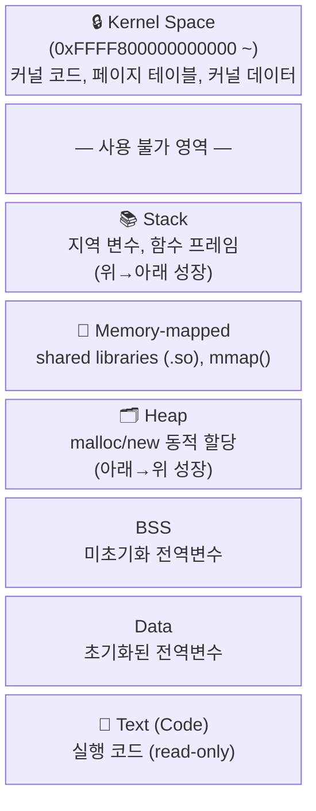
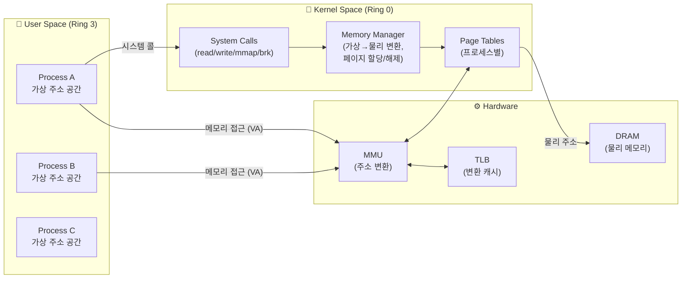
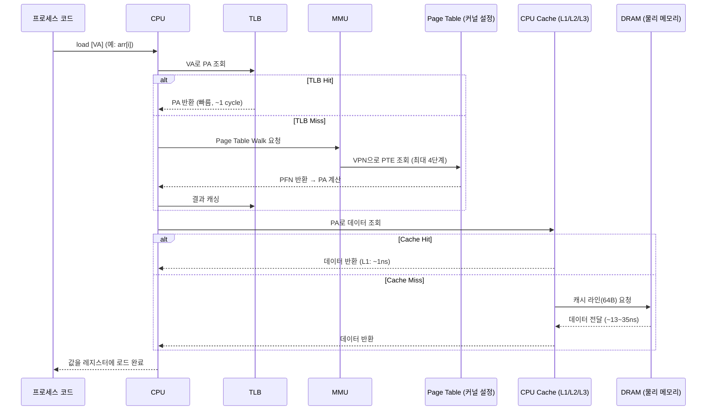
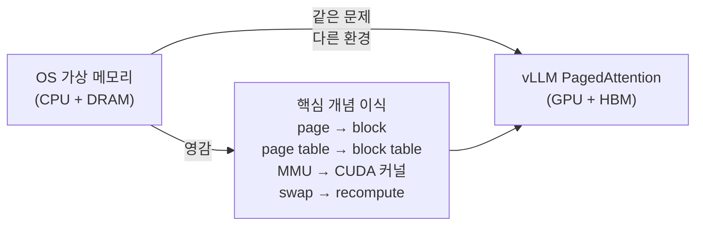

# Chapter 1 — Introduction: Linux에서 데이터는 어떻게 저장되고 접근되는가

---

## 핵심 질문

> 내가 `x = arr[i]` 한 줄을 실행할 때, 실제로 무슨 일이 일어나는가?

이 질문의 답은 단순하지 않다.  
OS와 하드웨어가 협력하는 수십 단계의 과정이 숨어 있다.  
이 Chapter에서는 그 과정을 끝까지 추적한다.

---

## 1. 프로세스의 주소 공간 (Virtual Address Space)

Linux에서 모든 프로세스는 **자신만의 가상 주소 공간**을 가진다.  
이 공간은 실제 물리 메모리와 1:1로 대응되지 않는다 — 운영체제가 중간에서 관리한다.

### 프로세스 메모리 레이아웃 (x86-64, 64-bit Linux)

```
높은 주소
┌──────────────────────────────────┐  0xFFFFFFFFFFFFFFFF
│          Kernel Space            │  (커널 전용, 프로세스에서 직접 접근 불가)
│   (커널 코드, 데이터, 페이지 테이블) │
├──────────────────────────────────┤  0xFFFF800000000000
│         (사용 불가 영역)          │
├──────────────────────────────────┤  0x00007FFFFFFFFFFF
│           Stack                  │  ← 위에서 아래로 성장
│     (지역 변수, 함수 호출 프레임) │    (각 쓰레드마다 별도)
│              ↓                   │
├──────────────────────────────────┤
│      Memory-mapped region        │  mmap(), shared library
│       (파일 매핑, 공유 메모리)    │
├──────────────────────────────────┤
│              ↑                   │
│            Heap                  │  ← 아래에서 위로 성장
│    (malloc/new로 동적 할당)       │    (brk/mmap 시스템콜)
├──────────────────────────────────┤
│        BSS Segment               │  초기화되지 않은 전역/정적 변수
├──────────────────────────────────┤
│        Data Segment              │  초기화된 전역/정적 변수
├──────────────────────────────────┤
│        Text Segment              │  실행 코드 (read-only)
└──────────────────────────────────┘  0x0000000000000000 (NULL)
낮은 주소
```



---

## 2. 커널 공간과 유저 공간의 분리



- **유저 공간**: 일반 프로세스가 실행되는 영역. 물리 메모리를 직접 볼 수 없음.
- **커널 공간**: OS 커널이 실행되는 영역. 물리 메모리 전체에 접근 가능.
- **MMU**: 하드웨어 칩. 유저가 VA를 발행하면 커널이 설정한 page table을 참조해 PA로 변환.
- **TLB**: 변환 결과 캐시. 동일한 VA 재접근 시 page table 탐색 없이 즉시 PA 반환.

---

## 3. "프로세스가 메모리를 읽을 때" — High-level 흐름



---

## 4. 이 Chapter에서 다루는 것

각 단계를 하나씩 깊이 파헤친다:

| 섹션 | 주제 | 핵심 질문 |
|------|------|-----------|
| 1.1 | 왜 가상 메모리인가 | 연속 할당의 문제점은? |
| 1.2 | Page와 Page Frame | page와 frame은 무엇이 다른가? |
| 1.3 | VA → PA 변환 | TLB와 page table은 어떻게 동작하는가? |
| 1.4 | PA → Data (물리 접근) | PA가 나온 후 데이터가 오기까지 얼마나 걸리는가? |
| 1.5 | Page Frame Allocator | 커널은 물리 프레임을 어떻게 할당하는가? |
| 1.6 | Page Replacement | 메모리 부족 시 어떤 페이지를 내쫓는가? |
| 1.7 | Shared Pages / COW | 여러 프로세스가 메모리를 어떻게 공유하는가? |
| 1.8 | OOM | 메모리가 완전히 부족하면 무슨 일이 일어나는가? |

---

## 5. 왜 이것이 vLLM과 연결되는가

> Chapter 2의 복선

이 모든 메커니즘은 **CPU + DRAM 환경**을 위해 설계되었다.  
vLLM은 동일한 문제를 **GPU + HBM 환경**에서 마주쳤고,  
OS의 설계에서 영감을 받아 독자적인 메모리 관리 시스템을 만들었다.



Chapter 1을 공부하면서 각 개념이 Chapter 2에서 어떻게 대응될지 염두에 두자.
