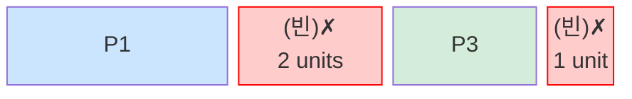
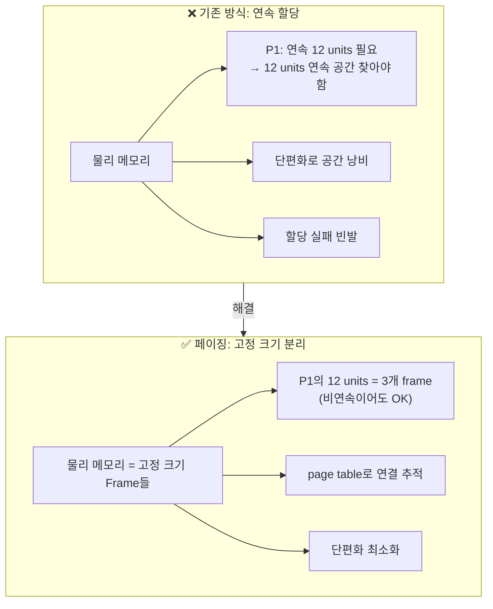
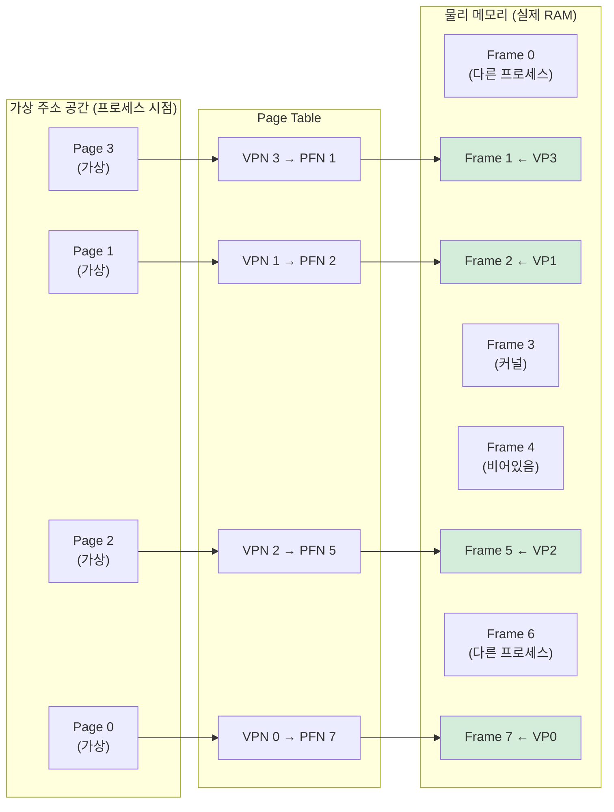
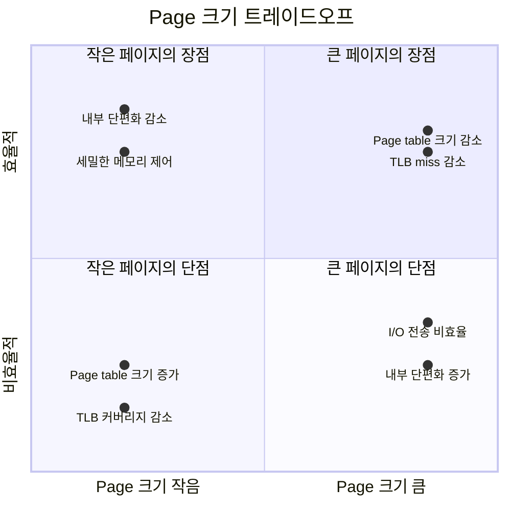
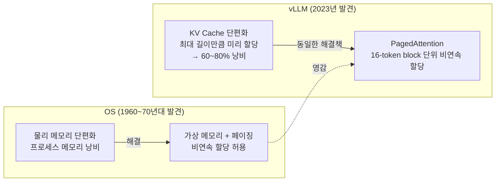

# 1.1 왜 가상 메모리인가 — 문제 정의

---

## 1. 가상 메모리 이전의 세계

초기 시스템에서는 프로세스가 **물리 주소를 직접 사용**했다.  
모든 프로그램은 RAM의 특정 위치를 직접 참조했고, 운영체제가 중간에 끼어들지 않았다.

### 문제 1: 외부 단편화 (External Fragmentation)

프로세스가 실행되고 종료되면서 메모리에 구멍이 생긴다.

```
초기 상태 (8 units 가용):
┌────┬────┬────┬────┬────┬────┬────┬────┐
│ 빈 │ 빈 │ 빈 │ 빈 │ 빈 │ 빈 │ 빈 │ 빈 │
└────┴────┴────┴────┴────┴────┴────┴────┘

P1(3), P2(2), P3(2) 순서로 할당:
┌────┬────┬────┬────┬────┬────┬────┬────┐
│ P1 │ P1 │ P1 │ P2 │ P2 │ P3 │ P3 │ 빈 │
└────┴────┴────┴────┴────┴────┴────┴────┘

P2 종료 후:
┌────┬────┬────┬────┬────┬────┬────┬────┐
│ P1 │ P1 │ P1 │ 빈 │ 빈 │ P3 │ P3 │ 빈 │
└────┴────┴────┴────┴────┴────┴────┴────┘
                ↑              ↑
              2 units        1 unit
         → 합치면 3 units이지만 연속이 아니라 3-unit 프로세스 할당 불가!
```



**→ 총 여유 공간 3 units이 있지만, 연속 3 units 요청은 실패**

---

### 문제 2: 내부 단편화 (Internal Fragmentation)

프로세스가 필요한 것보다 큰 단위로 메모리를 받으면, 내부에 낭비가 생긴다.

```
할당 단위: 4 units
프로세스 실제 필요: 3 units

┌────┬────┬────┬────┐
│████│████│████│낭비│  ← 1 unit 내부 낭비
└────┴────┴────┴────┘
       프로세스에 할당된 4 units
```

---

### 문제 3: 보안과 격리 불가

- 프로세스 A가 프로세스 B의 메모리 주소를 직접 읽을 수 있다
- 잘못된 포인터 하나로 다른 프로세스 데이터 오염 가능
- 커널 메모리도 접근 가능 → 심각한 보안 취약점

---

## 2. 핵심 통찰: 고정 크기 단위로 분리하자

OS 설계자들의 해답: **"연속 할당"을 포기하고, 고정 크기 단위(page)로 쪼개라**



---

## 3. 페이징의 핵심 아이디어



**핵심**: 프로세스 입장에서 가상 주소는 연속적이지만, 물리 메모리에서는 비연속적으로 흩어져 있다.  
Page Table이 이 매핑을 관리한다.

---

## 4. 페이징이 해결하는 것

| 문제 | 해결 방법 |
|------|-----------|
| 외부 단편화 | 고정 크기 frame 단위로 할당 → 구멍이 생겨도 다른 frame 사용 가능 |
| 내부 단편화 | 최대 page_size - 1 bytes의 낭비만 발생 (마지막 page) |
| 격리 | 각 프로세스가 자신의 page table 사용 → 다른 프로세스 메모리 접근 불가 |
| 보안 | page table entry에 permission bit (R/W/X/U) → 권한 없는 접근 차단 |

---

## 5. Page 크기의 선택: 왜 4KB인가?



- **4KB**는 수십 년 실험으로 검증된 균형점
- 너무 작으면: page table이 거대해짐 (4GB 공간 / 4KB = 100만 개 PTE)
- 너무 크면: 내부 단편화 큼, 프로세스 하나가 큰 페이지를 독점
- **Huge Page (2MB, 1GB)**: 특정 워크로드(DB, HPC)에서 TLB miss 감소 목적으로 활용

---

## 6. Chapter 2 복선: LLM도 같은 문제를 겪었다



> *"논문에서 vLLM 팀은 OS의 가상 메모리에서 직접 영감을 받았다고 명시했다"*  
> 같은 문제, 같은 해결책 — 단지 CPU RAM 대신 GPU VRAM에서.
