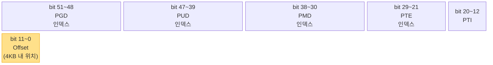
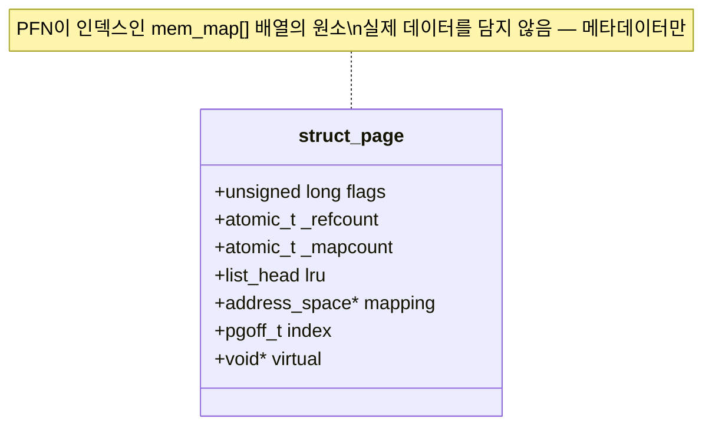
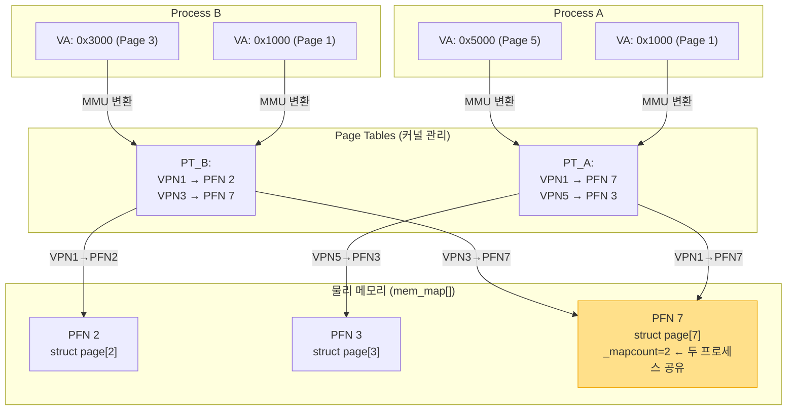
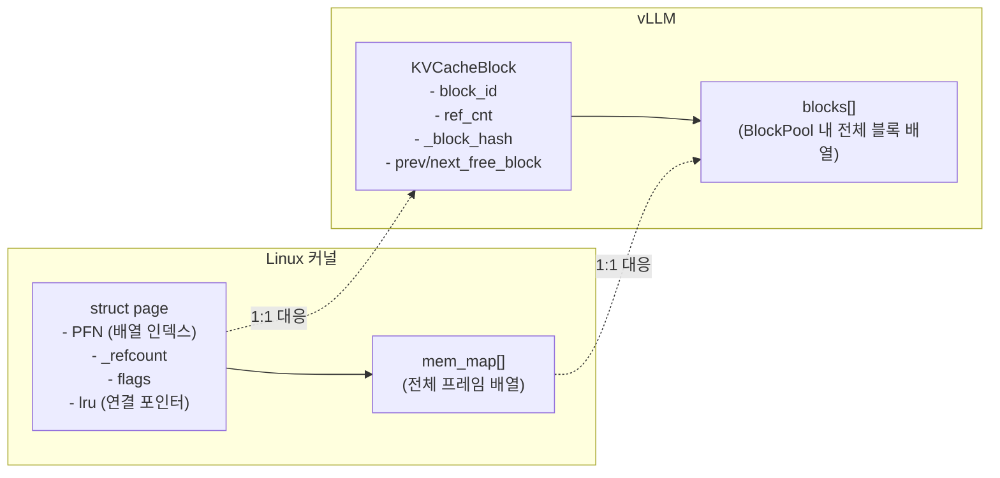

# 1.2 Page와 Page Frame

---

## 1. 핵심 구분: 논리 vs 물리

페이징의 핵심은 **두 개의 다른 세계**를 분리하는 것이다.


| | Page (논리) | Page Frame (물리) |
|---|---|---|
| **위치** | 가상 주소 공간 | 물리 RAM |
| **번호** | VPN (Virtual Page Number) | PFN (Page Frame Number) |
| **개수** | 가상 공간 크기에 따라 (x86-64: 2^52개) | RAM 크기에 따라 (16GB RAM / 4KB = 4M개) |
| **메타데이터** | PTE (Page Table Entry) | `struct page` |

---

## 2. 주소 비트 분해

4KB page 기준으로 64-bit VA는 다음과 같이 분해된다:

```
64-bit Virtual Address:
┌─────────────────────────────────────────┬────────────┐
│          VPN (Virtual Page Number)      │   Offset   │
│  상위 52 bits (page table 인덱스로 사용) │  하위 12 bits │
│                                         │ (page 내 위치) │
└─────────────────────────────────────────┴────────────┘
                                           ↑
                                   2^12 = 4096 = 4KB
```



- **상위 bits (VPN)**: page table 탐색에 사용 (4-level: PGD/PUD/PMD/PTE 인덱스)
- **하위 12 bits (offset)**: page 내의 byte 위치 (0~4095)

---

## 3. `struct page` — 물리 프레임의 메타데이터

Linux 커널은 모든 물리 프레임에 대해 `struct page` 하나를 유지한다.  
(`mem_map[]` 배열에 저장 — 인덱스 = PFN)

```c
// include/linux/mm_types.h (단순화)
struct page {
    unsigned long flags;       // PG_locked, PG_dirty, PG_active, PG_uptodate ...
    atomic_t _refcount;        // 참조 카운트 (0이면 해제 가능)
    atomic_t _mapcount;        // page table entry 수 (몇 개 프로세스가 참조)
    struct list_head lru;      // LRU 리스트 연결 (active/inactive list)
    struct address_space *mapping; // page cache: 어느 파일의 몇 번째 page?
    pgoff_t index;             // 파일 내 offset
    void *virtual;             // 가상 주소 (커널 주소 공간에서)
    /* ... 기타 필드 생략 ... */
};
```



### 주요 flags 비트

| Flag | 의미 |
|------|------|
| `PG_locked` | 현재 I/O 중 — 다른 접근 차단 |
| `PG_dirty` | 내용이 수정됨 — 디스크에 써야 함 |
| `PG_active` | active LRU 리스트에 있음 |
| `PG_unevictable` | 절대 evict 불가 (mlock 등) |
| `PG_uptodate` | 디스크와 동기화됨 |
| `PG_referenced` | 최근 접근됨 (LRU 결정에 사용) |

---

## 4. `mem_map[]` — 전체 프레임 배열

```
물리 메모리 전체:
┌──────┬──────┬──────┬──────┬──────┬──────┬──────┐
│Frame0│Frame1│Frame2│Frame3│Frame4│Frame5│Frame6│  ...  (물리 DRAM)
└──────┴──────┴──────┴──────┴──────┴──────┴──────┘
   ↑       ↑       ↑
   ↓       ↓       ↓
┌──────┬──────┬──────┬──────┬──────┬──────┬──────┐
│pg[0] │pg[1] │pg[2] │pg[3] │pg[4] │pg[5] │pg[6] │  ...  (mem_map[])
└──────┴──────┴──────┴──────┴──────┴──────┴──────┘
   PFN=0  PFN=1  PFN=2  ...

mem_map[PFN] = 해당 물리 프레임의 struct page
```

**메모리 오버헤드**: `struct page` 하나 ≈ 64 bytes  
→ 16GB RAM = 4M frames → 4M × 64B = **256MB** (약 1.5% 오버헤드)

---

## 5. Page Table Entry (PTE)

각 VPN에 대한 PTE 구조 (x86-64):

```
63        52 51           12 11  9  8  7  6  5  4  3  2  1  0
┌──────────┬───────────────┬────────────────────────────────────┐
│ Reserved │  PFN (40 bits)│ Ignored │G │PS │D │A │PCD│PWT│U │W │P │
└──────────┴───────────────┴────────────────────────────────────┘
```

| 비트 | 이름 | 의미 |
|------|------|------|
| 0 (P) | Present | 1이면 물리 메모리에 있음. 0이면 page fault |
| 1 (W) | Writable | 1이면 쓰기 가능 |
| 2 (U) | User | 1이면 유저 공간 접근 가능 |
| 5 (A) | Accessed | MMU가 접근 시 자동 set (LRU에 활용) |
| 6 (D) | Dirty | MMU가 쓰기 시 자동 set |
| 12~51 | PFN | 물리 프레임 번호 (40 bits → 최대 4PB 물리 메모리) |

---

## 6. Page와 Page Frame의 관계 정리



- **같은 VA라도 프로세스마다 다른 PA** (격리 보장)
- **하나의 PA를 여러 프로세스가 공유 가능** (shared pages, 1.7절)
- `struct page[7]._mapcount = 2` → 두 프로세스가 PFN 7을 참조 중

---

## 7. Chapter 2 복선: `struct page` → `KVCacheBlock`

vLLM은 `struct page`와 정확히 같은 역할의 구조체를 GPU 블록 메타데이터로 사용한다:


