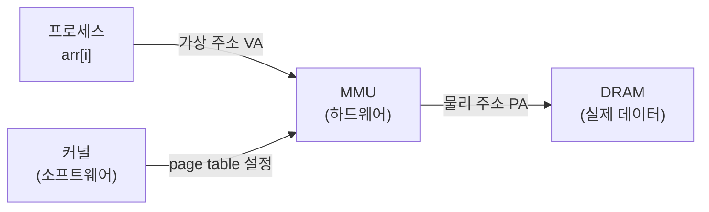
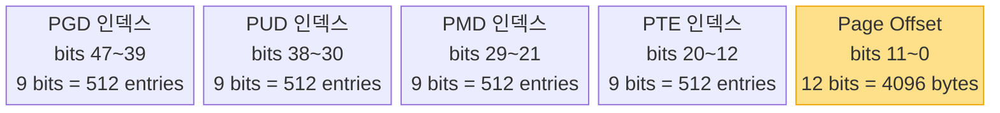
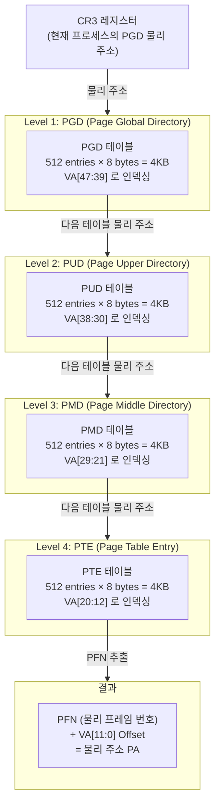
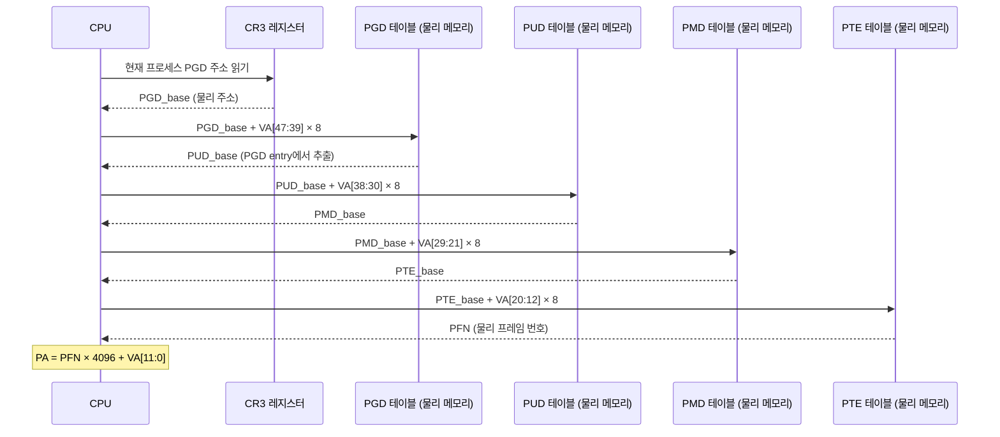
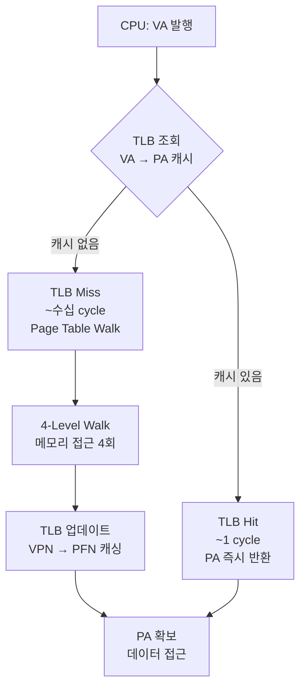
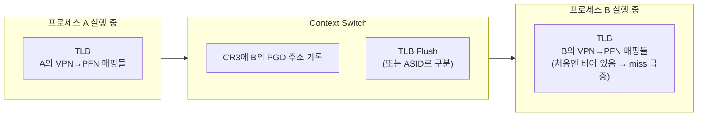
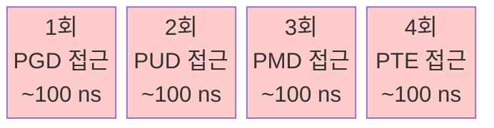
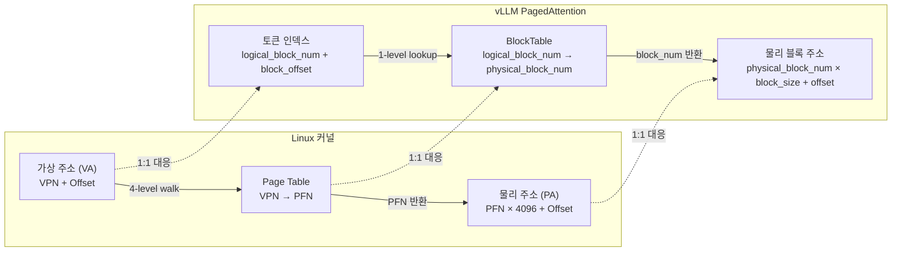

# 1.3 VA → PA 변환: TLB와 Page Table Walk

---

## 1. 문제: 모든 메모리 접근마다 변환이 필요하다

프로세스가 발행하는 모든 주소는 가상 주소(VA)다.  
CPU가 실제로 데이터를 읽으려면 반드시 물리 주소(PA)로 변환해야 한다.



변환 비용이 높으면 **모든 메모리 접근이 느려진다** — 이것이 TLB의 존재 이유다.

---

## 2. VA 비트 구조 (x86-64, 4KB page)

x86-64에서 실제로 사용되는 VA는 48비트다 (나머지는 sign extension).

```
48-bit Virtual Address (사용 중인 부분):
┌────────┬────────┬────────┬────────┬──────────────┐
│  PGD   │  PUD   │  PMD   │  PTE   │    Offset    │
│ [47:39]│ [38:30]│ [29:21]│ [20:12]│   [11:0]     │
│  9 bits│  9 bits│  9 bits│  9 bits│   12 bits    │
│ (512개)│ (512개)│ (512개)│ (512개)│  (4096 bytes)│
└────────┴────────┴────────┴────────┴──────────────┘
```



- 각 level은 **512개 entry**의 테이블을 인덱싱 (9 bits = 2^9)
- 총 VA 공간: 2^48 = 256 TB
- Offset 12 bits = 4096 bytes = 4 KB page 내 위치

---

## 3. 4-Level Page Table Walk

### 구조 개관



### 단계별 동작



---

## 4. TLB: Translation Lookaside Buffer

4-level walk는 **메모리 접근 4번**을 의미한다. 모든 접근마다 이를 수행하면 성능이 4배 저하된다.

**해결책**: 변환 결과를 하드웨어 캐시에 저장 → **TLB**



### TLB 스펙 (일반적인 x86-64 CPU)

| 항목 | L1 ITLB | L1 DTLB | L2 STLB |
|------|---------|---------|---------|
| 용량 | ~128 entries | ~64 entries | ~1536 entries |
| 레이턴시 | 1 cycle | 1 cycle | ~7 cycles |
| 커버리지 (4KB) | 512 KB | 256 KB | 6 MB |
| 커버리지 (2MB) | 256 MB | 128 MB | 3 GB |

### Context Switch 시 TLB



- Context switch 후 TLB miss가 급증 → **TLB warmup cost**
- ASID (Address Space ID): 프로세스 ID를 TLB entry에 태깅해 flush 없이 공존 가능

---

## 5. Page Table Walk 비용 분석



- TLB miss 1회 = DRAM 접근 4회 = **~400 ns 추가 지연**
- TLB hit = **~1 cycle ≈ 0.3 ns** (캐시 히트 수준)
- hit rate 99% 유지가 성능에 결정적

### Page Table 메모리 오버헤드

```
최악의 경우: 48-bit VA 공간 전체를 flat page table로 만들면?
→ 2^36 entries × 8 bytes = 512 GB (불가능)

4-level 계층적 table: 사용하는 범위만 테이블 생성
→ 일반 프로세스: 수 KB ~ 수 MB 수준
```

---

## 6. Huge Page와 TLB 효율

4KB page의 한계: TLB 64 entries × 4KB = 고작 256KB 커버

```mermaid
quadrantChart
    title Page 크기별 TLB 커버리지 vs 내부 단편화
    x-axis "내부 단편화 작음" --> "내부 단편화 큼"
    y-axis "TLB 커버리지 작음" --> "TLB 커버리지 큼"
    quadrant-1 이상적 (단편화도 크고 커버리지도 큼)
    quadrant-2 최적 영역
    quadrant-3 최악 (둘 다 나쁨)
    quadrant-4 TLB miss 많음

    "4KB (기본)": [0.1, 0.2]
    "2MB (Huge)": [0.5, 0.75]
    "1GB (Huge)": [0.9, 0.95]
```

- **2MB Huge Page**: TLB 64 entries × 2MB = 128MB 커버 → TLB miss 대폭 감소
- 대규모 메모리 접근 워크로드 (DB, HPC, vLLM 추론)에서 효과적

---

## 7. Chapter 2 복선: Block Table = Page Table

vLLM의 `BlockTable`은 Page Table과 동일한 역할을 한다:



- OS: 4-level walk (하드웨어 지원, 복잡)
- vLLM: 1-level lookup (소프트웨어, 단순) — GPU는 가상 메모리 없음
- 핵심 아이디어는 동일: **논리 → 물리 매핑 테이블**
