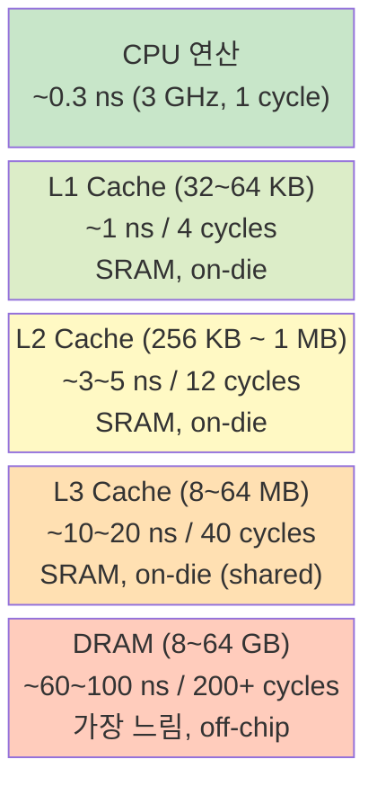
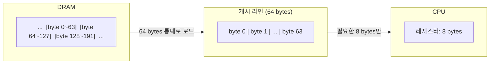
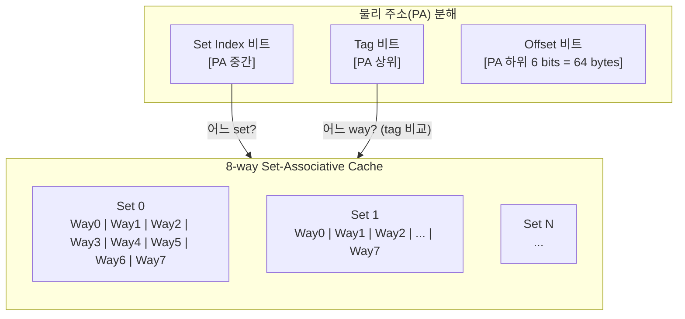
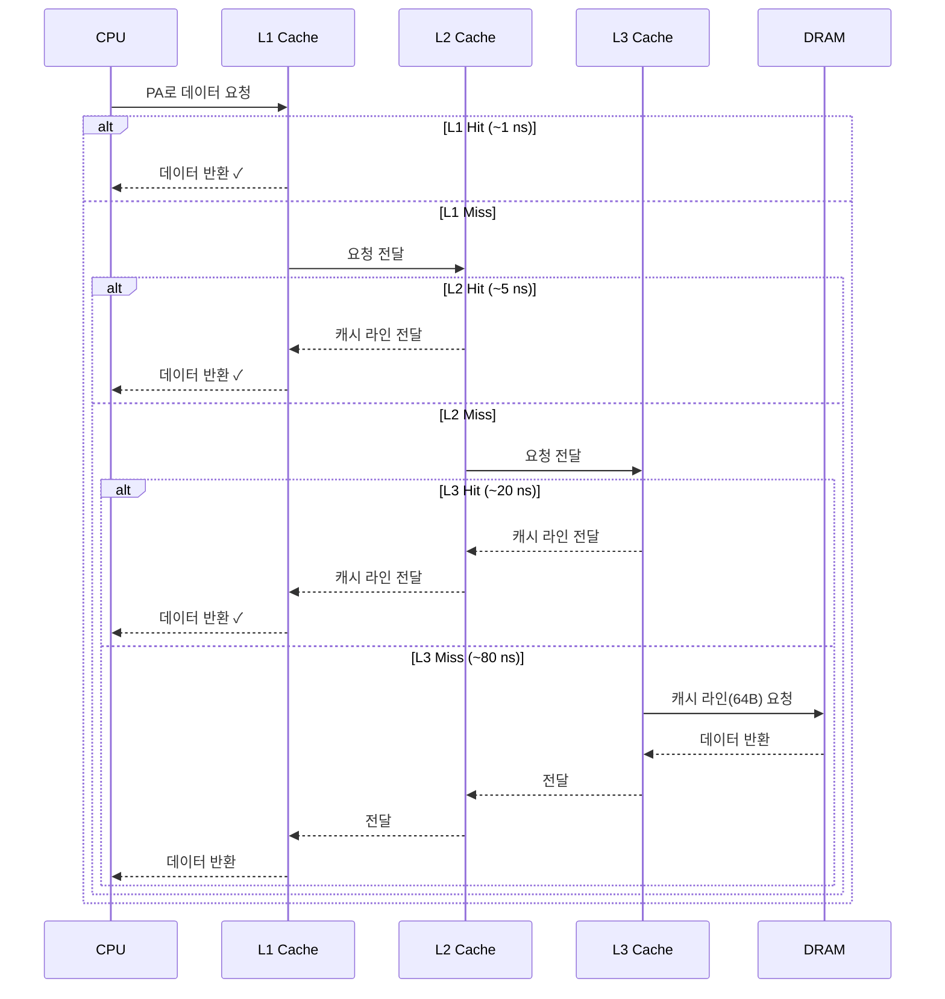
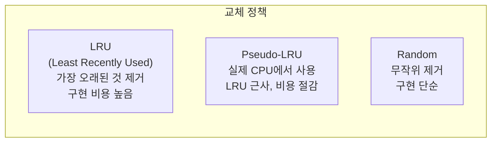
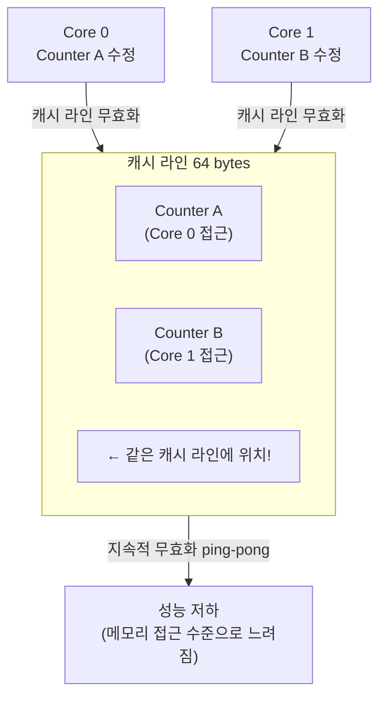
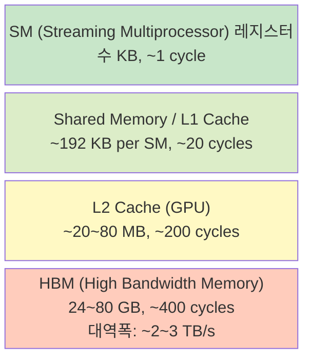

# 1.4.1 CPU 캐시 계층: L1 / L2 / L3 / DRAM

---

## 1. 왜 캐시가 필요한가

CPU 연산 속도와 DRAM 속도 간의 격차 (Memory Wall):



| 계층 | 용량 | 레이턴시 | 대역폭 | 위치 |
|------|------|----------|--------|------|
| L1 | 32~64 KB | ~1 ns | ~1 TB/s | 코어당 |
| L2 | 256 KB~1 MB | ~5 ns | ~400 GB/s | 코어당 |
| L3 | 8~64 MB | ~20 ns | ~200 GB/s | 소켓 공유 |
| DRAM | 8~256 GB | ~80 ns | ~50 GB/s | 보드 |

---

## 2. 캐시 라인 (Cache Line)

캐시는 **바이트 단위가 아니라 캐시 라인 단위**로 동작한다.



- x86-64에서 캐시 라인 크기 = **64 bytes** (고정)
- 1 byte만 필요해도 64 bytes 전체를 DRAM에서 가져옴
- **Spatial locality** 활용: 인접 데이터를 미리 캐싱

---

## 3. 캐시 구조: Set-Associative

캐시는 `Set × Way` 구조로 구성된다.



### 예: 32KB L1 캐시, 8-way, 64B 캐시 라인

```
총 라인 수 = 32KB / 64B = 512 lines
Set 수 = 512 / 8 = 64 sets
Set Index 비트 수 = log2(64) = 6 bits
Offset 비트 수 = log2(64) = 6 bits
Tag 비트 수 = 48 - 6 - 6 = 36 bits
```

---

## 4. 캐시 히트/미스 흐름



---

## 5. 캐시 교체 정책 (Eviction Policy)

캐시가 가득 찼을 때 어떤 라인을 내보낼지:



- 실제 CPU L1/L2: **Pseudo-LRU** 또는 **Tree-LRU** 사용
- L3: 제조사마다 다름 (Intel: 독자 알고리즘)

---

## 6. False Sharing (캐시 오염)



- 서로 다른 데이터지만 **같은 캐시 라인**에 있으면 서로 간섭
- 해결: 패딩으로 다른 캐시 라인에 배치 (`alignas(64)`)

---

## 7. Chapter 2 복선: GPU HBM의 캐시 구조

vLLM이 동작하는 GPU의 메모리 계층:



- GPU HBM은 CPU DRAM보다 **대역폭이 50배** 높음 (~3 TB/s vs ~50 GB/s)
- KV Cache는 HBM에 저장 → 대역폭이 성능 병목
- KV Cache 접근 패턴 (순차 vs 랜덤)이 처리량에 직접 영향
