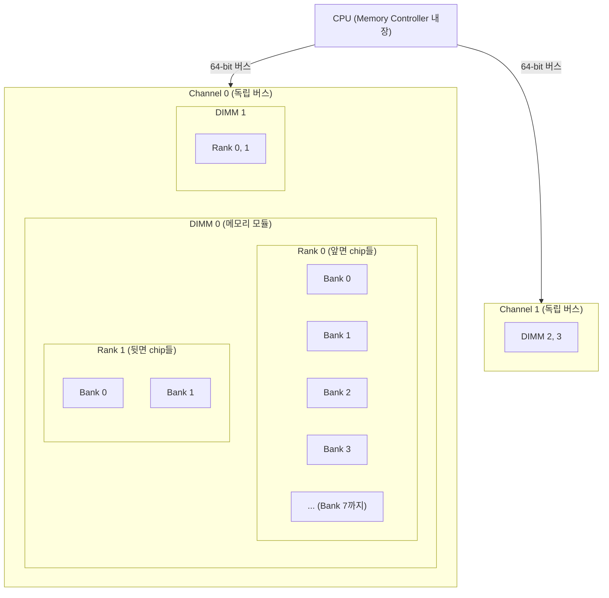
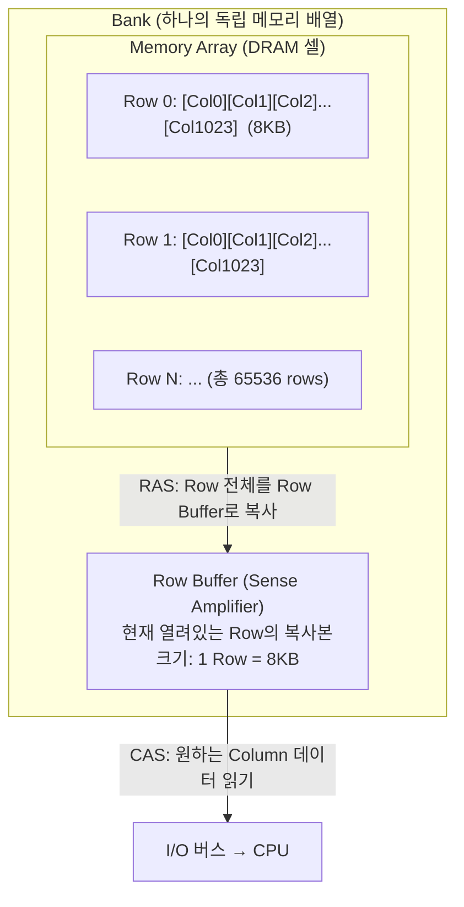
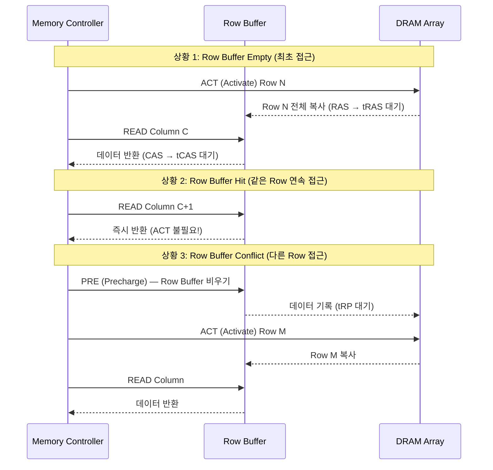
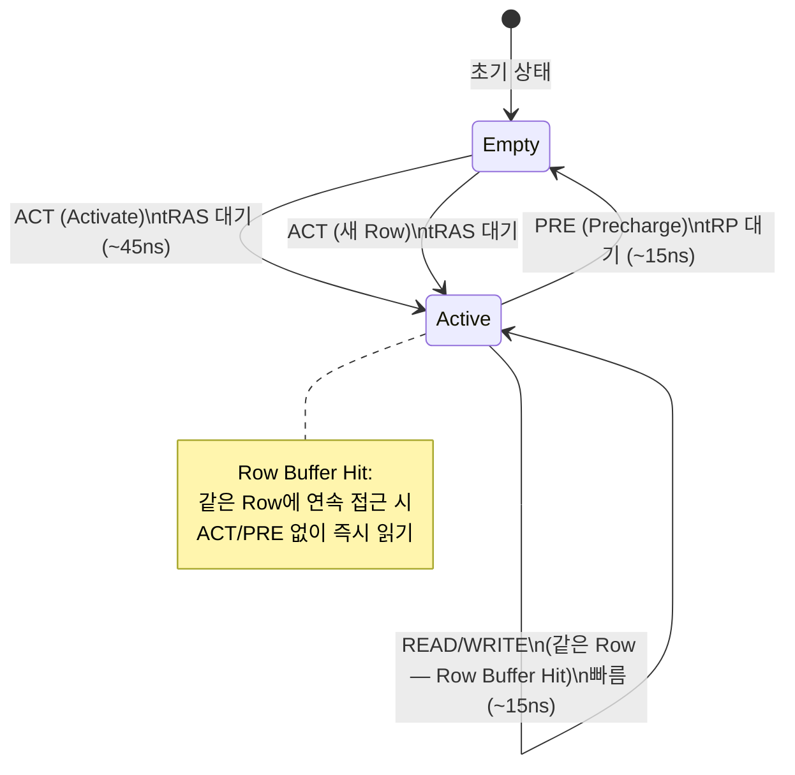
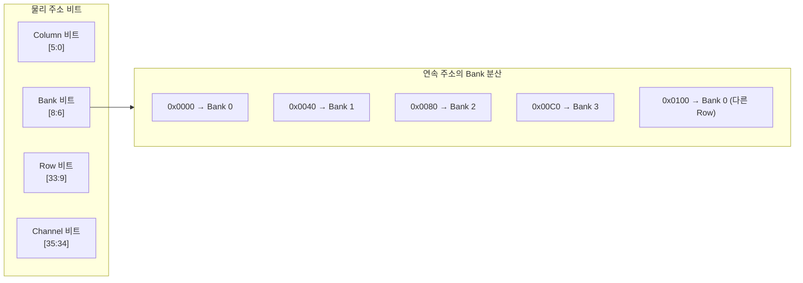
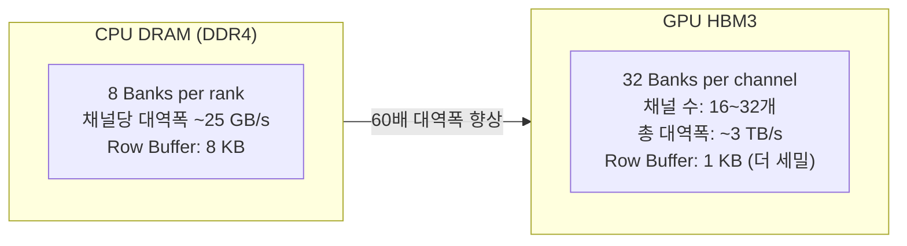

# 1.4.2 DRAM 물리 구조: Channel / Rank / Bank / Row / Column

---

## 1. 전체 계층 구조

CPU에서 DRAM까지는 여러 계층을 통해 연결된다.

| 계층 | 설명 | 병렬성 |
|------|------|--------|
| **Channel** | 독립적인 메모리 버스 (보통 2~4개) | 완전 병렬 |
| **Rank** | DIMM 위 칩들의 그룹 (앞/뒤) | 번갈아 접근 |
| **Bank** | 칩 내부 독립 배열 (보통 8~16개) | 동시 활성화 가능 |
| **Row** | Bank 내 행 (보통 65536개) | 한 번에 1개 열림 |
| **Column** | Row 내 단위 데이터 | 순서대로 읽기 |

---

## 2. Bank 내부 구조: Row와 Row Buffer

- **Row Buffer**: Bank당 하나. 현재 활성화된 Row의 내용을 담는 고속 버퍼.
- 모든 DRAM 접근은 먼저 Row를 Buffer로 올린 후 Column을 읽는다.

---

## 3. DRAM 명령 시퀀스

---

## 4. Row Buffer 상태 전이

---

## 5. 주소 인터리빙 (Address Interleaving)

메모리 컨트롤러는 연속 주소를 어떻게 Bank에 매핑하는지:

- 연속 주소를 다른 Bank로 분산 → **Bank 병렬 접근** 가능
- 64-byte 캐시 라인 경계마다 다른 Bank → 캐시 라인 읽기 중 다음 준비 가능

---

## 6. Chapter 2 복선: HBM의 뱅크 병렬성

- HBM: bank 수가 훨씬 많고, 각 bank의 Row Buffer가 작아 **충돌 확률 감소**
- KV Cache의 비순차 블록 접근도 HBM에서는 상대적으로 덜 불리함
- 그러나 접근 패턴 최적화 (코어레스드 접근)는 여전히 중요
