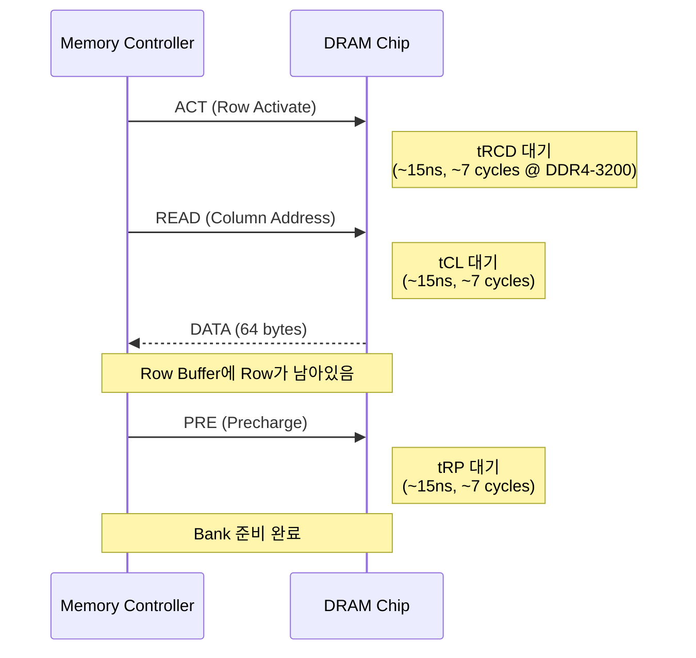
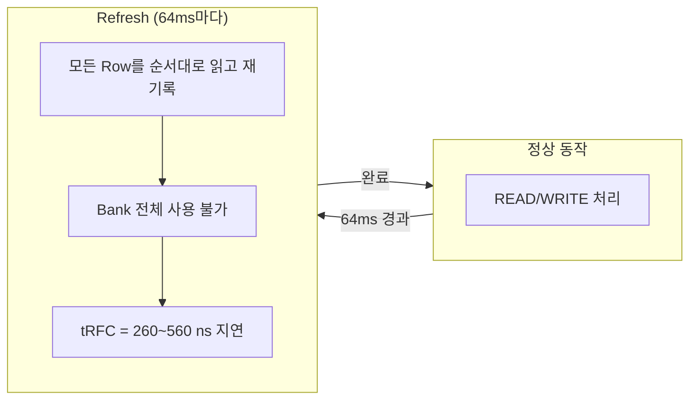
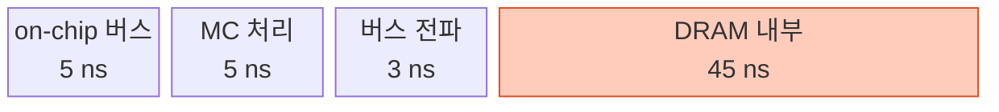
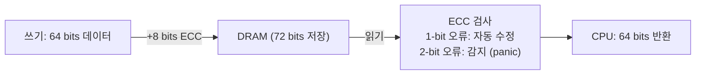
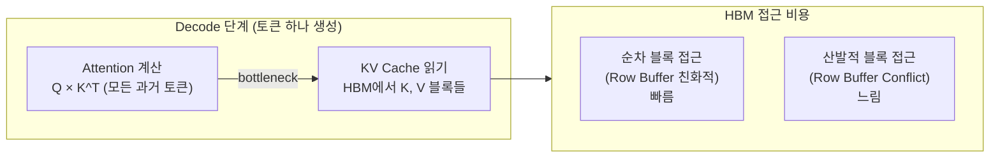

# 1.4.3 DRAM 레이턴시: RAS / CAS / 타이밍 파라미터

---

## 1. DRAM 타이밍의 핵심 파라미터

DRAM 스펙에 표기되는 숫자들 (예: **DDR4-3200 CL22-22-22-52**):

| 파라미터 | 명칭 | 의미 | 일반값 |
|----------|------|------|--------|
| **tCL** | CAS Latency | READ 명령 후 데이터까지 대기 시간 | 14~22 cycles |
| **tRCD** | RAS to CAS Delay | ACT 후 READ/WRITE 가능까지 | 14~22 cycles |
| **tRP** | Row Precharge | PRE 후 다시 ACT 가능까지 | 14~22 cycles |
| **tRAS** | Row Active Time | ACT 후 PRE 가능까지 최소 시간 | 32~52 cycles |
| **tRFC** | Refresh Cycle | 전체 Refresh 완료까지 | 260~560 cycles |

---

## 2. Row Buffer Miss 시 전체 타이밍 시퀀스

```
시간 →
         tRCD        tCL
         ├─────┤     ├──────┤
MC: |ACT |     |READ |      |DATA|
         |← tRAS (최소 활성 시간) →|
                              |PRE|
                              └── tRP ──┘
```



**총 Row Buffer Miss 레이턴시** ≈ tRCD + tCL = **~30 ns** (실제 전송 전까지)  
전체 왕복 포함: **~60~100 ns**

---

## 3. Row Buffer Hit vs Miss vs Conflict 비교

```mermaid
flowchart TD
    subgraph Hit["Row Buffer Hit\n(최선)"]
        H1["같은 Row에 연속 접근"]
        H2["ACT/PRE 불필요"]
        H3["레이턴시: ~tCL = 15 ns"]
        H1 --> H2 --> H3
    end

    subgraph Miss["Row Buffer Miss\n(보통)"]
        M1["다른 Row, Buffer 비어있음"]
        M2["ACT 필요"]
        M3["레이턴시: tRCD + tCL = 30 ns"]
        M1 --> M2 --> M3
    end

    subgraph Conflict["Row Buffer Conflict\n(최악)"]
        C1["다른 Row, Buffer에 다른 Row 있음"]
        C2["PRE → ACT 필요"]
        C3["레이턴시: tRP + tRCD + tCL = 45 ns"]
        C1 --> C2 --> C3
    end

    style Hit fill:#d4edda
    style Miss fill:#fff9c4
    style Conflict fill:#ffcccc
```



---

## 4. DRAM Refresh

DRAM은 SRAM과 달리 **캐패시터**에 전하를 저장 → 주기적으로 충전 필요



- **64 ms** 안에 모든 Row를 1번 이상 Refresh해야 데이터 보존
- Refresh 중 Bank는 접근 불가 → 숨겨진 레이턴시 버블
- DDR5에서는 Bank 그룹 분할로 Refresh 오버헤드 감소

---

## 5. 실제 레이턴시 스택 (DDR4-3200 기준)

```
CPU에서 메모리 컨트롤러까지:    ~5 ns   (on-chip 버스)
메모리 컨트롤러 처리:           ~5 ns
물리 버스 전파 (trace):         ~3 ns
DRAM 내부 (Row Buffer Miss):   ~45 ns   (tRCD + tCL + tRP)
데이터 반환 (64 bytes burst):  ~10 ns
총 왕복 레이턴시:              ~68 ns   → 흔히 "80 ns" 로 표현
```



---

## 6. ECC (Error Correcting Code)

서버용 DRAM은 비트 오류를 자동 수정:



- 1 bit flip: 자동 수정 (SECDED 코드)
- 레이턴시 오버헤드: 무시 가능 수준
- 데이터센터 GPU (A100, H100)도 HBM에 ECC 적용

---

## 7. Chapter 2 복선: vLLM에서 레이턴시가 중요한 이유



- Decode는 **memory-bound**: 모든 KV Cache를 읽어야 함
- KV 블록이 HBM에 어떻게 배치되느냐가 레이턴시에 직접 영향
- PagedAttention의 비연속 블록 배치 → HBM 랜덤 접근 증가는 설계상 트레이드오프
