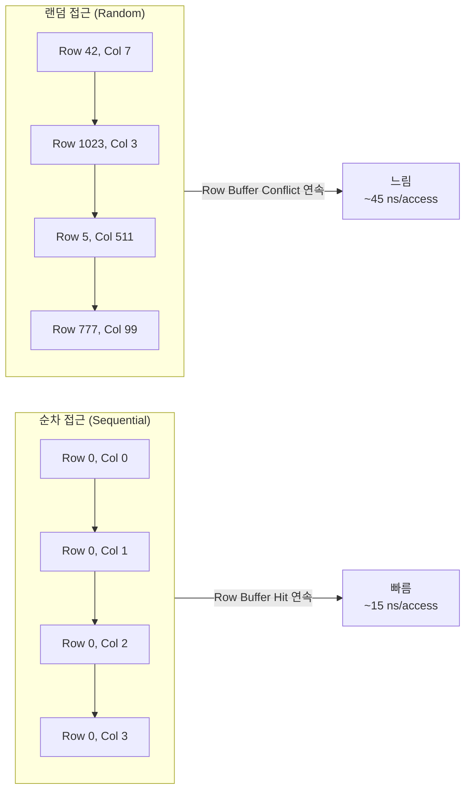
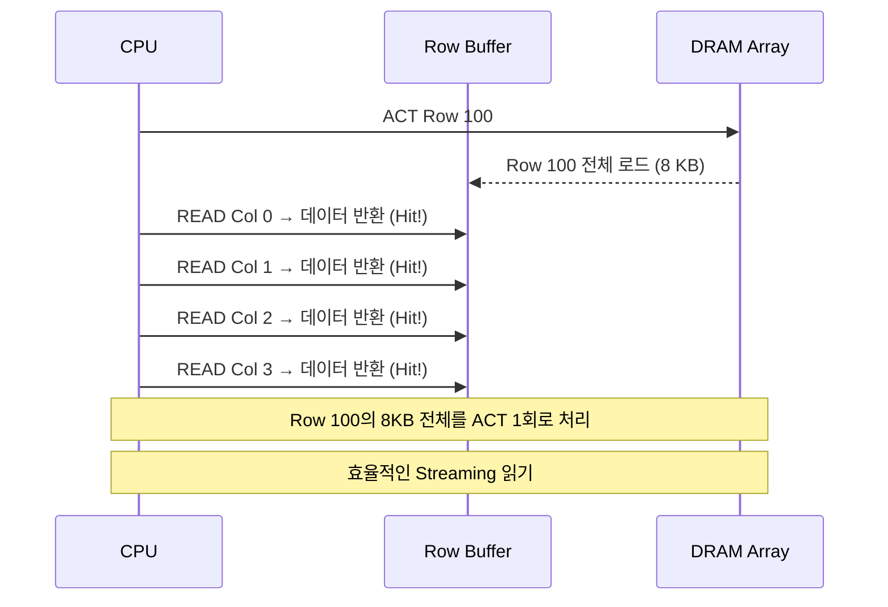
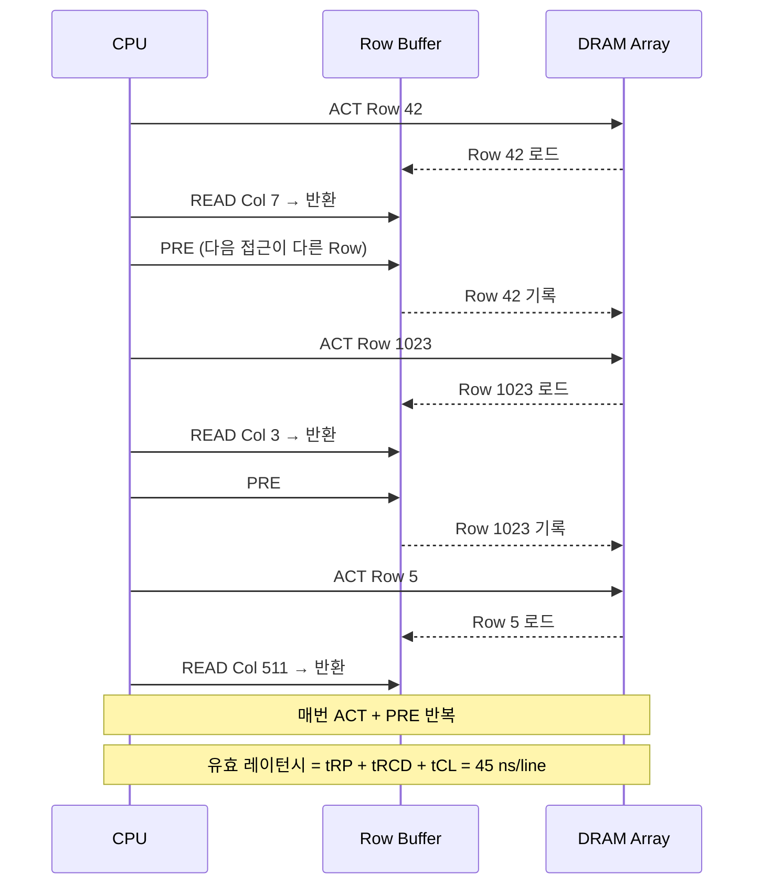
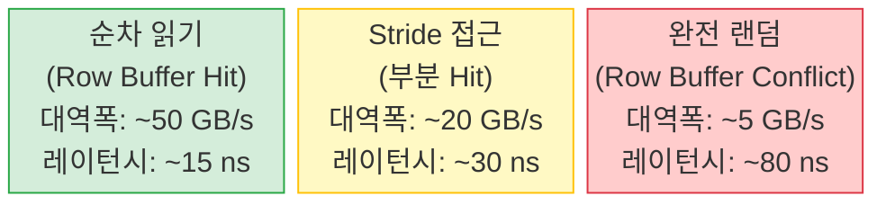
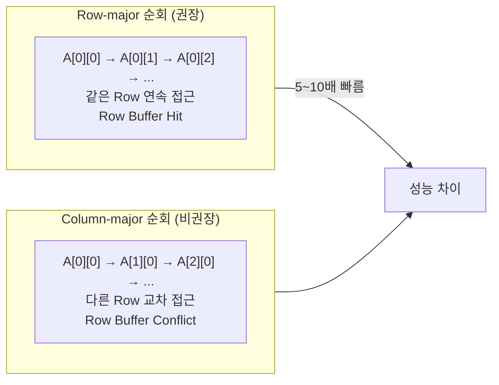
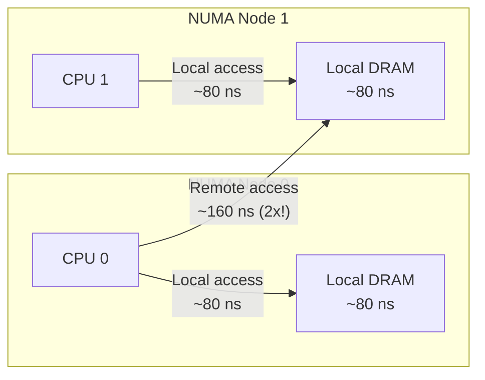
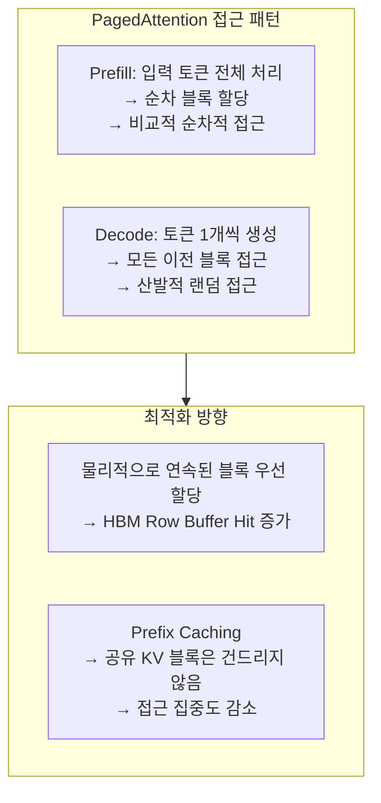

# 1.4.4 Random vs Sequential 접근: Row Buffer 동작 비교

---

## 1. 핵심 차이

같은 양의 데이터를 읽더라도 **접근 패턴**이 성능을 크게 좌우한다.



---

## 2. 순차 접근: Row Buffer 최대 활용



- ACT 1회로 Row 전체(8 KB) 접근 가능
- 64 byte 캐시 라인 128개를 히트로 처리
- **유효 레이턴시** = (tRCD + tCL) / 128 ≈ 0.23 ns/line

---

## 3. 랜덤 접근: Row Buffer Conflict 반복



- 매 접근마다 ACT → PRE 필요
- **유효 레이턴시** = tRP + tRCD + tCL ≈ 45 ns/line
- 순차 대비 **약 3~10배 느림**

---

## 4. 메모리 접근 패턴 성능 비교



### Stride 접근 패턴

```
Stride 64B  → 캐시 라인 1개씩 건너뜀 → Row Buffer Hit 가능
Stride 4KB  → 다른 페이지 경계 → Row Buffer Hit 가능성 낮음
Stride 8KB  → Row 크기 = 매번 다른 Row → Row Buffer Conflict
```

---

## 5. 실제 예: 행렬 순회 (Row-major vs Column-major)

### C 언어 배열 (Row-major 저장):

```c
double A[1024][1024];  // 8MB, Row 0 = A[0][0..1023] 연속 저장

// 순차 접근 (빠름 ✓)
for (int i = 0; i < 1024; i++)
    for (int j = 0; j < 1024; j++)
        sum += A[i][j];  // A[0][0], A[0][1], ... (Row-major)

// 랜덤 접근 (느림 ✗)
for (int j = 0; j < 1024; j++)
    for (int i = 0; i < 1024; i++)
        sum += A[i][j];  // A[0][0], A[1][0], ... (Column-major)
```



---

## 6. NUMA (Non-Uniform Memory Access)

멀티 소켓 서버에서 메모리 위치도 중요:



- Remote NUMA 접근: **레이턴시 2배, 대역폭 절반**
- `numactl --localalloc`: 항상 로컬 메모리 사용 강제

---

## 7. Chapter 2 복선: KV Cache 블록 배치 전략



- PagedAttention은 메모리 효율 vs 접근 패턴 효율 간 트레이드오프
- vLLM은 가능한 한 연속 블록 할당 시도 (물리 연속성 최대화)
- HBM의 높은 대역폭이 이 트레이드오프를 감수할 수 있게 해줌
