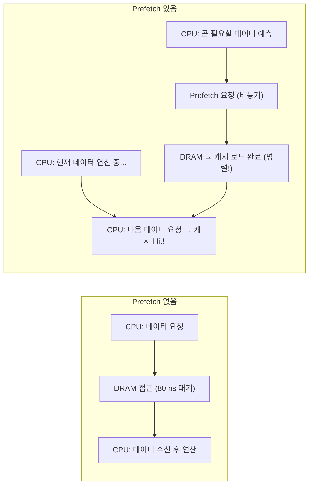
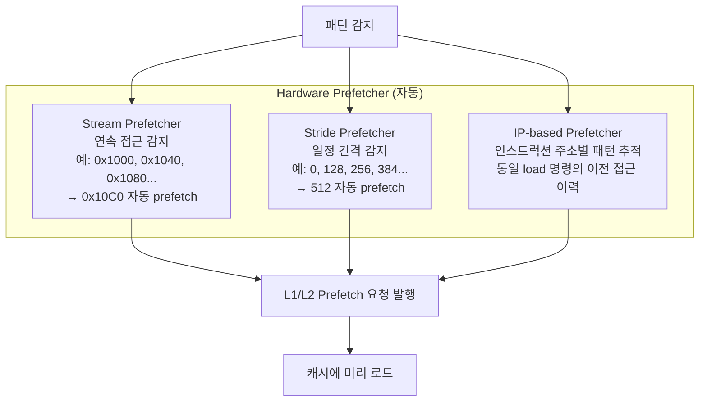
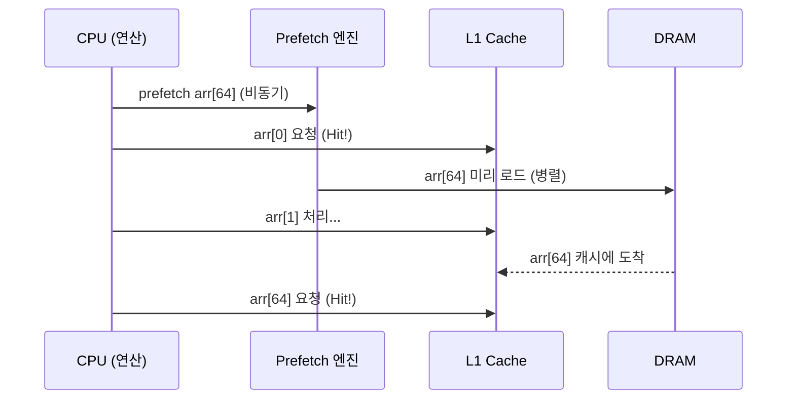
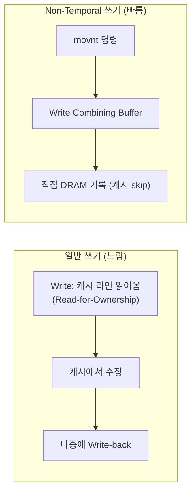
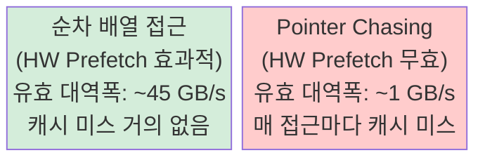
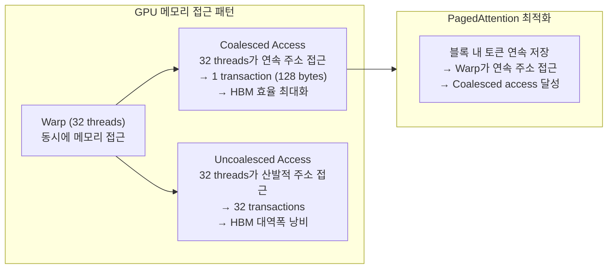

# 1.4.5 Prefetch: 데이터를 미리 가져오기

---

## 1. 핵심 아이디어

Prefetch = **CPU가 데이터를 요청하기 전에 미리 캐시에 로드해 두기**



- 연산과 메모리 접근을 **겹침 (overlap)** → 유효 레이턴시 숨김
- 전제 조건: **접근 패턴을 예측할 수 있어야 함**

---

## 2. Hardware Prefetcher

CPU에 내장된 회로가 접근 패턴을 자동 감지:



### Hardware Prefetcher가 잘 동작하는 패턴

| 패턴 | 예시 | 결과 |
|------|------|------|
| 순차 | `arr[0], arr[1], arr[2], ...` | 매우 효과적 |
| 고정 Stride | `arr[0], arr[8], arr[16], ...` | 효과적 |
| 역방향 | `arr[N], arr[N-1], ...` | 효과적 |
| 랜덤 | `arr[hash(i)]` | 무효 (예측 불가) |
| Pointer chasing | `p = p->next` (linked list) | 무효 |

---

## 3. Software Prefetch

프로그래머 또는 컴파일러가 명시적으로 prefetch 명령 삽입:

```c
// x86 intrinsic
#include <immintrin.h>

void process_array(double* arr, int n) {
    for (int i = 0; i < n; i++) {
        // 64개 원소 앞을 미리 prefetch
        _mm_prefetch((char*)&arr[i + 64], _MM_HINT_T0);
        
        // 현재 원소 처리
        result += arr[i] * 2.0;
    }
}
```



### Prefetch 힌트 종류

| 힌트 | 의미 |
|------|------|
| `_MM_HINT_T0` | L1 캐시로 가져옴 (곧 사용) |
| `_MM_HINT_T1` | L2 캐시로 가져옴 |
| `_MM_HINT_T2` | L3 캐시로 가져옴 |
| `_MM_HINT_NTA` | Non-Temporal: 캐시 오염 최소화 (한 번만 사용) |

---

## 4. Non-Temporal Store (Streaming Write)

대용량 데이터를 **캐시를 거치지 않고** 직접 DRAM에 쓰기:



- 대규모 memcpy, 비디오 프레임 처리, 파일 스트리밍에 유용
- 캐시 오염 없이 DRAM 대역폭 최대화

---

## 5. Prefetch 효과 측정



- Linked list 순회: pointer chasing → prefetch 불가 → DRAM 레이턴시 직격
- 이것이 **배열 > 연결리스트** 성능 차이의 근본 원인

---

## 6. Chapter 2 복선: GPU Prefetch와 KV Cache



- GPU의 "Coalesced memory access" = CPU의 "sequential prefetch"와 동일한 원리
- vLLM의 KV 블록 크기 (16 tokens)는 Coalesced access를 위해 튜닝된 값
- 블록 내부는 연속 저장 → Warp 단위 접근 시 효율적
