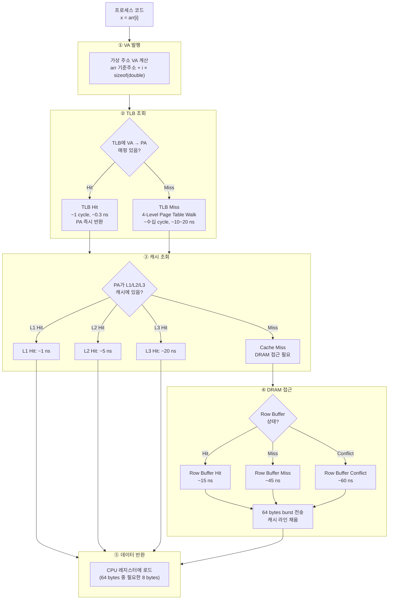
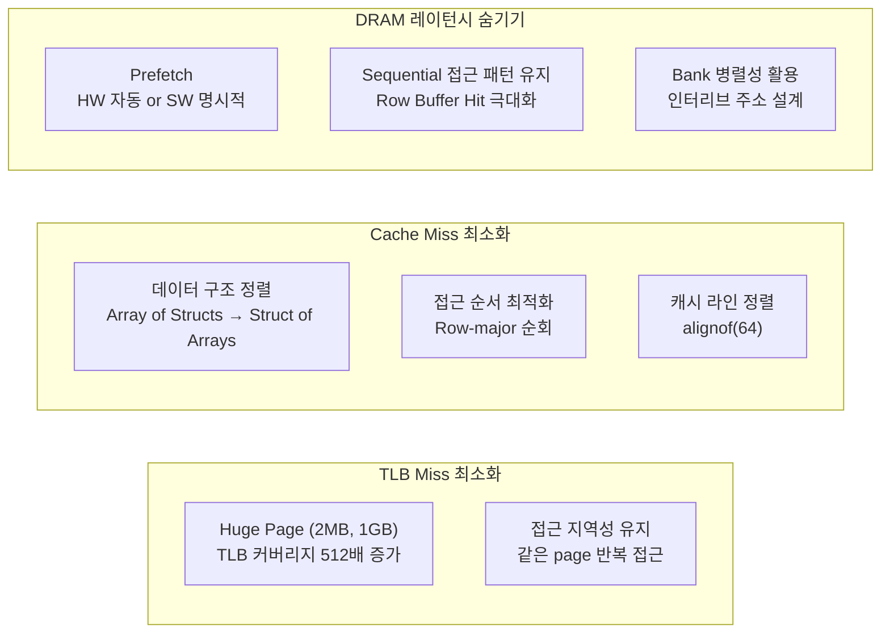
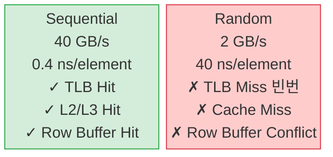
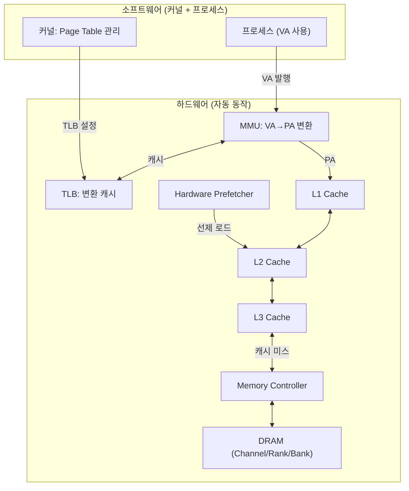

# 1.4.6 VA → 실제 데이터: End-to-End 전체 경로 정리

---

## 1. 전체 경로 한눈에

`x = arr[i]` 한 줄이 실행될 때 일어나는 모든 일:



---

## 2. 레이턴시 누적 테이블

| 경우 | TLB | Cache | DRAM | 합계 |
|------|-----|-------|------|------|
| **최선** | Hit (0.3 ns) | L1 Hit (1 ns) | — | **~1 ns** |
| **일반** | Hit (0.3 ns) | L3 Hit (20 ns) | — | **~20 ns** |
| **보통** | Miss (15 ns) | L3 Hit (20 ns) | — | **~35 ns** |
| **최악** | Miss (15 ns) | Miss | RB Conflict (60 ns) | **~90 ns** |

---

## 3. 병목 구간별 최적화 전략



---

## 4. 실제 성능 측정 예 (간단한 benchmark)

### Sequential vs Random 차이 요약

```
arr[0], arr[1], arr[2], ... (Sequential, 16 GB array):
  → TLB Hit Rate: ~99.9%
  → L1/L2 Hit Rate: ~95% (HW Prefetch 동작)
  → 유효 대역폭: ~40 GB/s
  → 시간: ~0.4 ns/element

arr[random()], arr[random()], ... (Random, 16 GB array):
  → TLB Hit Rate: ~60% (huge page 없이)
  → L1/L2/L3 Hit Rate: ~10% (cache working set 초과)
  → 유효 대역폭: ~2 GB/s
  → 시간: ~40 ns/element (100x 느림!)
```

```mermaid
block-metrics
```



---

## 5. 전체 하드웨어 협력 구조



---

## 6. Chapter 2 복선: GPU에서의 동일 경로

| CPU 경로 | GPU 경로 | 비고 |
|----------|----------|------|
| VA → TLB → PA | VA → GPU MMU → PA | GPU도 가상 주소 사용 (CUDA unified memory) |
| PA → L1/L2/L3 | PA → Shared Mem / L1 / L2 | GPU L1: 192KB/SM, L2: 20~80MB |
| PA → DRAM | PA → HBM | 대역폭 50x (3 TB/s vs 50 GB/s) |
| HW Prefetcher | Warp Coalescing | 같은 원리: 연속 접근 = 고효율 |
| Page Table Walk | Block Table Lookup | 1-level (단순) vs 4-level |

- GPU에서 KV Cache 접근은 이 전체 경로의 **GPU 버전**
- 핵심 병목: HBM 대역폭 (충분히 큼) + 비코어레스드 접근 (피해야 함)
