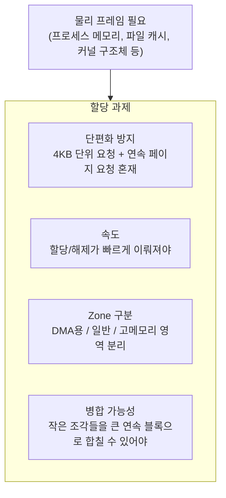
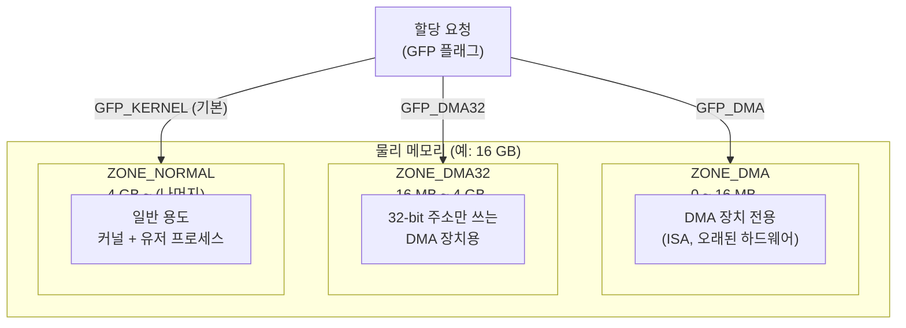
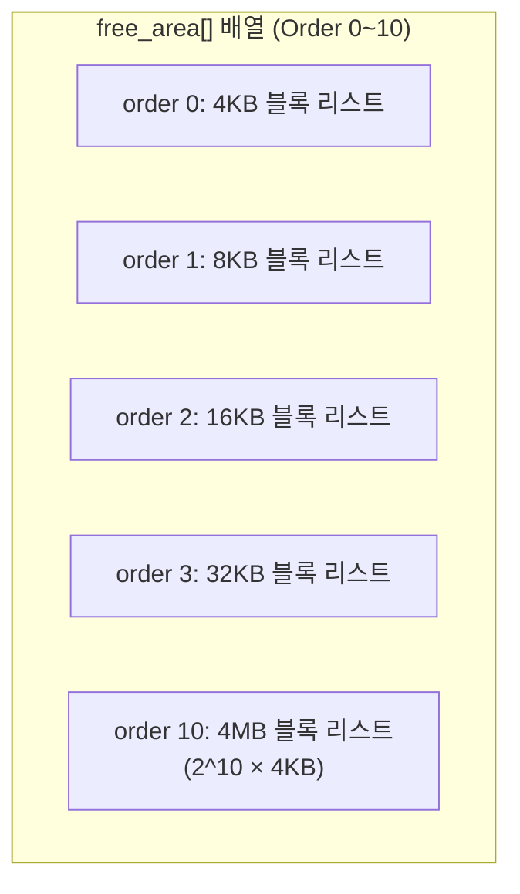
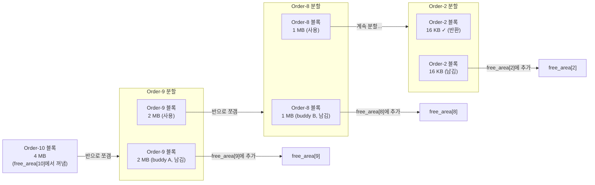
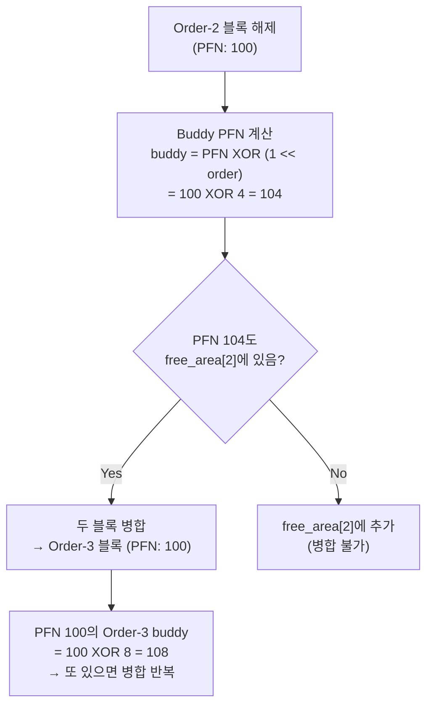
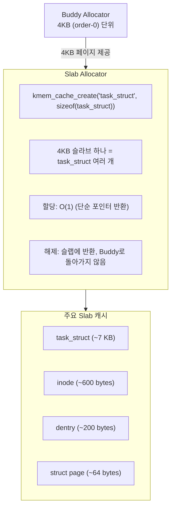
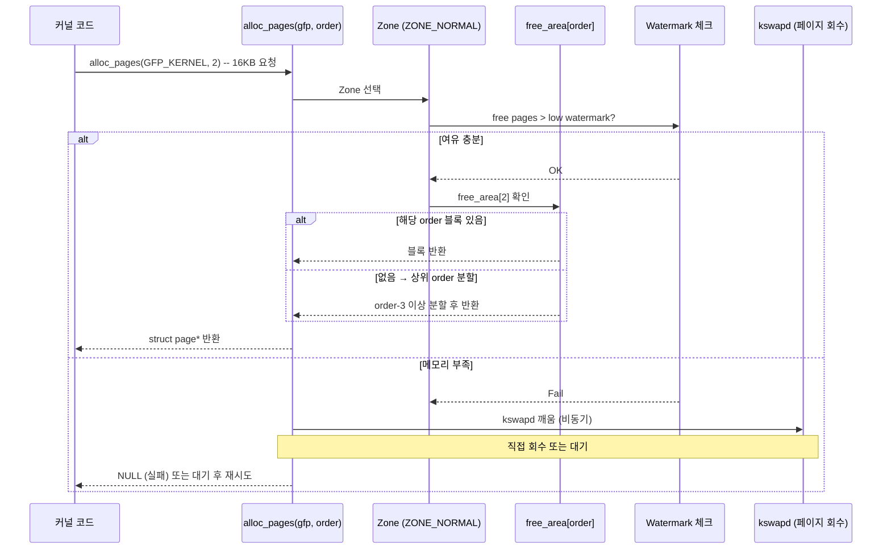
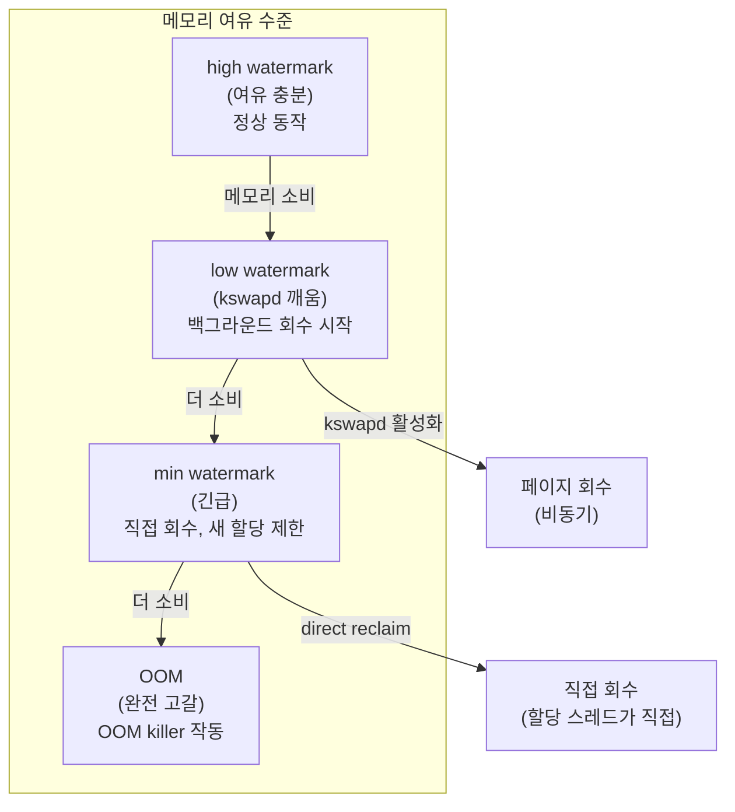
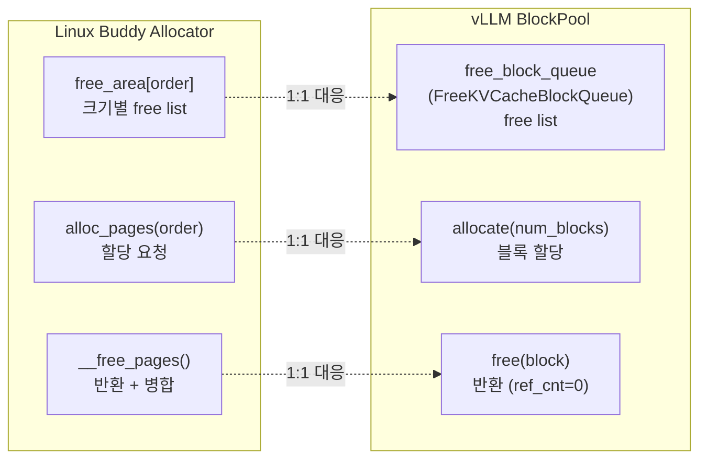

# 1.5 Page Frame Allocator: 커널은 물리 프레임을 어떻게 할당하는가

---

## 1. 문제 정의

커널이 새로운 물리 프레임을 할당할 때 고려해야 하는 것들:

---

## 2. Zone 구조

Linux는 물리 메모리를 **Zone**으로 나눈다:

- `GFP_KERNEL`: 일반 커널 할당 (슬립 허용)
- `GFP_ATOMIC`: 인터럽트 핸들러 (슬립 불가)
- `GFP_USER`: 유저 공간 메모리

---

## 3. Buddy Allocator

Linux의 핵심 물리 메모리 할당 알고리즘:

### 원리: 이진 분할 (Binary Split)

### 4MB 블록에서 16KB 할당 요청 시 분할 과정

### 해제 시 병합 (Merge): Buddy 찾기

---

## 4. Slab Allocator

Buddy는 4KB 단위가 최소 — 더 작은 커널 구조체는?

- `kmalloc()`: 범용 slab 캐시 (2^n 크기별)
- `kfree()`: slab으로 반환, Buddy로는 페이지가 비워질 때만 반환
- 내부 단편화 최소화 + 캐시 재사용 효과

---

## 5. `alloc_pages()` 흐름

커널이 물리 프레임을 요청하는 핵심 함수:

---

## 6. Watermark 시스템

---

## 7. Chapter 2 복선: `BlockPool` = Buddy Allocator

- Buddy: 2^n 크기의 연속 프레임을 free list로 관리
- BlockPool: 고정 크기 블록을 free list로 관리 (더 단순 — buddy 병합 없음)
- 핵심 공통점: **free list에서 꺼내고, 해제 시 리스트로 반환**
