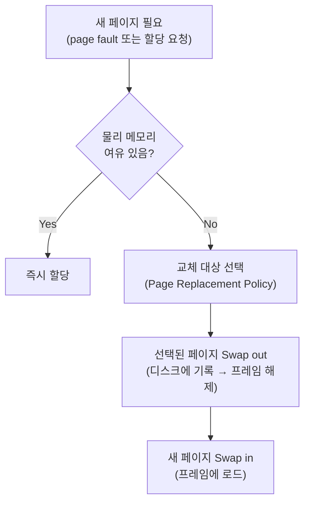
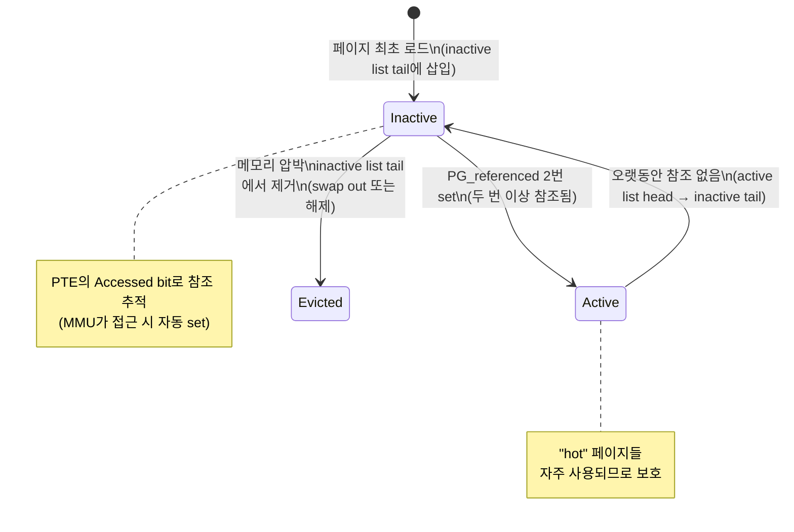
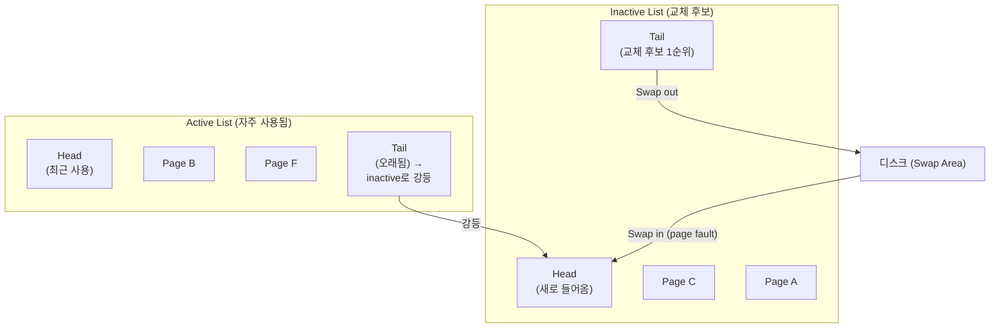
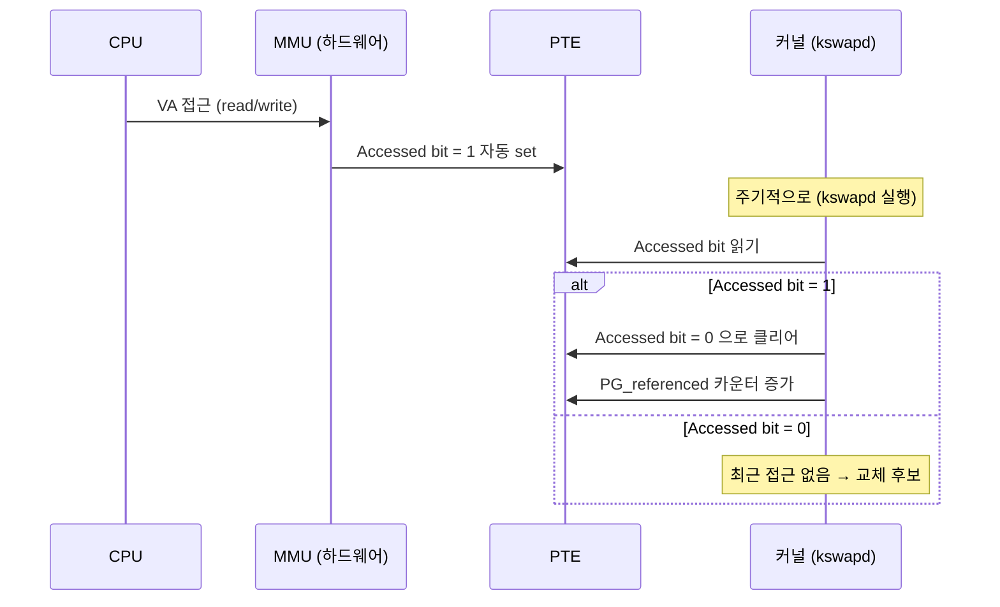
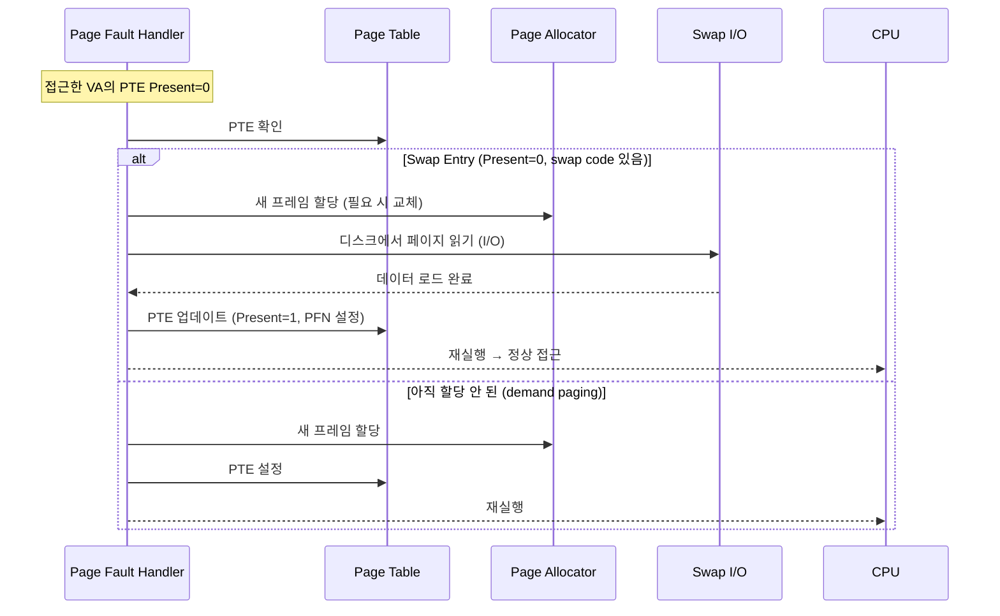
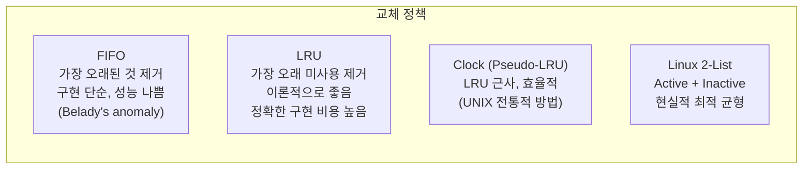
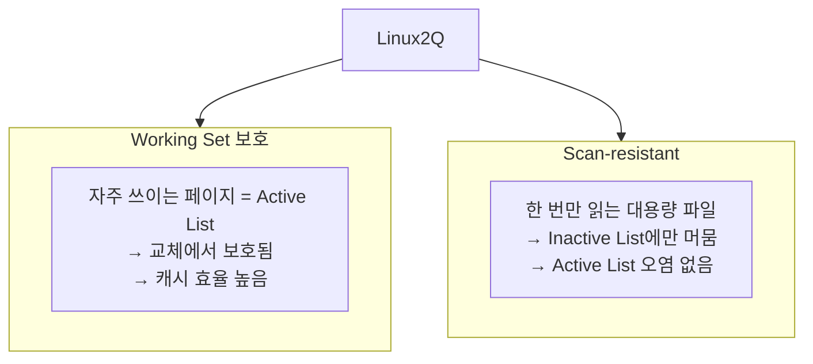
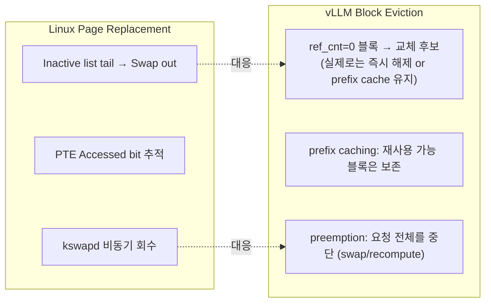

# 1.6 Page Replacement: 메모리 부족 시 어떤 페이지를 내쫓는가

---

## 1. 문제 정의

물리 메모리가 부족할 때, 어떤 페이지를 **Swap out** (디스크로 내보내기) 할 것인가?



---

## 2. LRU와 Linux의 Active/Inactive 리스트

### 이상적인 OPT (Optimal) 알고리즘 (구현 불가)
- 미래에 가장 늦게 사용될 페이지를 교체
- 이론적 최적이지만 미래를 알 수 없음

### Linux의 실용적 해답: 2-리스트 LRU



### 리스트 구조



---

## 3. PTE Accessed Bit 활용



- MMU가 하드웨어적으로 자동 set → 소프트웨어 오버헤드 없음
- 커널이 주기적으로 스캔하며 클리어 → "최근 2번 접근" 여부 추적

---

## 4. Swap 동작 상세



### Swap 장치

```
물리 메모리 (RAM):    빠름, 용량 작음
Swap 파티션 (SSD):   중간, RAM의 10~100배
Swap 파티션 (HDD):   느림, 거의 사용 안 됨
```

- Swap out: 페이지 내용 → 디스크, PTE Present=0 (swap entry 저장)
- Swap in: 디스크 → 새 프레임, PTE Present=1 복원

---

## 5. 교체 정책 비교



### Linux 2-리스트가 Clock보다 나은 점



---

## 6. Chapter 2 복선: vLLM 블록 교체 전략



| OS 개념 | vLLM 개념 | 차이점 |
|---------|-----------|--------|
| Page swap out | 블록 evict / 요청 preemption | vLLM은 블록 단위 아닌 요청 단위 중단 가능 |
| Inactive list | ref_cnt=0 블록들 | 단순화됨 |
| kswapd | Scheduler preemption 로직 | 백그라운드 아닌 스케줄링 시점 |
| Swap in (page fault) | Recompute or swap-in | GPU recompute가 디스크 I/O보다 빠를 수 있음 |
