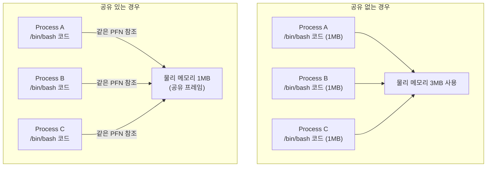
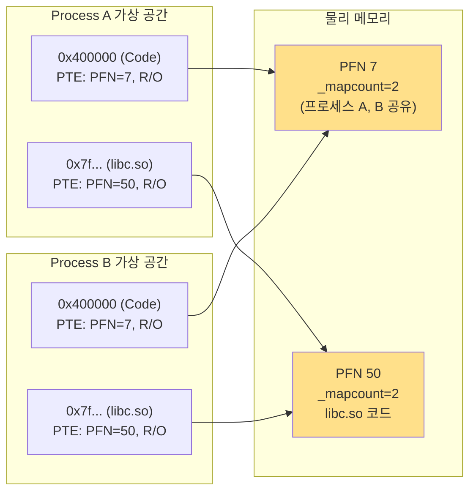
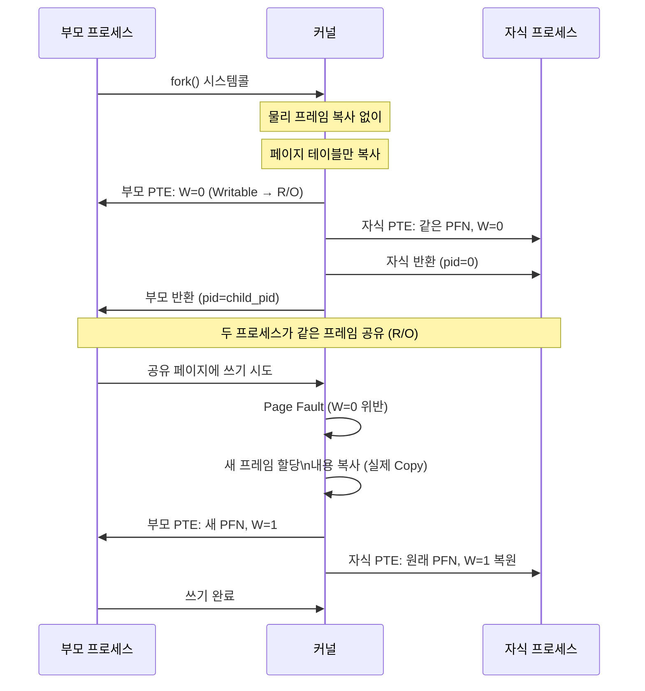
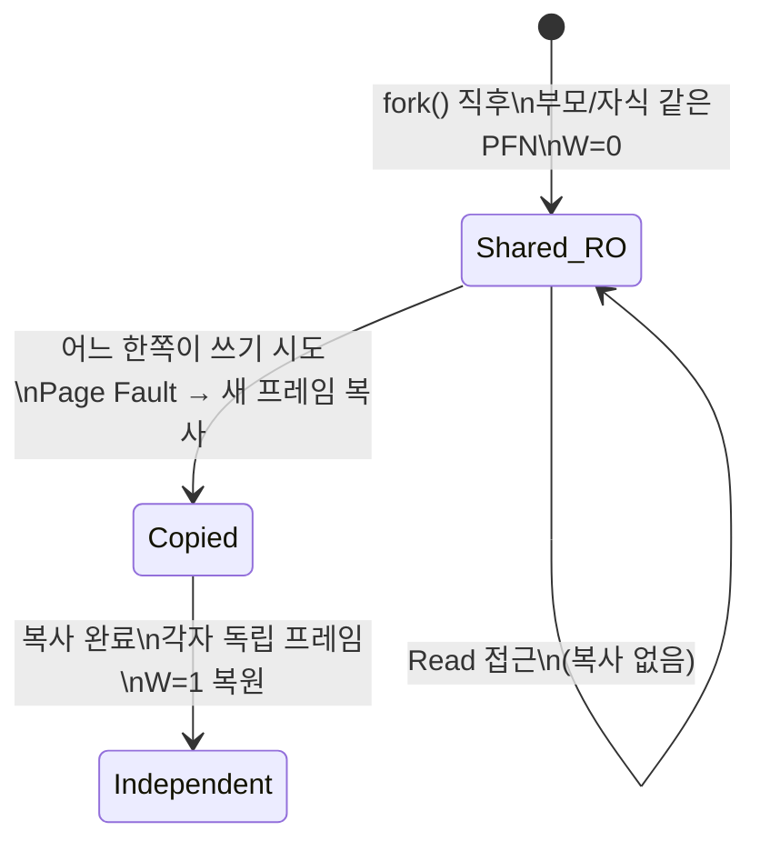
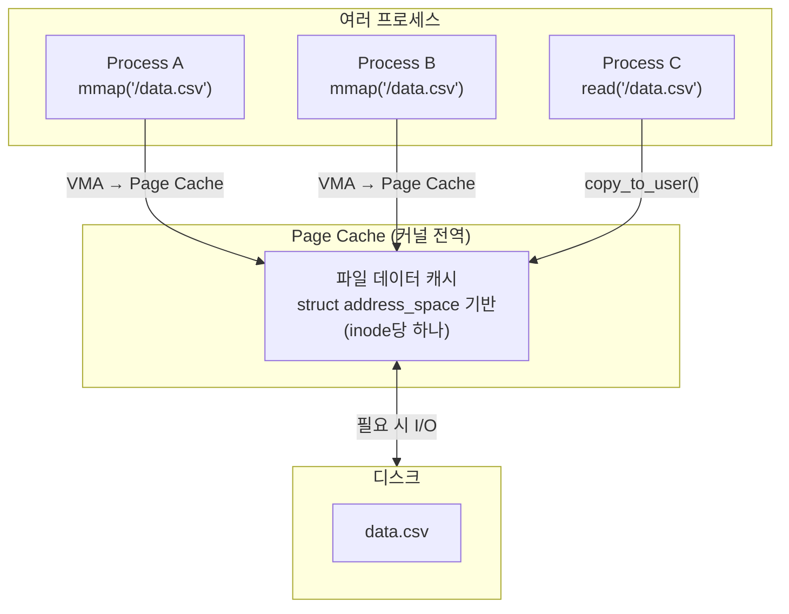
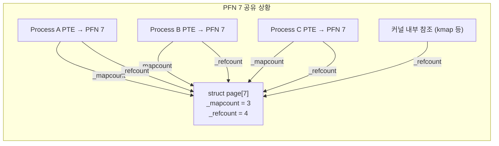
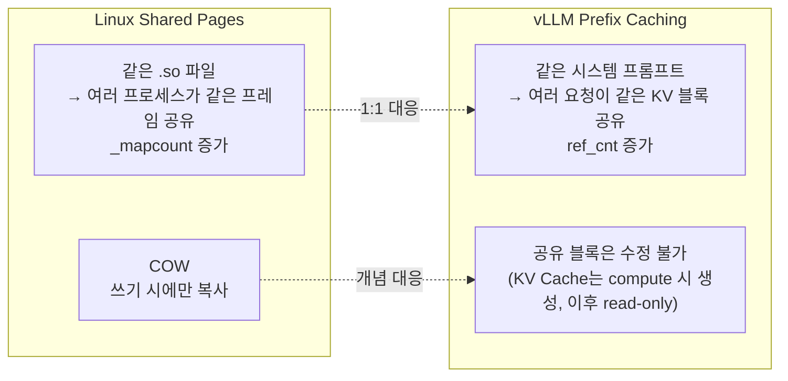

# 1.7 Shared Pages / Copy-on-Write: 메모리를 어떻게 공유하는가

---

## 1. 왜 공유가 필요한가



- 100개의 bash 인스턴스: 공유 없이 100MB, 공유 시 ~1MB
- **_mapcount**: 이 프레임을 가리키는 PTE 수 (공유 시 > 1)

---

## 2. Read-Only Shared Pages (코드, 라이브러리)



- 코드 세그먼트 (text): 모든 인스턴스가 동일 PFN 공유
- Shared Library (.so): 한 번만 물리 메모리에 로드
- PTE에 `W=0` (Writable 비트 off) → 쓰기 시도 시 Page Fault

---

## 3. Copy-on-Write (COW)

### fork() 후 COW 설정



### COW 상태 전이



---

## 4. Page Cache: 파일 I/O 공유



- 같은 파일을 여러 프로세스가 접근해도 물리 프레임은 하나
- `mmap()`: Page Cache 프레임을 직접 VA에 매핑 (복사 없음)
- `read()`: Page Cache → 유저 버퍼 복사 (한 번의 복사)

---

## 5. `struct page`의 공유 추적

```c
struct page {
    atomic_t _mapcount;  // 이 프레임을 가리키는 PTE 수
    atomic_t _refcount;  // 전체 참조 카운트 (PTE + 커널 내부 사용)
    // ...
};
```



- `_mapcount = -1`: 공유 없음 (단독 소유)
- `_mapcount >= 0`: 해당 값 + 1개의 PTE가 참조 중
- 교체 불가 조건: `_refcount > 0` (누군가 참조 중)

---

## 6. Chapter 2 복선: Prefix Caching = Shared Pages



| OS 개념 | vLLM 개념 |
|---------|-----------|
| Shared library pages | 공유 Prefix KV 블록 |
| `_mapcount` | `KVCacheBlock.ref_cnt` |
| COW on write | (해당 없음 — KV는 생성 후 R/O) |
| Page Cache | Prefix hash → block 매핑 테이블 |
| `munmap()` → `_mapcount--` | `free()` → `ref_cnt--` → 0이면 해제 가능 |
