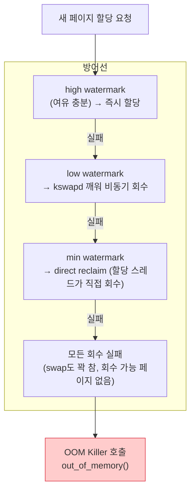
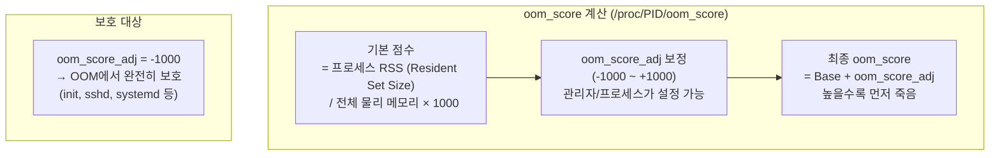
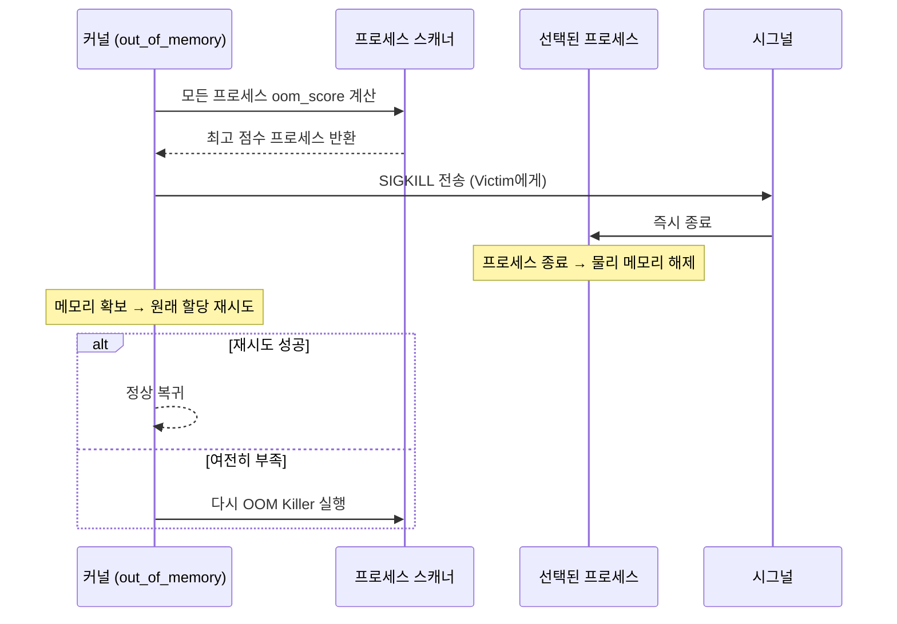
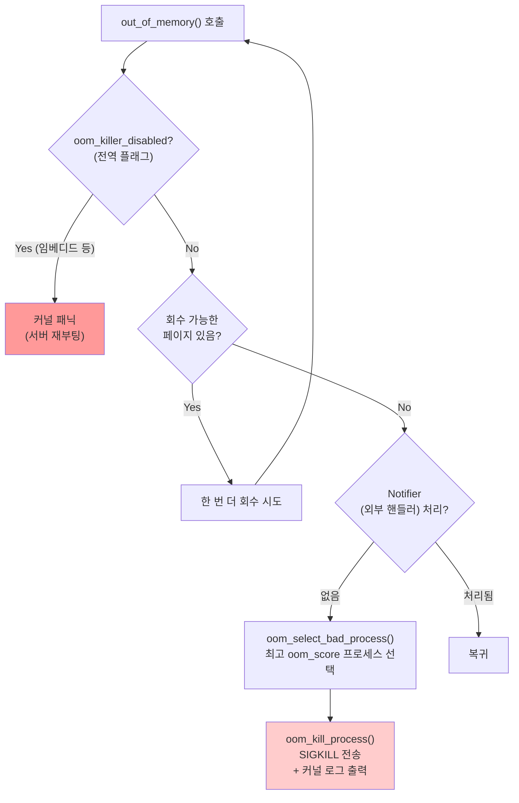
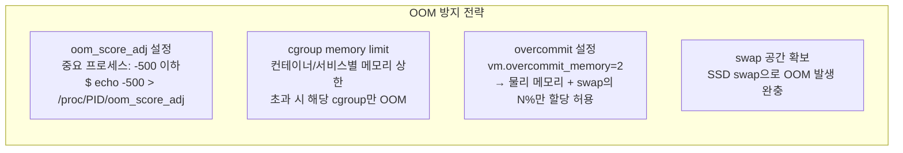
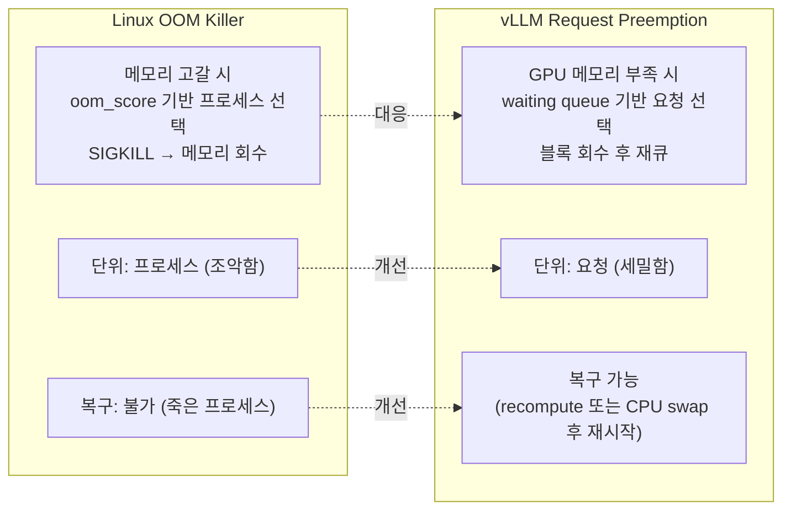

# 1.8 OOM: 메모리가 완전히 부족하면 무슨 일이 일어나는가

---

## 1. OOM 발생 조건



---

## 2. OOM Score 계산

커널은 각 프로세스에 `oom_score`를 계산해 누구를 죽일지 결정:



### 점수에 영향을 주는 요소

| 요소 | 영향 |
|------|------|
| 메모리 사용량 (RSS) | 많이 쓸수록 점수 높음 (먼저 죽음) |
| `oom_score_adj` | -1000 (보호) ~ +1000 (우선 타겟) |
| 루트 프로세스 | 소폭 감점 (보호) |
| 자식 프로세스 메모리 | 부모 점수에 포함 가능 |

---

## 3. OOM Killer 동작 흐름



---

## 4. OOM 판정 흐름 (커널 내부)



---

## 5. OOM 로그 해석

실제 OOM killer 발생 시 커널 로그:

```
Out of memory: Kill process 1234 (python3) score 892 or sacrifice child
Killed process 1234 (python3) total-vm:8GB, anon-rss:7.8GB, file-rss:200MB
```

| 필드 | 의미 |
|------|------|
| `score 892` | OOM score (높을수록 먼저 죽음) |
| `total-vm` | 가상 메모리 크기 |
| `anon-rss` | 익명 페이지 (heap, stack) RSS |
| `file-rss` | 파일 매핑 RSS (코드, 라이브러리) |

---

## 6. OOM 방어 전략



---

## 7. Chapter 2 복선: vLLM의 Request Preemption



| OS OOM Killer | vLLM Preemption | 차이 |
|---------------|-----------------|------|
| oom_score (메모리 사용량) | 우선순위 (priority) 또는 도착 순서 | vLLM이 더 정밀한 정책 가능 |
| SIGKILL (복구 불가) | preempt + requeue (복구 가능) | vLLM이 안전함 |
| 전체 프로세스 메모리 반환 | 해당 요청의 KV 블록만 반환 | vLLM이 세밀함 |
| 커널 자동 | Scheduler 명시적 제어 | vLLM이 예측 가능 |
