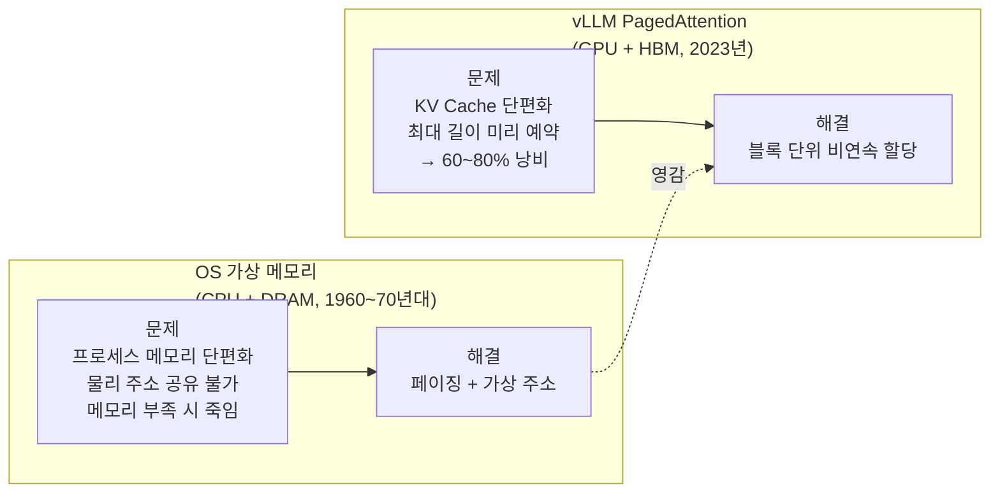
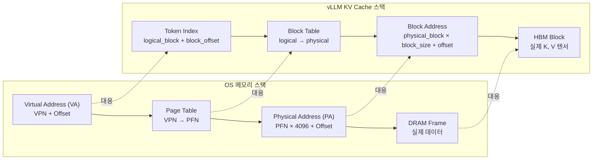
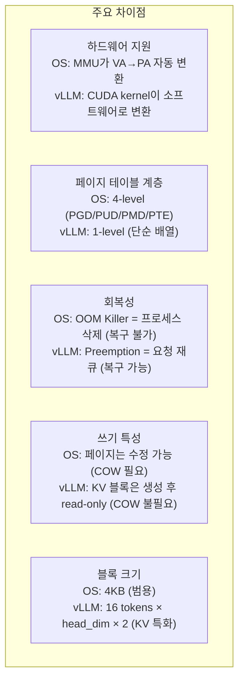
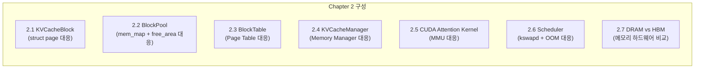
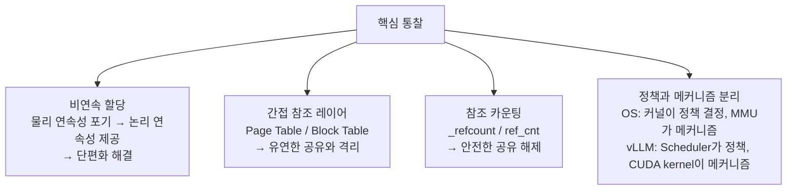

# 1.9 Bridge: OS 메모리 관리 → vLLM PagedAttention

---

## 1. 같은 문제, 다른 환경

Chapter 1에서 다룬 OS의 메모리 관리 기법들은  
vLLM이 GPU에서 **동일한 문제**를 해결할 때 그대로 적용된다.

> *"We take inspiration from how operating systems handle memory management."*  
> — Kwon et al., vLLM paper (2023)

---

## 2. 완전한 1:1 개념 대응 테이블

| OS 개념 | 역할 | vLLM 대응 개념 | 역할 |
|---------|------|----------------|------|
| **Page** | 가상 주소 공간 고정 크기 단위 | **KV Block (논리)** | 요청의 논리적 KV 공간 단위 |
| **Page Frame** | 물리 메모리 고정 크기 슬롯 | **KV Block (물리)** | GPU HBM의 실제 KV 저장 슬롯 |
| **VPN** | 가상 페이지 번호 | **logical_block_num** | 요청 내 논리 블록 번호 |
| **PFN** | 물리 프레임 번호 | **physical_block_num** | HBM 내 물리 블록 번호 |
| **Page Table** | VPN → PFN 매핑 | **BlockTable** | logical → physical 매핑 |
| **Page Table Entry** | PTE (PFN + 권한 비트) | **BlockTable 항목** | physical_block_num |
| **MMU** | 하드웨어 주소 변환 | **CUDA Kernel** | 소프트웨어 주소 변환 |
| **TLB** | 변환 결과 캐시 | (해당 없음) | GPU는 TLB 없이 직접 계산 |
| **struct page** | 프레임 메타데이터 | **KVCacheBlock** | 블록 메타데이터 |
| **mem_map[]** | 전체 프레임 배열 | **BlockPool.blocks[]** | 전체 블록 배열 |
| **free_area[] (Buddy)** | 빈 프레임 리스트 | **free_block_queue** | 빈 블록 큐 |
| **alloc_pages()** | 프레임 할당 | **allocate_slots()** | 블록 할당 |
| **\_refcount** | 프레임 참조 카운트 | **KVCacheBlock.ref_cnt** | 블록 참조 카운트 |
| **\_mapcount** | PTE 수 (공유 추적) | **ref_cnt** | 공유 요청 수 추적 |
| **Shared Pages** | 여러 프로세스 공유 프레임 | **Prefix Caching** | 공통 Prefix 블록 공유 |
| **COW** | 쓰기 시 복사 | (해당 없음) | KV는 생성 후 read-only |
| **Page Cache** | 파일 I/O 캐시 | **Prefix Block Hash Cache** | KV 결과 재사용 |
| **kswapd** | 백그라운드 회수 데몬 | **Scheduler 선점 로직** | 블록 회수 결정 |
| **Swap out** | 페이지 → 디스크 | **Preempt + CPU Swap** | 블록 → CPU 메모리 |
| **Swap in (page fault)** | 디스크 → 메모리 | **Recompute or Swap in** | KV 재계산 또는 복원 |
| **OOM Killer** | 프로세스 강제 종료 | **Request Preemption** | 요청 중단 + 재큐 |

---

## 3. 구조적 대응 다이어그램

---

## 4. 핵심 차이점

OS와 vLLM이 **다른 점**도 이해해야 한다:

---

## 5. Chapter 2 미리보기

Chapter 2에서는 vLLM 코드에서 이 대응 관계를 직접 확인한다:

---

## 6. 핵심 메시지

> **OS의 가상 메모리는 "같은 자원을 여러 사용자가 안전하게 공유"하는 문제를 해결한다.**  
> **vLLM의 PagedAttention은 "GPU 메모리를 여러 요청이 효율적으로 공유"하는 동일한 문제를 해결한다.**

